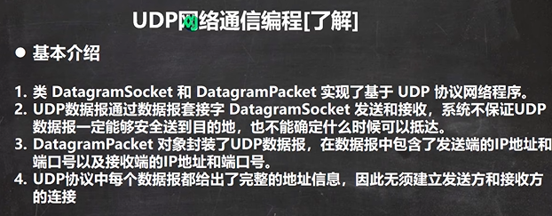
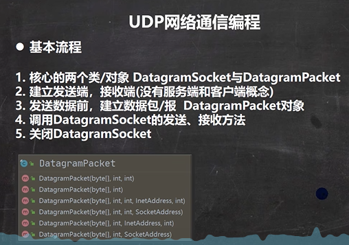
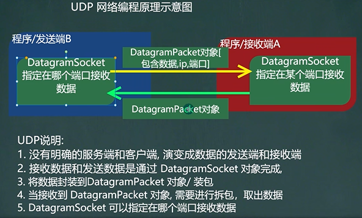
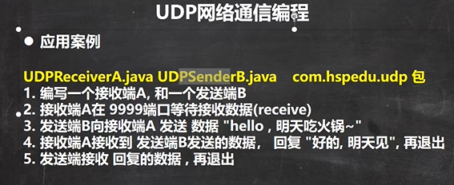

```java
public class UDPReceiverA {
    public static void main(String[] args) throws IOException {
        //1. 创建一个 DatagramSocket 对象，准备在9999接收数据
        DatagramSocket socket = new DatagramSocket(9999);
        //2. 构建一个 DatagramPacket 对象，准备接收数据
        //   在前面讲解UDP 协议时，老师说过一个数据包最大 64k
        byte[] buf = new byte[1024];
        DatagramPacket packet = new DatagramPacket(buf, buf.length);
        //3. 调用 接收方法, 将通过网络传输的 DatagramPacket 对象
        //   填充到 packet对象
        //老师提示: 当有数据包发送到 本机的9999端口时，就会接收到数据
        //   如果没有数据包发送到 本机的9999端口, 就会阻塞等待.
        System.out.println("接收端A 等待接收数据..");
        socket.receive(packet);

        //4. 可以把packet 进行拆包，取出数据，并显示.
        int length = packet.getLength();//实际接收到的数据字节长度
        byte[] data = packet.getData();//接收到数据
        String s = new String(data, 0, length);
        System.out.println(s);

        //===回复信息给B端
        //将需要发送的数据，封装到 DatagramPacket对象
        data = "好的, 明天见".getBytes();
        //说明: 封装的 DatagramPacket对象 data 内容字节数组 , data.length , 主机(IP) , 端口
        packet =
                new DatagramPacket(data, data.length, InetAddress.getByName("192.168.12.1"), 9998);

        socket.send(packet);//发送

        //5. 关闭资源
        socket.close();
        System.out.println("A端退出...");
    }
}

public class UDPSenderB {
    public static void main(String[] args) throws IOException {

        //1.创建 DatagramSocket 对象，准备在9998端口 接收数据
        DatagramSocket socket = new DatagramSocket(9998);

        //2. 将需要发送的数据，封装到 DatagramPacket对象
        byte[] data = "hello 明天吃火锅~".getBytes();

        //说明: 封装的 DatagramPacket对象 data 内容字节数组 , data.length , 主机(IP) , 端口
        DatagramPacket packet =
                new DatagramPacket(data, data.length, InetAddress.getByName("192.168.12.1"), 9999);

        socket.send(packet);

        //3.=== 接收从A端回复的信息
        //(1)   构建一个 DatagramPacket 对象，准备接收数据
        //   在前面讲解UDP 协议时，老师说过一个数据包最大 64k
        byte[] buf = new byte[1024];
        packet = new DatagramPacket(buf, buf.length);
        //(2)    调用 接收方法, 将通过网络传输的 DatagramPacket 对象
        //   填充到 packet对象
        //老师提示: 当有数据包发送到 本机的9998端口时，就会接收到数据
        //   如果没有数据包发送到 本机的9998端口, 就会阻塞等待.
        socket.receive(packet);

        //(3)  可以把packet 进行拆包，取出数据，并显示.
        int length = packet.getLength();//实际接收到的数据字节长度
        data = packet.getData();//接收到数据
        String s = new String(data, 0, length);
        System.out.println(s);

        //关闭资源
        socket.close();
        System.out.println("B端退出");
    }
}
```

