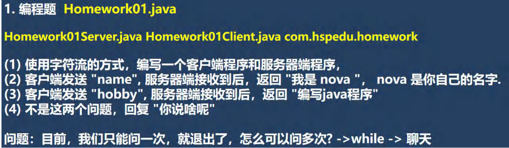
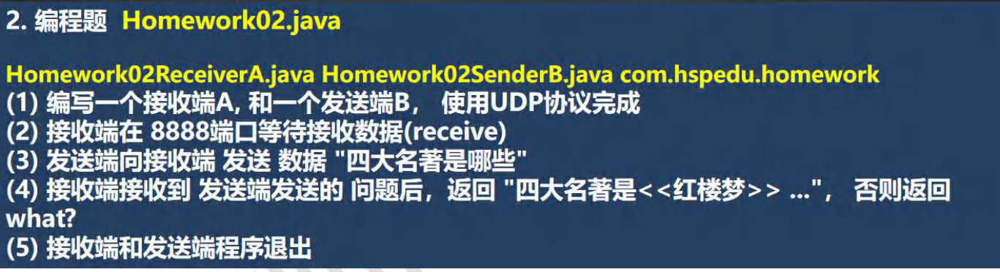
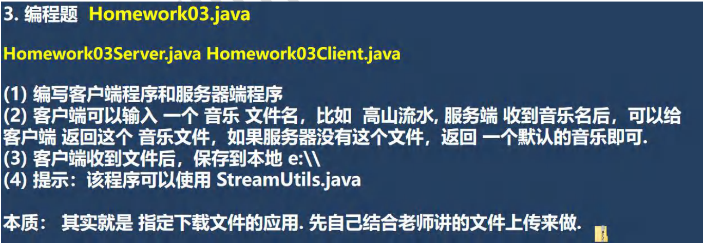
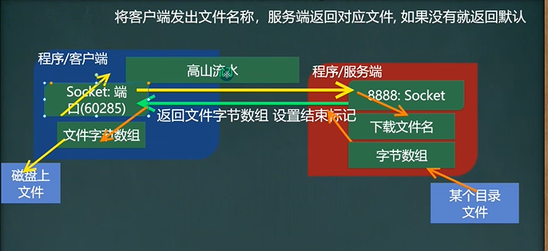

```java
public class Homework01Server {
    public static void main(String[] args) throws IOException {
        //思路
        //1. 在本机 的9999端口监听, 等待连接
        //   细节: 要求在本机没有其它服务在监听9999
        //   细节：这个 ServerSocket 可以通过 accept() 返回多个Socket[多个客户端连接服务器的并发]
        ServerSocket serverSocket = new ServerSocket(9999);
        System.out.println("服务端，在9999端口监听，等待连接..");
        //2. 当没有客户端连接9999端口时，程序会 阻塞, 等待连接
        //   如果有客户端连接，则会返回Socket对象，程序继续

        Socket socket = serverSocket.accept();
        
        //3. 通过socket.getInputStream() 读取客户端写入到数据通道的数据, 显示
        InputStream inputStream = socket.getInputStream();
        //4. IO读取, 使用字符流, 老师使用 InputStreamReader 将 inputStream 转成字符流
        BufferedReader bufferedReader = new BufferedReader(new InputStreamReader(inputStream));
        String s = bufferedReader.readLine();
        String answer = "";
        if ("name".equals(s)) {
            answer = "我是韩顺平";
        } else if("hobby".equals(s)) {
            answer = "编写java程序";
        } else {
            answer = "你说的啥子";
        }
        
        //5. 获取socket相关联的输出流
        OutputStream outputStream = socket.getOutputStream();
        //    使用字符输出流的方式回复信息
        BufferedWriter bufferedWriter = new BufferedWriter(new OutputStreamWriter(outputStream));
        bufferedWriter.write(answer);
        bufferedWriter.newLine();// 插入一个换行符，表示回复内容的结束
        bufferedWriter.flush();//注意需要手动的flush
        
        //6.关闭流和socket
        bufferedWriter.close();
        bufferedReader.close();
        socket.close();
        serverSocket.close();//关闭
    }
}

public class Homework01Client {
    public static void main(String[] args) throws IOException {
        //思路
        //1. 连接服务端 (ip , 端口）
        //解读: 连接本机的 9999端口, 如果连接成功，返回Socket对象
        Socket socket = new Socket(InetAddress.getLocalHost(), 9999);

        //2. 连接上后，生成Socket, 通过socket.getOutputStream()
        //   得到 和 socket对象关联的输出流对象
        OutputStream outputStream = socket.getOutputStream();
        //3. 通过输出流，写入数据到 数据通道, 使用字符流
        BufferedWriter bufferedWriter = new BufferedWriter(new OutputStreamWriter(outputStream));

        //从键盘读取用户的问题
        Scanner scanner = new Scanner(System.in);
        System.out.println("请输入你的问题");
        String question = scanner.next();

        bufferedWriter.write(question);
        bufferedWriter.newLine();//插入一个换行符，表示写入的内容结束, 注意，要求对方使用readLine()!!!!
        bufferedWriter.flush();// 如果使用的字符流，需要手动刷新，否则数据不会写入数据通道

        //4. 获取和socket关联的输入流. 读取数据(字符)，并显示
        InputStream inputStream = socket.getInputStream();
        BufferedReader bufferedReader = new BufferedReader(new InputStreamReader(inputStream));
        String s = bufferedReader.readLine();
        System.out.println(s);

        //5. 关闭流对象和socket, 必须关闭
        bufferedReader.close();//关闭外层流
        bufferedWriter.close();
        socket.close();
        System.out.println("客户端退出.....");
    }
}
```




```java
public class Homework02ReceiverA {
    public static void main(String[] args) throws IOException {
        //1. 创建一个 DatagramSocket 对象，准备在8888接收数据
        DatagramSocket socket = new DatagramSocket(8888);
        //2. 构建一个 DatagramPacket 对象，准备接收数据
        //   在前面讲解UDP 协议时，老师说过一个数据包最大 64k
        byte[] buf = new byte[1024];
        DatagramPacket packet = new DatagramPacket(buf, buf.length);
        //3. 调用 接收方法, 将通过网络传输的 DatagramPacket 对象
        //   填充到 packet对象
        System.out.println("接收端 等待接收问题 ");
        socket.receive(packet);

        //4. 可以把packet 进行拆包，取出数据，并显示.
        int length = packet.getLength();//实际接收到的数据字节长度
        byte[] data = packet.getData();//接收到数据
        String s = new String(data, 0, length);
        //判断接收到的信息是什么
        String answer = "";
        if("四大名著是哪些".equals(s)) {
            answer = "四大名著 <<红楼梦>> <<三国演示>> <<西游记>> <<水浒传>>";
        } else {
            answer = "what?";
        }

        //===回复信息给B端
        //将需要发送的数据，封装到 DatagramPacket对象
        data = answer.getBytes();
        //说明: 封装的 DatagramPacket对象 data 内容字节数组 , data.length , 主机(IP) , 端口
        packet =
                new DatagramPacket(data, data.length, InetAddress.getByName("192.168.12.1"), 9998);

        socket.send(packet);//发送

        //5. 关闭资源
        socket.close();
        System.out.println("A端退出...");
    }
}

public class Homework02SenderB {
    public static void main(String[] args) throws IOException {

        //1.创建 DatagramSocket 对象，准备在9998端口 接收数据
        DatagramSocket socket = new DatagramSocket(9998);

        //2. 将需要发送的数据，封装到 DatagramPacket对象
        Scanner scanner = new Scanner(System.in);
        System.out.println("请输入你的问题: ");
        String question = scanner.next();
        byte[] data = question.getBytes(); //

        //说明: 封装的 DatagramPacket对象 data 内容字节数组 , data.length , 主机(IP) , 端口
        DatagramPacket packet =
                new DatagramPacket(data, data.length, InetAddress.getByName("192.168.12.1"), 8888);

        socket.send(packet);

        //3.=== 接收从A端回复的信息
        //(1)   构建一个 DatagramPacket 对象，准备接收数据
        //   在前面讲解UDP 协议时，老师说过一个数据包最大 64k
        byte[] buf = new byte[1024];
        packet = new DatagramPacket(buf, buf.length);
        //(2)    调用 接收方法, 将通过网络传输的 DatagramPacket 对象
        //   填充到 packet对象
        //老师提示: 当有数据包发送到 本机的9998端口时，就会接收到数据
        //   如果没有数据包发送到 本机的9998端口, 就会阻塞等待.
        socket.receive(packet);

        //(3)  可以把packet 进行拆包，取出数据，并显示.
        int length = packet.getLength();//实际接收到的数据字节长度
        data = packet.getData();//接收到数据
        String s = new String(data, 0, length);
        System.out.println(s);

        //关闭资源
        socket.close();
        System.out.println("B端退出");
    }
}
```






```java
public class Homework03Server {
    public static void main(String[] args) throws Exception {

        //1 监听 9999端口
        ServerSocket serverSocket = new ServerSocket(9999);
        //2.等待客户端连接
        System.out.println("服务端，在9999端口监听，等待下载文件");
        Socket socket = serverSocket.accept();
        //3.读取 客户端发送要下载的文件名
        //  这里老师使用了while读取文件名，是考虑将来客户端发送的数据较大的情况
        InputStream inputStream = socket.getInputStream();
        byte[] b = new byte[1024];
        int len = 0;
        String downLoadFileName = "";
        while ((len = inputStream.read(b)) != -1) {
            downLoadFileName += new String(b, 0 , len);
        }
        System.out.println("客户端希望下载文件名=" + downLoadFileName);

        //老师在服务器上有两个文件, 无名.mp3 高山流水.mp3
        //如果客户下载的是 高山流水 我们就返回该文件，否则一律返回 无名.mp3

        String resFileName = "";
        if("高山流水".equals(downLoadFileName)) {
            resFileName = "src\\高山流水.mp3";
        } else {
            resFileName = "src\\无名.mp3";
        }

        //4. 创建一个输入流，读取文件
        BufferedInputStream bis =
                new BufferedInputStream(new FileInputStream(resFileName));

        //5. 使用工具类StreamUtils ，读取文件到一个字节数组

        byte[] bytes = StreamUtils.streamToByteArray(bis);
        //6. 得到Socket关联的输出流
        BufferedOutputStream bos =
                new BufferedOutputStream(socket.getOutputStream());
        //7. 写入到数据通道，返回给客户端
        bos.write(bytes);
        socket.shutdownOutput();//很关键.

        //8 关闭相关的资源
        bis.close();
        inputStream.close();
        socket.close();
        serverSocket.close();
        System.out.println("服务端退出...");
    }
}

public class Homework03Client {
    public static void main(String[] args) throws Exception {

        //1. 接收用户输入，指定下载文件名
        Scanner scanner = new Scanner(System.in);
        System.out.println("请输入下载文件名");
        String downloadFileName = scanner.next();

        //2. 客户端连接服务端，准备发送
        Socket socket = new Socket(InetAddress.getLocalHost(), 9999);
        //3. 获取和Socket关联的输出流
        OutputStream outputStream = socket.getOutputStream();
        outputStream.write(downloadFileName.getBytes());
        //设置写入结束的标志
        socket.shutdownOutput();

        //4. 读取服务端返回的文件(字节数据)
        BufferedInputStream bis = new BufferedInputStream(socket.getInputStream());
        byte[] bytes = StreamUtils.streamToByteArray(bis);
        //5. 得到一个输出流，准备将 bytes 写入到磁盘文件
        //比如你下载的是 高山流水 => 下载的就是 高山流水.mp3
        //    你下载的是 韩顺平 => 下载的就是 无名.mp3  文件名 韩顺平.mp3
        String filePath = "e:\\" + downloadFileName + ".mp3";
        BufferedOutputStream bos = new BufferedOutputStream(new FileOutputStream(filePath));
        bos.write(bytes);

        //6. 关闭相关的资源
        bos.close();
        bis.close();
        outputStream.close();
        socket.close();

        System.out.println("客户端下载完毕，正确退出..");
    }
}
```

