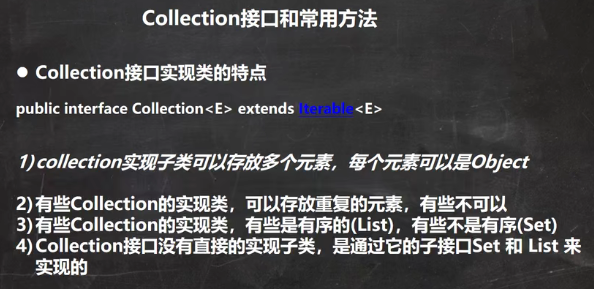 

接口本身不能直接被实例化，要以实现了接口的类ArrayList来演示。

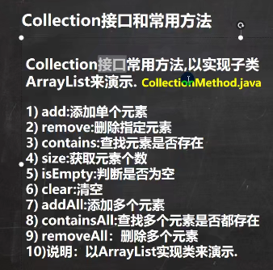 

```java
public class CollectionMethod {
    @SuppressWarnings({"all"})
    public static void main(String[] args) {
        List list = new ArrayList();

        //add:添加单个元素
        list.add("jack");//只要是Object的子类对象都可以传递进去
        list.add(10);//list.add(new Integer(10)) 先把基本数据类型自动装箱
        list.add(true);
        System.out.println("list=" + list);
        //输出：
        // list=[jack, 10, true] 里面不再是基本数据类型，而是对象

        //remove:删除指定元素
        //list.remove(0);//删除第一个元素
        list.remove(true);//指定删除某个元素
        System.out.println("list=" + list);

        //contains:查找元素是否存在
        System.out.println(list.contains("jack"));//T

        //size:获取元素个数
        System.out.println(list.size());//2

        //isEmpty:判断是否为空
        System.out.println(list.isEmpty());//F

        //clear:清空
        list.clear();
        System.out.println("list=" + list);

        //addAll:添加多个元素
        ArrayList list2 = new ArrayList();
        list2.add("红楼梦");
        list2.add("三国演义");
        list.addAll(list2);
        System.out.println("list=" + list);

        //containsAll:查找多个元素是否都存在
        System.out.println(list.containsAll(list2));//T

        //removeAll：删除多个元素
        list.add("聊斋");
        list.removeAll(list2);
        System.out.println("list=" + list);//[聊斋]
    }
}
```


只要是实现了Collection接口的类/集合(List/Set)，都可以获取到迭代器，然后用迭代器去遍历。

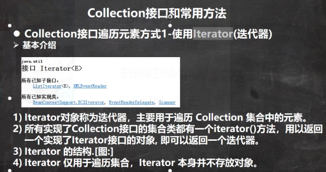 

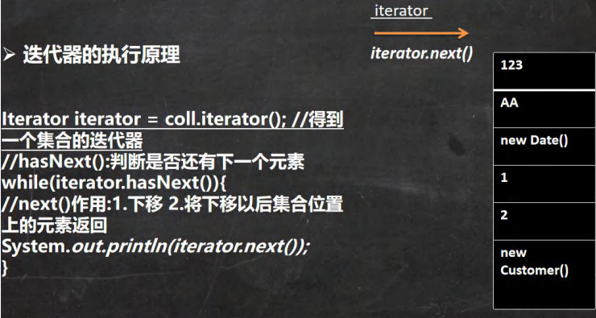 

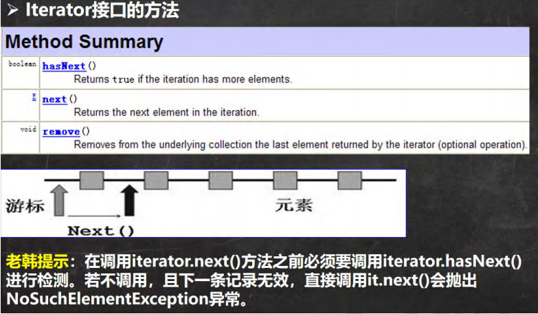 

```java
public class CollectionIterator {
    @SuppressWarnings({"all"})
    public static void main(String[] args) {

        //接口类型的引用指向实现了接口的类
        Collection col = new ArrayList();

        col.add(new Book("三国演义", "罗贯中", 10.1));
        col.add(new Book("小李飞刀", "古龙", 5.1));
        col.add(new Book("红楼梦", "曹雪芹", 34.6));
        System.out.println("col=" + col);

        //现在希望能够遍历 col集合
        //1. 先得到 col 对应的 迭代器
        Iterator iterator = col.iterator();
        //2. 使用while循环遍历
//        while (iterator.hasNext()) {//判断是否还有数据
//            //返回下一个元素，类型是Object，不管什么数据类型，认为object都能接收
//            Object obj = iterator.next();
//            System.out.println("obj=" + obj);//默认调用toString方法
//        }

        //快捷键，快速生成 while => itit
        //显示所有的快捷键的的快捷键 ctrl + j
        while (iterator.hasNext()) {
            Object obj = iterator.next();
            System.out.println("obj=" + obj);
        }
        //3. 当退出while循环后 , 这时iterator迭代器，指向最后的元素
        //iterator.next();//NoSuchElementException
        //4. 如果希望再次遍历，需要重置我们的迭代器
        iterator = col.iterator();
        System.out.println("===第二次遍历===");
        while (iterator.hasNext()) {
            Object obj = iterator.next();
            System.out.println("obj=" + obj);
        }
    }
}

class Book {
    private String name;
    private String author;
    private double price;

    public Book(String name, String author, double price) {
        this.name = name;
        this.author = author;
        this.price = price;
    }

    public String getName() {
        return name;
    }

    public void setName(String name) {
        this.name = name;
    }

    public String getAuthor() {
        return author;
    }

    public void setAuthor(String author) {
        this.author = author;
    }

    public double getPrice() {
        return price;
    }

    public void setPrice(double price) {
        this.price = price;
    }

    @Override
    public String toString() {
        return "Book{" +
                "name='" + name + '\'' +
                ", author='" + author + '\'' +
                ", price=" + price +
                '}';
    }
}
```

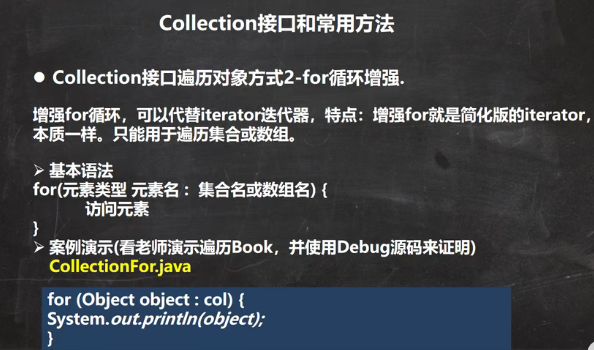 

```java
public class CollectionFor {
    @SuppressWarnings({"all"})
    public static void main(String[] args) {
        
        Collection col = new ArrayList();

        col.add(new Book("三国演义", "罗贯中", 10.1));
        col.add(new Book("小李飞刀", "古龙", 5.1));
        col.add(new Book("红楼梦", "曹雪芹", 34.6));

        //1. 使用增强for, 在Collection集合
        //2. 增强for,底层仍然是迭代器
        //3. 增强for可以理解成就是简化版本的 迭代器遍历
        //4. 快捷键方式 I
        for (Object book : col) {
            System.out.println("book=" + book);
        }
        for (Object o : col) {
            System.out.println("book=" + o);
        }
        
        //增强for，也可以直接在数组使用
        int[] nums = {1, 8, 10, 90};
        for (int i : nums) {
            System.out.println("i=" + i);
        }
    }
}
```


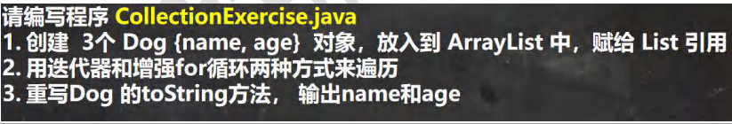 

```java
public class CollectionExercise {
    public static void main(String[] args) {
        List list = new ArrayList();
        //Collection list = new ArrayList();接口多态的传递
        list.add(new Dog("小黑", 3));
        list.add(new Dog("大黄", 100));
        list.add(new Dog("大壮", 8));
        
        //先使用for增强
        for (Object dog : list) {
            System.out.println("dog=" + dog);
        }

        //使用迭代器
        System.out.println("===使用迭代器来遍历===");
        Iterator iterator = list.iterator();
        while (iterator.hasNext()) {
            Object dog =  iterator.next();
            System.out.println("dog=" + dog);
        }
    }
}

class Dog {
    private String name;
    private int age;

    public Dog(String name, int age) {
        this.name = name;
        this.age = age;
    }

    public String getName() {
        return name;
    }

    public void setName(String name) {
        this.name = name;
    }

    public int getAge() {
        return age;
    }

    public void setAge(int age) {
        this.age = age;
    }

    @Override
    public String toString() {
        return "Dog{" +
                "name='" + name + '\'' +
                ", age=" + age +
                '}';
    }
}
```


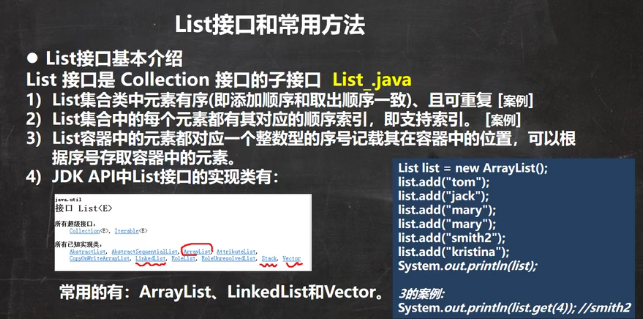 

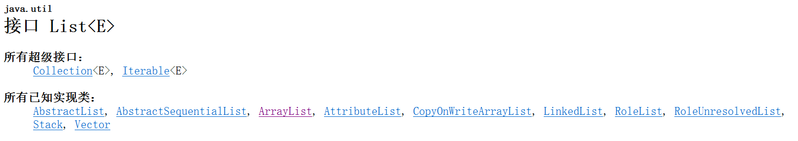 

```java
public class List_ {
    @SuppressWarnings({"all"})
    public static void main(String[] args) {
        //1. List集合类中元素有序(即添加顺序和取出顺序一致)、且可重复
        // 只要是实现了List接口的集合就有这个特点
        List list = new ArrayList();
        list.add("jack");
        list.add("tom");
        list.add("mary");
        list.add("hsp");
        list.add("tom");
        System.out.println("list=" + list);
        //2. List集合中的每个元素都有其对应的顺序索引，即支持索引
        //   索引是从0开始的
        System.out.println(list.get(3));
    }
}
```


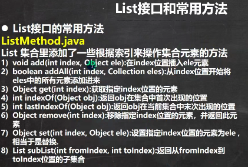 

```java
public class ListMethod {
    @SuppressWarnings({"all"})
    public static void main(String[] args) {
        List list = new ArrayList();

        list.add("张三丰");
        list.add("贾宝玉");
        //void add(int index, Object ele):在index位置插入ele元素
        //在index = 1的位置插入一个对象
        list.add(1, "czl");
        System.out.println("list=" + list);

        //boolean addAll(int index, Collection eles):从index位置开始将eles中的所有元素添加进来
        List list2 = new ArrayList();
        list2.add("jack");
        list2.add("tom");
        list.addAll(1, list2);
        System.out.println("list=" + list);

        //Object get(int index):获取指定index位置的元素

        //int indexOf(Object obj):返回obj在集合中首次出现的位置
        System.out.println(list.indexOf("tom"));//2

        //int lastIndexOf(Object obj):返回obj在当前集合中末次出现的位置
        list.add("czl");
        System.out.println("list=" + list);
        System.out.println(list.lastIndexOf("czl"));

        //Object remove(int index):移除指定index位置的元素，并返回此元素
        list.remove(0);
        System.out.println("list=" + list);
        
        //Object set(int index, Object ele):设置指定index位置的元素为ele , 相当于是替换.
        list.set(1, "玛丽");
        System.out.println("list=" + list);
        
        //List subList(int fromIndex, int toIndex):返回从fromIndex到toIndex位置的子集合
        // 注意返回的子集合 fromIndex <= subList < toIndex
        List returnlist = list.subList(0, 2);
        System.out.println("returnlist=" + returnlist);
    }
}
```


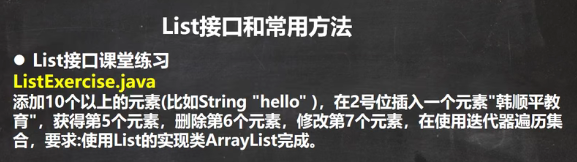 

```java
public class ListExercise {
    @SuppressWarnings({"all"})
    public static void main(String[] args) {
        List list = new ArrayList();
        for (int i = 0; i < 12; i++) {
            list.add("hello" + i);
        }
        System.out.println("list=" + list);

        //在2号位插入一个元素"韩顺平教育"
        list.add(1, "韩顺平教育");
        System.out.println("list=" + list);
        //获得第5个元素
        System.out.println("第五个元素=" + list.get(4));
        //删除第6个元素
        list.remove(5);
        System.out.println("list=" + list);
        //修改第7个元素
        list.set(6, "三国演义");
        System.out.println("list=" + list);

        //在使用迭代器遍历集合
        Iterator iterator = list.iterator();
        while (iterator.hasNext()) {
            Object obj =  iterator.next();
            System.out.println("obj=" + obj);
        }
    }
}
```


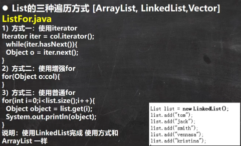 

```java
public class ListFor {
    public static void main(String[] args) {

        //List 接口的实现子类 Vector LinkedList
        //List list = new ArrayList();
        //List list = new Vector();
        List list = new LinkedList();

        list.add("jack");
        list.add("tom");
        list.add("鱼香肉丝");
        list.add("北京烤鸭子");

        //遍历
        //1. 迭代器
        Iterator iterator = list.iterator();
        while (iterator.hasNext()) {
            Object obj =  iterator.next();
            System.out.println(obj);
        }

        System.out.println("=====增强for=====");

        //2. 增强for
        for (Object o : list) {
            System.out.println("o=" + o);
        }

        System.out.println("=====普通for====");
        //3. 使用普通for
        for (int i = 0; i < list.size(); i++) {
            System.out.println("对象=" + list.get(i));
        }
    }
}
```


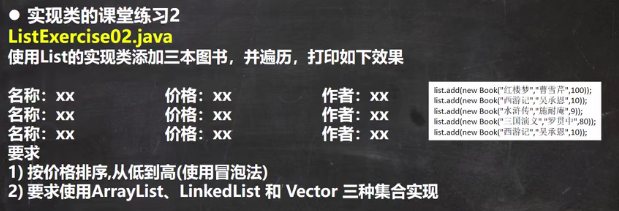 

```java
public class ListExercise02 {
    public static void main(String[] args) {

        //List list = new ArrayList();
        List list = new LinkedList();
        //List list = new Vector();

        //list.add(Object e)；
        //由于Object是任何对象的父类，所以任何的子对象都是可以被List通过add方法进行存放的
        //传进去的Book对象实例会自动向上转型成Object，
        //因此这里可以认为集合中存储的都是Object类的
        list.add(new Book("红楼梦", "曹雪芹", 100));
        list.add(new Book("西游记", "吴承恩", 10));
        list.add(new Book("水浒传", "施耐庵", 19));
        list.add(new Book("三国", "罗贯中", 80));
        //list.add(new Book("西游记", "吴承恩", 10));

        //如何对集合进行排序
        //遍历
        for (Object o : list) {
            System.out.println(o);
        }

        //冒泡排序
        sort(list);

        System.out.println("==排序后==");
        for (Object o : list) {
            System.out.println(o);
        }
    }

    //静态方法
    //价格要求是从小到大
    public static void sort(List list) {
        //用List接收实参，只要是实现了List接口的类对象都能接收
        int listSize = list.size();
        for (int i = 0; i < listSize - 1; i++) {
            for (int j = 0; j < listSize - 1 - i; j++) {
                //取出对象Book
                //向下转型，get取出来的是一个object对象
                //book1.getPrice()调用的是Book类的方法，因此需要向下转型
                Book book1 = (Book) list.get(j);
                Book book2 = (Book) list.get(j + 1);
                if (book1.getPrice() > book2.getPrice()) {//交换
                    list.set(j, book2);
                    list.set(j + 1, book1);
                }
            }
        }
    }
}
```


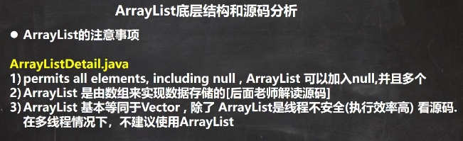 

```java
public class ArrayListDetail {
    public static void main(String[] args) {

        //ArrayList 是线程不安全的, 可以看源码 没有 synchronized
        /*
            public boolean add(E e) {
                ensureCapacityInternal(size + 1);  // Increments modCount!!
                elementData[size++] = e;
                return true;
            }
         */
        ArrayList arrayList = new ArrayList();
        arrayList.add(null);
        arrayList.add("jack");
        arrayList.add(null);
        arrayList.add("hsp");
        System.out.println(arrayList);
        //[null, jack, null, hsp]
    }
}
```


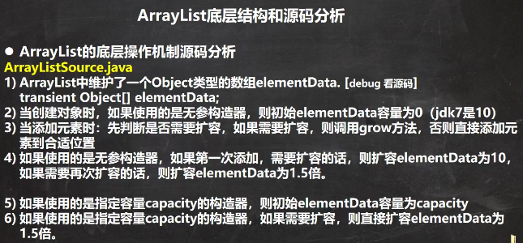 

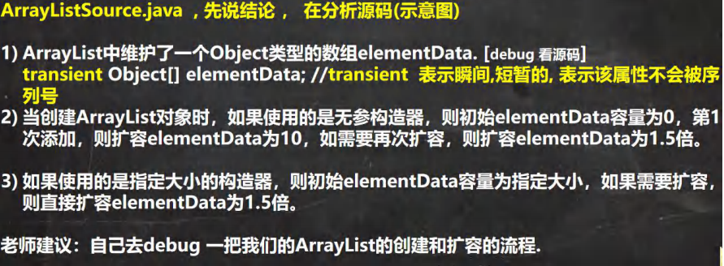 

```java
public class ArrayListSource {
    public static void main(String[] args) {
        //使用无参构造器创建ArrayList对象
        ArrayList list = new ArrayList();
        //ArrayList list = new ArrayList(8);
        //使用for给list集合添加 1-10数据
        for (int i = 1; i <= 10; i++) {
            list.add(i);
        }
        //使用for给list集合添加 11-15数据
        for (int i = 11; i <= 15; i++) {
            list.add(i);
        }
        list.add(100);
        list.add(200);
        list.add(null);
    }
}
```


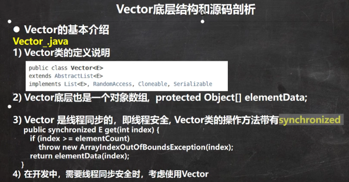 

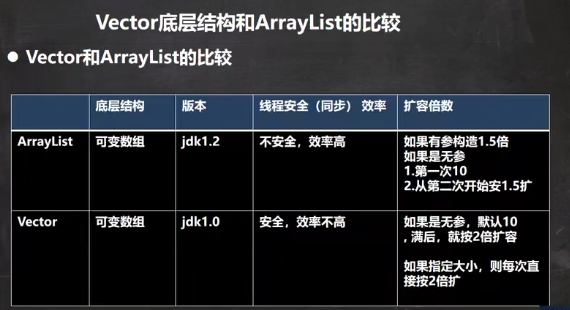 


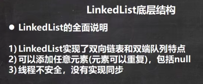 

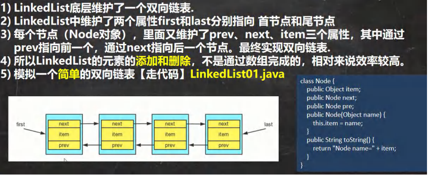 

```java
public class LinkedList01 {
    public static void main(String[] args) {
        //模拟一个简单的双向链表
        Node jack = new Node("jack");
        Node tom = new Node("tom");
        Node hsp = new Node("hsp");

        //连接三个结点，形成双向链表
        //jack -> tom -> hsp
        jack.next = tom;
        tom.next = hsp;
        //hsp -> tom -> jack
        hsp.pre = tom;
        tom.pre = jack;

        Node first = jack;//让first引用指向jack,就是双向链表的头结点
        Node last = hsp; //让last引用指向hsp,就是双向链表的尾结点


        //演示，从头到尾进行遍历
        System.out.println("===从头到尾进行遍历===");
        while (true) {
            if(first == null) {
                break;
            }
            //输出first 信息
            System.out.println(first);
            first = first.next;
        }

        //演示，从尾到头的遍历
        System.out.println("====从尾到头的遍历====");
        while (true) {
            if(last == null) {
                break;
            }
            //输出last 信息
            System.out.println(last);
            last = last.pre;
        }

        //演示链表的添加对象/数据，是多么的方便
        //要求，是在 tom --------- 老韩之间，插入一个对象 smith

        //1. 先创建一个 Node 结点，name 就是 smith
        Node smith = new Node("smith");
        //下面就把 smith 加入到双向链表了
        smith.next = hsp;
        smith.pre = tom;
        hsp.pre = smith;
        tom.next = smith;

        //让first 再次指向jack
        first = jack;//让first引用指向jack,就是双向链表的头结点

        System.out.println("===从头到尾进行遍历===");
        while (true) {
            if(first == null) {
                break;
            }
            //输出first 信息
            System.out.println(first);
            first = first.next;
        }

        last = hsp; //让last 重新指向最后一个结点
        //演示，从尾到头的遍历
        System.out.println("====从尾到头的遍历====");
        while (true) {
            if(last == null) {
                break;
            }
            //输出last 信息
            System.out.println(last);
            last = last.pre;
        }
    }
}

//定义一个Node 类，Node 对象 表示双向链表的一个结点
class Node {
    public Object item; //真正存放数据
    public Node next; //指向后一个结点
    public Node pre; //指向前一个结点
    public Node(Object name) {
        this.item = name;
    }
    public String toString() {
        return "Node name=" + item;
    }
}
```


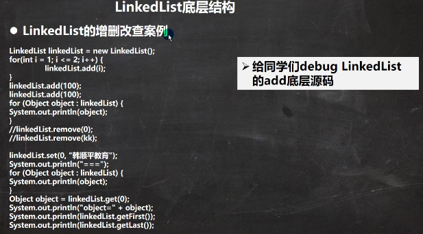 

```java
public class LinkedListCRUD {
    public static void main(String[] args) {

        LinkedList linkedList = new LinkedList();
        linkedList.add(1);
        linkedList.add(2);
        linkedList.add(3);
        System.out.println("linkedList=" + linkedList);

        //演示一个删除结点的
        linkedList.remove(); // 这里默认删除的是第一个结点
        //linkedList.remove(2);

        System.out.println("linkedList=" + linkedList);

        //修改某个结点对象
        linkedList.set(1, 999);
        System.out.println("linkedList=" + linkedList);

        //得到某个结点对象
        //get(1) 是得到双向链表的第二个对象
        Object o = linkedList.get(1);
        System.out.println(o);//999

        //因为LinkedList 是 实现了List接口, 遍历方式
        System.out.println("===LinkedList遍历迭代器====");
        Iterator iterator = linkedList.iterator();
        while (iterator.hasNext()) {
            Object next =  iterator.next();
            System.out.println("next=" + next);
        }
        System.out.println("===LinkedList遍历增强for====");
        for (Object o1 : linkedList) {
            System.out.println("o1=" + o1);
        }
        System.out.println("===LinkedList遍历普通for====");
        for (int i = 0; i < linkedList.size(); i++) {
            System.out.println(linkedList.get(i));
        }
    }
}
```


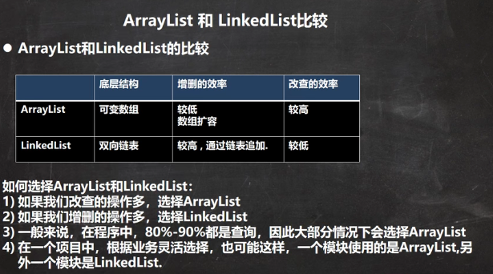 


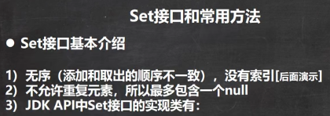 

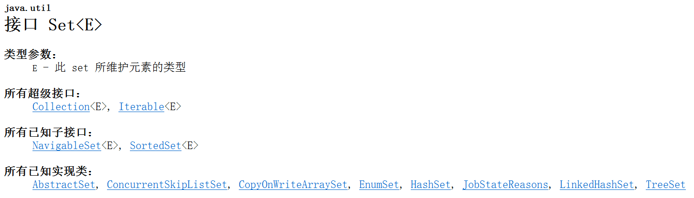 

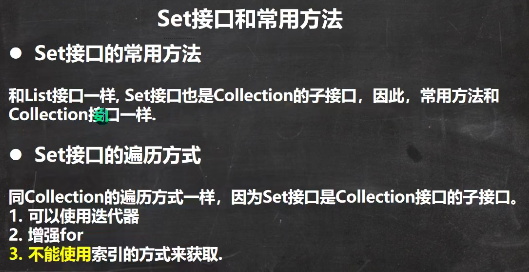 

```java
public class SetMethod {
    public static void main(String[] args) {
        //1. 以Set 接口的实现类 HashSet 来讲解Set 接口的方法
        //2. Set 接口的实现类的对象(Set接口对象), 不能存放重复的元素, 可以添加一个null
        //3. Set 接口对象存放数据是无序(即添加的顺序和取出的顺序不一致)
        //4. 注意：取出的顺序的顺序虽然不是添加的顺序，但是他的固定.
        Set set = new HashSet();
        set.add("john");
        set.add("lucy");
        set.add("john");//重复
        set.add("jack");
        set.add("hsp");
        set.add("mary");
        set.add(null);//
        set.add(null);//再次添加null
        for(int i = 0; i <2;i ++) {
            System.out.println("set=" + set);
        }
        //set=[null, hsp, mary, john, lucy, jack]
        //set=[null, hsp, mary, john, lucy, jack]

        //遍历
        //方式1： 使用迭代器
        System.out.println("=====使用迭代器====");
        Iterator iterator = set.iterator();
        while (iterator.hasNext()) {
            Object obj =  iterator.next();
            System.out.println("obj=" + obj);
        }

        set.remove(null);

        //方式2: 增强for
        System.out.println("=====增强for====");
        for (Object o : set) {
            System.out.println("o=" + o);
        }

        //set 接口对象，不能通过索引来获取
    }
}
```


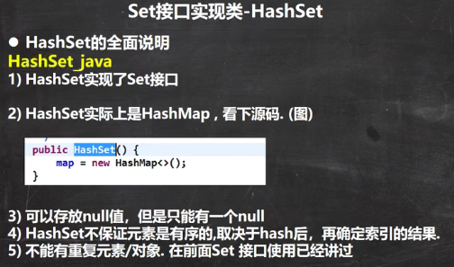 

```java
public class HashSet_ {
    public static void main(String[] args) {
        //1. 构造器走的源码
        /*
            public HashSet() {
                map = new HashMap<>();
            }
         2. HashSet 可以存放null ,但是只能有一个null,即元素不能重复
         */
        Set hashSet = new HashSet();
        hashSet.add(null);
        hashSet.add(null);
        System.out.println("hashSet=" + hashSet);
    }
}
```


HashSet案例：

```java
public class HashSet01 {
    public static void main(String[] args) {
        HashSet set = new HashSet();

        //说明
        //1. 在执行add方法后，会返回一个boolean值
        //2. 如果添加成功，返回 true, 否则返回false
        //3. 可以通过 remove 指定删除哪个对象
        System.out.println(set.add("john"));//T
        System.out.println(set.add("lucy"));//T
        System.out.println(set.add("john"));//F
        System.out.println(set.add("jack"));//T
        System.out.println(set.add("Rose"));//T

        set.remove("john");
        System.out.println("set=" + set);//set=[Rose, lucy, jack]

        set  = new HashSet();
        System.out.println("set=" + set);//set=[]
        //4 Hashset 不能添加相同的元素/数据?
        set.add("lucy");//添加成功
        set.add("lucy");//加入不了
        //这两个lucy是同一个对象，都在常量池
        set.add(new Dog("tom"));//OK
        set.add(new Dog("tom"));//Ok，此时没有重写hashCode()方法
        System.out.println("set=" + set);//set=[Dog{name='tom'}, Dog{name='tom'}, lucy]

        //再加深一下. 非常经典的面试题
        set.add(new String("hsp"));//ok
        set.add(new String("hsp"));//加入不了.
        System.out.println("set=" + set);
    }
}
class Dog { //定义了Dog类
    private String name;

    public Dog(String name) {
        this.name = name;
    }

    @Override
    public String toString() {
        return "Dog{" +
                "name='" + name + '\'' +
                '}';
    }
}
```


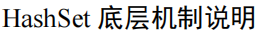 

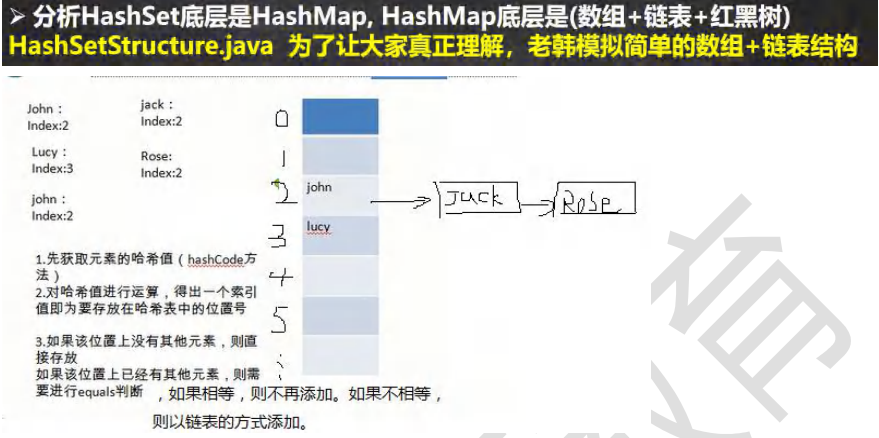 

```java
package com.czl.set_;

@SuppressWarnings({"all"})
public class HashSetStructure {
    public static void main(String[] args) {
        //模拟一个HashSet的底层 (HashMap 的底层结构)

        //1. 创建一个数组，数组的类型是 Node[]
        //2. 有些人，直接把 Node[] 数组称为 表
        Node[] table = new Node[16];

        //3. 创建结点
        Node john = new Node("john", null);

        table[2] = john;
        Node jack = new Node("jack", null);
        john.next = jack;// 将jack 结点挂载到john
        Node rose = new Node("Rose", null);
        jack.next = rose;// 将rose 结点挂载到jack

        Node lucy = new Node("lucy", null);
        table[3] = lucy; // 把lucy 放到 table表的索引为3的位置.
        System.out.println("table=" + table);
    }
}
class Node { //结点, 存储数据, 可以指向下一个结点，从而形成链表
    Object item; //存放数据
    Node next; // 指向下一个结点

    public Node(Object item, Node next) {
        this.item = item;
        this.next = next;
    }
}
```


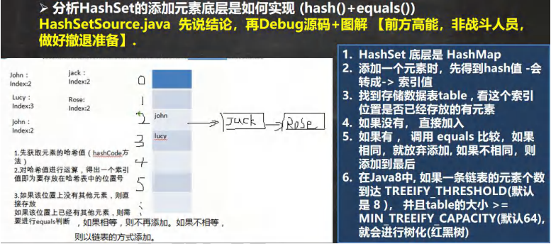 


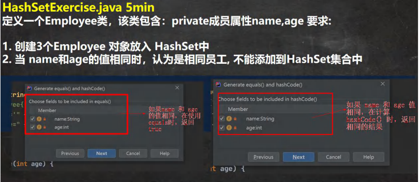 

```java
public class HashSetExercise {
    public static void main(String[] args) {
        HashSet hashSet = new HashSet();
        hashSet.add(new Employee("milan", 18));//ok，对应索引值的位置是空的
        hashSet.add(new Employee("smith", 28));//ok，名字和年龄不一样，hashCode值不一样
        hashSet.add(new Employee("milan", 18));//加入不成
        //即便hashCode值一样，如果equals比较结果为false，一样能加进去

        System.out.println("hashSet=" + hashSet);
        //hashSet=[Employee{name='smith', age=28}, Employee{name='milan', age=18}]
    }
}

//创建Employee
class Employee {
    private String name;
    private int age;

    public Employee(String name, int age) {
        this.name = name;
        this.age = age;
    }

    public String getName() {
        return name;
    }

    public void setName(String name) {
        this.name = name;
    }

    public int getAge() {
        return age;
    }

    @Override
    public String toString() {
        return "Employee{" +
                "name='" + name + '\'' +
                ", age=" + age +
                '}';
    }

    public void setAge(int age) {
        this.age = age;
    }

    @Override
    public boolean equals(Object o) {
        if (this == o) return true;
        if (o == null || getClass() != o.getClass()) return false;
        Employee employee = (Employee) o;
        return age == employee.age &&
                Objects.equals(name, employee.name);
    }

    //重写了hashCode()方法，如果name和age值相同，则返回相同的hash值
    @Override
    public int hashCode() {
        return Objects.hash(name, age);
    }
}
```


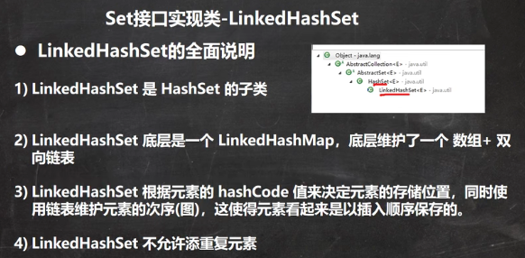 

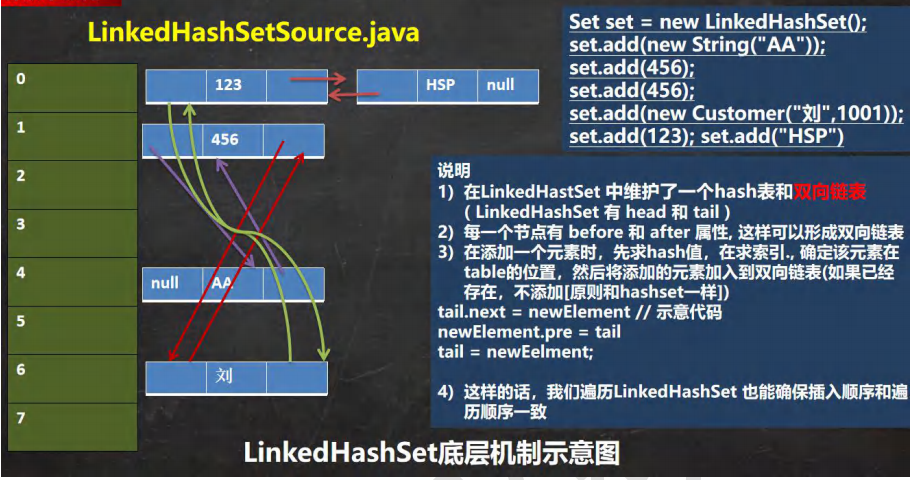 

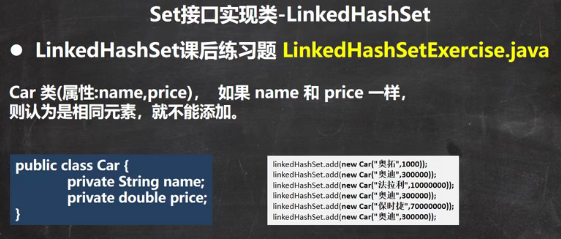 

```java
public class LinkedHashSetExercise {
    public static void main(String[] args) {

        LinkedHashSet linkedHashSet = new LinkedHashSet();
        linkedHashSet.add(new Car("奥拓", 1000));//OK
        linkedHashSet.add(new Car("奥迪", 300000));//OK
        linkedHashSet.add(new Car("法拉利", 10000000));//OK
        linkedHashSet.add(new Car("奥迪", 300000));//加入不了
        //默认情况下，这两个的hashCode值不一样，因为是两个不同的对象，所以可以添加
        linkedHashSet.add(new Car("保时捷", 70000000));//OK
        linkedHashSet.add(new Car("奥迪", 300000));//加入不了

        System.out.println("linkedHashSet=" + linkedHashSet);

    }
}

class Car {
    private String name;
    private double price;

    public Car(String name, double price) {
        this.name = name;
        this.price = price;
    }

    public String getName() {
        return name;
    }

    public void setName(String name) {
        this.name = name;
    }

    public double getPrice() {
        return price;
    }

    public void setPrice(double price) {
        this.price = price;
    }

    @Override
    public String toString() {
        return "\nCar{" +
                "name='" + name + '\'' +
                ", price=" + price +
                '}';
    }

    @Override
    public boolean equals(Object o) {
        if (this == o) return true;
        if (o == null || getClass() != o.getClass()) return false;
        Car car = (Car) o;
        return Double.compare(car.price, price) == 0 &&
                Objects.equals(name, car.name);
    }

    @Override
    public int hashCode() {
        return Objects.hash(name, price);
    }

    //重写equals 方法 和 hashCode
    //当 name 和 price 相同时， 就返回相同的 hashCode 值, equals返回t
}
```


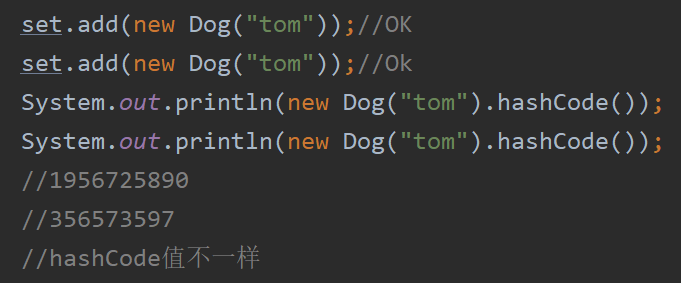 

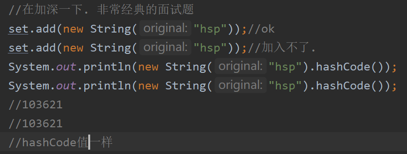 