set底层存放的也是k-v，k对应我们存放进去的对象，v用的是present常量替代，所以set存放数据只是用了k，v是用常量对象填充。
map的k和v是输进去的具体的对象。

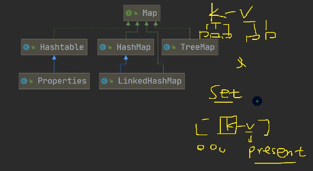 


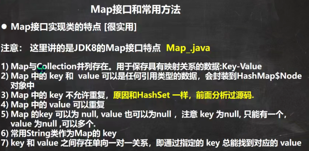 

```java
@SuppressWarnings({"all"})
public class Map_ {
    public static void main(String[] args) {
        //Map 接口实现类的特点, 使用实现类HashMap
        //1. Map与Collection并列存在。用于保存具有映射关系的数据:Key-Value(双列元素)
        //2. Map 中的 key 和  value 可以是任何引用类型的数据，会封装到HashMap$Node 对象中
        //3. Map 中的 key 不允许重复，原因和HashSet 一样，前面分析过源码.
        //4. Map 中的 value 可以重复
        //5. Map 的key 可以为 null, value 也可以为null ，注意 key 为null,
        //   只能有一个，value 为null ,可以多个
        //6. 常用String类作为Map的 key
        //7. key 和 value 之间存在单向一对一关系，即通过指定的 key 总能找到对应的 value
        Map map = new HashMap();
        //map.put(Object key,Object value);
        map.put("no1", "czl");//k-v
        map.put("no2", "张无忌");//k-v //map={no2=张无忌, no1=czl}
        map.put("no1", "张三丰");//当有相同的k , 就等价于替换. //map={no2=张无忌, no1=张三丰}
        map.put("no3", "张三丰");//k-v //map={no2=张无忌, no1=张三丰, no3=张三丰}
        map.put(null, null); //k-v //map={no2=张无忌, null=null, no1=张三丰, no3=张三丰}
        map.put(null, "abc"); //等价替换 //map={no2=张无忌, null=abc, no1=张三丰, no3=张三丰}
        map.put("no4", null); //k-v
        map.put("no5", null); //k-v //map={no2=张无忌, null=abc, no1=张三丰, no4=null, no3=张三丰, no5=null}
        map.put(1, "赵敏");//k-v //只要是Object子类都能传进去
        map.put(new Object(), "金毛狮王");//k-v
        // 通过get 方法，传入 key ,会返回对应的value
        System.out.println(map.get("no2"));//张无忌

        System.out.println("map=" + map);
    }
}
```

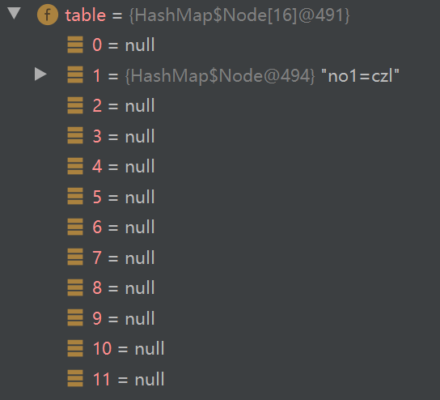 

table表是HashMap$Node类型的数组


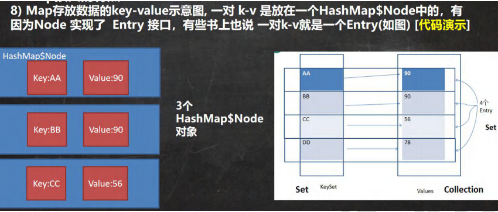 

```java
public class MapSource_ {
    public static void main(String[] args) {
        Map map = new HashMap();
        map.put("no1", "czl");//k-v
        map.put("no2", "张无忌");//k-v
        map.put(new Car(), new Person());//k-v

        //1. k-v 最后是存放 HashMap$Node node = newNode(hash, key, value, null)
        //2. k-v 为了方便程序员的遍历，还会 创建 EntrySet 集合 ，该集合存放的元素的类型 Entry, 而一个Entry
        //   对象就包含k,v 即EntrySet<Entry<K,V>> 即： transient Set<Map.Entry<K,V>> entrySet;
        //3. entrySet 中， 定义的类型是 Map.Entry ，但是实际上存放的还是 HashMap$Node
        //   这时因为 static class Node<K,V> implements Map.Entry<K,V>
        //4. 当把 HashMap$Node 对象 存放到 entrySet 就方便我们的遍历, 因为 Map.Entry 提供了重要方法
        //   K getKey(); V getValue();

        Set set = map.entrySet();
        System.out.println(set.getClass());// HashMap$EntrySet
        for (Object obj : set) {
            //System.out.println(obj.getClass()); //HashMap$Node
            //为了从 HashMap$Node 取出k-v
            //1. 先做一个向下转型
            Map.Entry entry = (Map.Entry) obj;
            System.out.println(entry.getKey() + "-" + entry.getValue() );
        }

        Set set1 = map.keySet();
        System.out.println(set1.getClass());
        Collection values = map.values();
        System.out.println(values.getClass());
    }
}

class Car {

}

class Person{

}
```


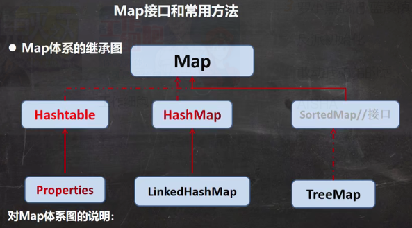 

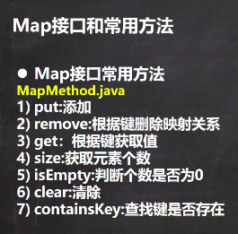 

```java
public class MapMethod {
    public static void main(String[] args) {
        //演示map接口常用方法

        Map map = new HashMap();
        map.put("邓超", new Book("", 100));//OK
        map.put("邓超", "孙俪");//替换
        map.put("王宝强", "马蓉");//OK
        map.put("宋喆", "马蓉");//OK
        map.put("刘令博", null);//OK
        map.put(null, "刘亦菲");//OK
        map.put("鹿晗", "关晓彤");//OK
        map.put("hsp", "hsp的老婆");

        System.out.println("map=" + map);

//        remove:根据键删除映射关系
        map.remove(null);
        System.out.println("map=" + map);
//        get：根据键获取值
        Object val = map.get("鹿晗");
        System.out.println("val=" + val);
//        size:获取元素个数
        System.out.println("k-v=" + map.size());
//        isEmpty:判断个数是否为0
        System.out.println(map.isEmpty());//F
//        clear:清除k-v
        //map.clear();
        System.out.println("map=" + map);
//        containsKey:查找键是否存在
        System.out.println("结果=" + map.containsKey("hsp"));//T
    }
}

class Book {
    private String name;
    private int num;

    public Book(String name, int num) {
        this.name = name;
        this.num = num;
    }
}
```


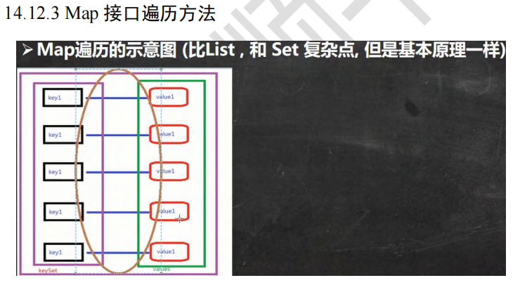 

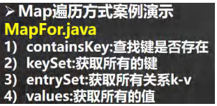 

```java
public class MapFor {
    public static void main(String[] args) {

        Map map = new HashMap();
        map.put("邓超", "孙俪");
        map.put("王宝强", "马蓉");
        map.put("宋喆", "马蓉");
        map.put("刘令博", null);
        map.put(null, "刘亦菲");
        map.put("鹿晗", "关晓彤");

        //第一组: 先取出 所有的Key , 通过Key 取出对应的Value
        Set keyset = map.keySet();
        //(1) 增强for
        System.out.println("-----第一种方式-------");
        for (Object key : keyset) {
            System.out.println(key + "-" + map.get(key));
        }
        //(2) 迭代器
        System.out.println("----第二种方式--------");
        Iterator iterator = keyset.iterator();
        while (iterator.hasNext()) {
            Object key =  iterator.next();
            System.out.println(key + "-" + map.get(key));
        }

        //第二组: 把所有的values取出
        Collection values = map.values();
        //这里可以使用所有的Collections使用的遍历方法
        //(1) 增强for
        System.out.println("---取出所有的value 增强for----");
        for (Object value : values) {
            System.out.println(value);
        }
        //(2) 迭代器
        System.out.println("---取出所有的value 迭代器----");
        Iterator iterator2 = values.iterator();
        while (iterator2.hasNext()) {
            Object value =  iterator2.next();
            System.out.println(value);

        }

        //第三组: 通过EntrySet 来获取 k-v
        Set entrySet = map.entrySet();// EntrySet<Map.Entry<K,V>>
        //(1) 增强for
        System.out.println("----使用EntrySet 的 for增强(第3种)----");
        for (Object entry : entrySet) {
            //将entry 转成 Map.Entry
            Map.Entry m = (Map.Entry) entry;
            System.out.println(m.getKey() + "-" + m.getValue());
        }
        //(2) 迭代器
        System.out.println("----使用EntrySet 的 迭代器(第4种)----");
        Iterator iterator3 = entrySet.iterator();
        while (iterator3.hasNext()) {
            Object entry =  iterator3.next();
            //System.out.println(next.getClass());//HashMap$Node -实现-> Map.Entry (getKey,getValue)
            //向下转型 Map.Entry
            Map.Entry m = (Map.Entry) entry;
            System.out.println(m.getKey() + "-" + m.getValue());
        }
    }
}
```


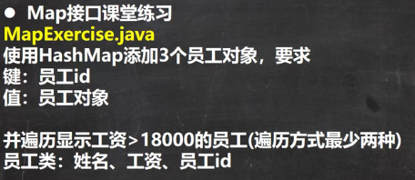 

```java
public class MapExercise {
    public static void main(String[] args) {
        //完成代码
        Map hashMap = new HashMap();
        //添加对象
        hashMap.put(1, new Emp("jack", 300000, 1));
        hashMap.put(2, new Emp("tom", 21000, 2));
        hashMap.put(3, new Emp("milan", 12000, 3));
        
        //遍历2种方式
        //并遍历显示工资>18000的员工(遍历方式最少两种)
        //1. 使用keySet  -> 增强for
        Set keySet = hashMap.keySet();
        System.out.println("====第一种遍历方式====");
        for (Object key : keySet) {
            //先获取value
            Emp emp = (Emp) hashMap.get(key);
            if(emp.getSal() >18000) {
                System.out.println(emp);
            }
        }

        //2. 使用EntrySet -> 迭代器
        Set entrySet = hashMap.entrySet();
        System.out.println("======迭代器======");
        Iterator iterator = entrySet.iterator();
        while (iterator.hasNext()) {
            Map.Entry entry =  (Map.Entry)iterator.next();
            //通过entry 取得key 和 value
            Emp emp = (Emp) entry.getValue();
            if(emp.getSal() > 18000) {
                System.out.println(emp);
            }
        }
    }
}

class Emp {
    private String name;
    private double sal;
    private int id;

    public Emp(String name, double sal, int id) {
        this.name = name;
        this.sal = sal;
        this.id = id;
    }

    public String getName() {
        return name;
    }

    public void setName(String name) {
        this.name = name;
    }

    public double getSal() {
        return sal;
    }

    public void setSal(double sal) {
        this.sal = sal;
    }

    public int getId() {
        return id;
    }

    public void setId(int id) {
        this.id = id;
    }

    @Override
    public String toString() {
        return "Emp{" +
                "name='" + name + '\'' +
                ", sal=" + sal +
                ", id=" + id +
                '}';
    }
}
```


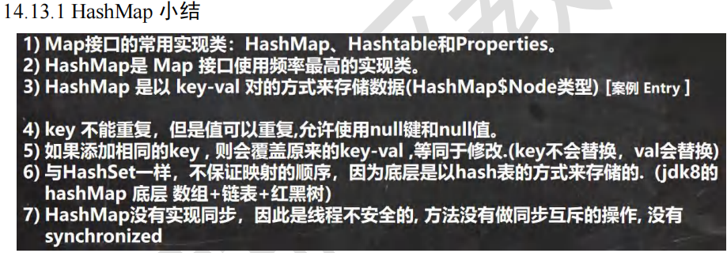 


HashMap底层机制和源码剖析

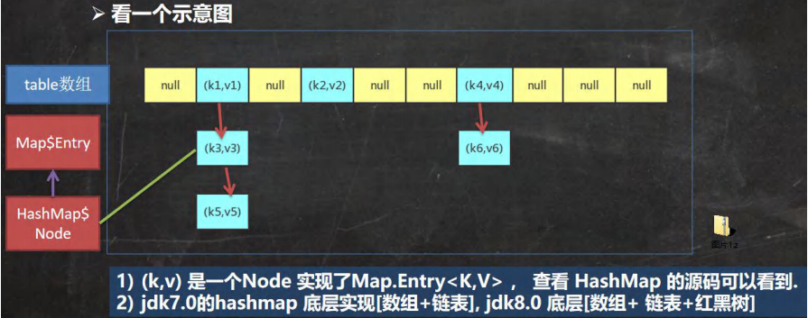 

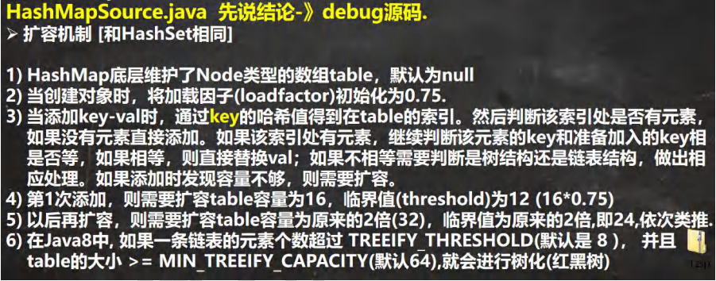


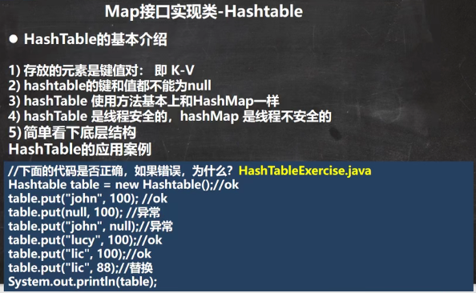 

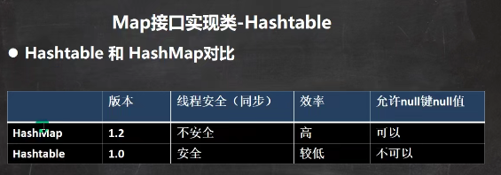 

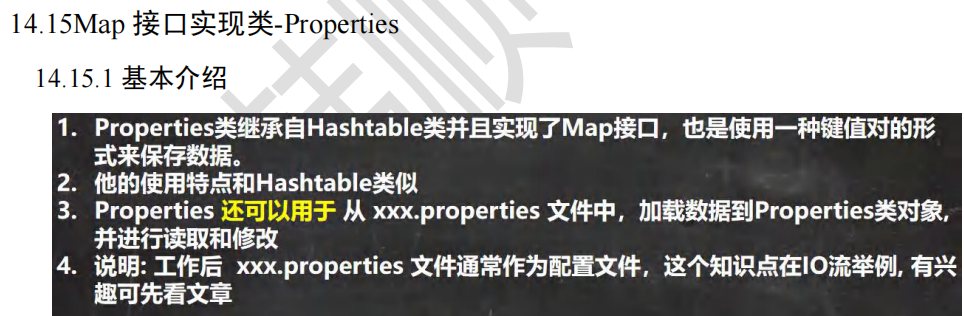 

```java
@SuppressWarnings({"all"})
public class Properties_ {
    public static void main(String[] args) {

        //1. Properties 继承  Hashtable
        //2. 可以通过 k-v 存放数据，当然key 和 value 不能为 null
        //增加
        Properties properties = new Properties();
        //properties.put(null, "abc");//抛出 空指针异常
        //properties.put("abc", null); //抛出 空指针异常
        properties.put("john", 100);//k-v
        properties.put("lucy", 100);
        properties.put("lic", 100);
        properties.put("lic", 88);//如果有相同的key ， value被替换

        System.out.println("properties=" + properties);

        //通过k 获取对应值
        System.out.println(properties.get("lic"));//88

        //删除
        properties.remove("lic");
        System.out.println("properties=" + properties);

        //修改
        properties.put("john", "约翰");
        System.out.println("properties=" + properties);
    }
}
```


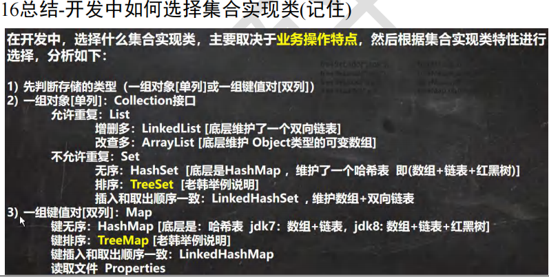 

TreeSet:

```java
public class TreeSet_ {
    public static void main(String[] args) {
        //1. 当我们使用无参构造器，创建TreeSet时，仍然是无序的
        //2. 希望添加的元素，按照字符串大小来排序
        //3. 使用TreeSet 提供的一个构造器，可以传入一个比较器(匿名内部类)
        //   并指定排序规则
        //4. 简单看看源码
        /*
        1. 构造器把传入的比较器对象，赋给了 TreeSet的底层的 TreeMap的属性this.comparator

         public TreeMap(Comparator<? super K> comparator) {
                this.comparator = comparator;
            }
         2. 在 调用 treeSet.add("tom"), 在底层会执行到

             if (cpr != null) {//cpr 就是我们的匿名内部类(对象)
                do {
                    parent = t;
                    //动态绑定到我们的匿名内部类(对象)compare
                    cmp = cpr.compare(key, t.key);
                    if (cmp < 0)
                        t = t.left;
                    else if (cmp > 0)
                        t = t.right;
                    else //如果相等，即返回0,这个Key就没有加入
                        return t.setValue(value);
                } while (t != null);
            }
         */

//        TreeSet treeSet = new TreeSet();
        TreeSet treeSet = new TreeSet(new Comparator() {
            @Override
            public int compare(Object o1, Object o2) {
                //下面 调用String的 compareTo方法进行字符串大小比较
                //如果要求加入的元素，按照长度大小排序
                //return ((String) o2).compareTo((String) o1);
                return ((String) o1).length() - ((String) o2).length();
            }
        });
        //添加数据.
        treeSet.add("jack");
        treeSet.add("tom");//3
        treeSet.add("sp");
        treeSet.add("a");
        treeSet.add("abc");//3
        //当比较的是长度大小时，abc不会被加入，
        //因为((String) o1).length() - ((String) o2).length()返回的是0
        System.out.println("treeSet=" + treeSet);
    }
}
```

TreeMap:

```java
public class TreeMap_ {
    public static void main(String[] args) {

        //使用默认的构造器，创建TreeMap, 是无序的(也没有排序)
        /*
            要求：按照传入的 k(String) 的大小进行排序
         */
//        TreeMap treeMap = new TreeMap();
        TreeMap treeMap = new TreeMap(new Comparator() {
            @Override
            public int compare(Object o1, Object o2) {
                //按照传入的 k(String) 的大小进行排序
                //按照K(String) 的长度大小排序
                //return ((String) o2).compareTo((String) o1);
                return ((String) o2).length() - ((String) o1).length();
            }
        });
        treeMap.put("jack", "杰克");
        treeMap.put("tom", "汤姆");
        treeMap.put("kristina", "克瑞斯提诺");
        treeMap.put("smith", "斯密斯");
        treeMap.put("hsp", "韩顺平");//加入不了

        System.out.println("treemap=" + treeMap);

        /*
            解读源码：
            1. 构造器. 把传入的实现了 Comparator接口的匿名内部类(对象)，传给给TreeMap的comparator
             public TreeMap(Comparator<? super K> comparator) {
                this.comparator = comparator;
            }
            2. 调用put方法
            2.1 第一次添加, 把k-v 封装到 Entry对象，放入root
            Entry<K,V> t = root;
            if (t == null) {
                compare(key, key); // type (and possibly null) check

                root = new Entry<>(key, value, null);
                size = 1;
                modCount++;
                return null;
            }
            2.2 以后添加
            Comparator<? super K> cpr = comparator;
            if (cpr != null) {
                do { //遍历所有的key , 给当前key找到适当位置
                    parent = t;
                    cmp = cpr.compare(key, t.key);//动态绑定到我们的匿名内部类的compare
                    if (cmp < 0)
                        t = t.left;
                    else if (cmp > 0)
                        t = t.right;
                    else  //如果遍历过程中，发现准备添加Key 和当前已有的Key 相等，就不添加
                        return t.setValue(value);
                } while (t != null);
            }
         */
    }
}
```

