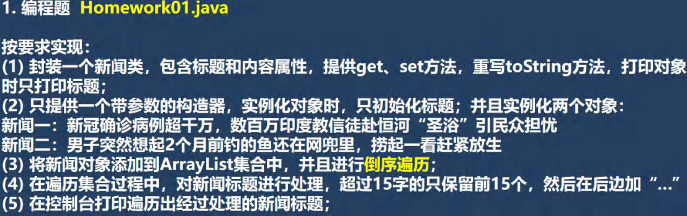
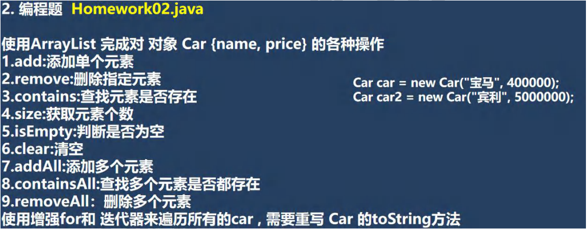
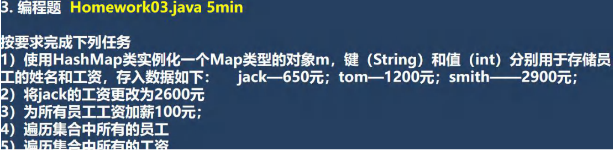
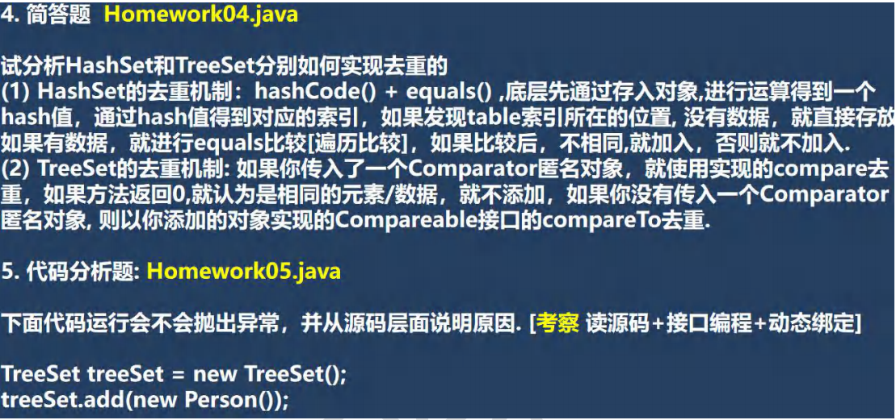
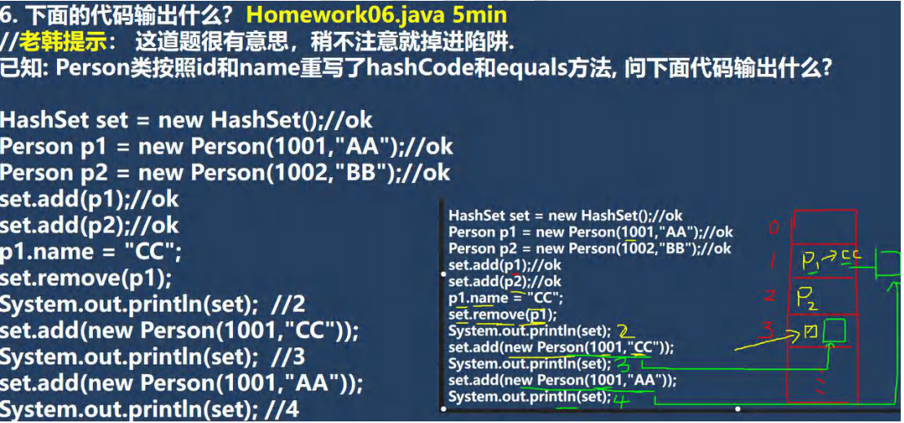
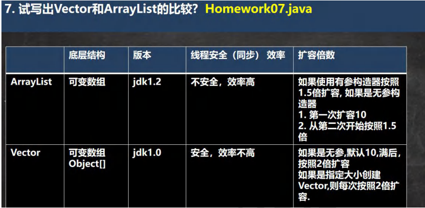

 

```java
public class Homework01 {
    public static void main(String[] args) {
        ArrayList arrayList = new ArrayList();
        arrayList.add(new News("新冠确诊病例超千万，数百万印度教信徒赴恒河\"圣浴\"引民众担忧"));
        arrayList.add(new News("男子突然想起2个月前钓的鱼还在网兜里，捞起一看赶紧放生"));

        int size = arrayList.size();
        for (int i = size - 1; i >= 0; i--) {
            //System.out.println(arrayList.get(i));
            News news = (News)arrayList.get(i);
            System.out.println(processTitle(news.getTitle()));
        }

    }
    //专门写一个方法，处理现实新闻标题 process处理
    public static String processTitle(String title) {
        if(title == null) {
            return "";
        }
        if(title.length() > 15) {
            return title.substring(0, 15) + "...";
        } else {
            return title;
        }
    }
}

class News {
    private String title;
    private String content;

    public News(String title) {
        this.title = title;
    }

    public String getTitle() {
        return title;
    }

    public void setTitle(String title) {
        this.title = title;
    }

    public String getContent() {
        return content;
    }

    public void setContent(String content) {
        this.content = content;
    }

    @Override
    public String toString() {
        return "News{" +
                "title='" + title + '\'' +
                '}';
    }
}
```


 

```java
public class Homework02 {
    public static void main(String[] args) {
        ArrayList arrayList = new ArrayList();
        Car car = new Car("宝马", 400000);
        Car car2 = new Car("宾利",5000000);
        //1.add:添加单个元素
        arrayList.add(car);
        arrayList.add(car2);
        System.out.println(arrayList);
        //* 2.remove:删除指定元素
        arrayList.remove(car);
        System.out.println(arrayList);
        //* 3.contains:查找元素是否存在
        System.out.println(arrayList.contains(car));//F
        //* 4.size:获取元素个数
        System.out.println(arrayList.size());//1
        //* 5.isEmpty:判断是否为空
        System.out.println(arrayList.isEmpty());//F
        //* 6.clear:清空
        //System.out.println(arrayList.clear(););
        //* 7.addAll:添加多个元素
        System.out.println(arrayList);
        arrayList.addAll(arrayList);//2个宾利
        System.out.println(arrayList);
        //* 8.containsAll:查找多个元素是否都存在
        arrayList.containsAll(arrayList);//T
        //* 9.removeAll：删除多个元素
        //arrayList.removeAll(arrayList); //相当于清空
        //* 使用增强for和 迭代器来遍历所有的car , 需要重写 Car 的toString方法

        for (Object o : arrayList) {
            System.out.println(o);
        }
        System.out.println("===迭代器===");
        Iterator iterator = arrayList.iterator();
        while (iterator.hasNext()) {
            Object next =  iterator.next();
            System.out.println(next);
        }
    }
}
class Car {
    private String name;
    private double price;

    public Car(String name, double price) {
        this.name = name;
        this.price = price;
    }

    public String getName() {
        return name;
    }

    public void setName(String name) {
        this.name = name;
    }

    public double getPrice() {
        return price;
    }

    public void setPrice(double price) {
        this.price = price;
    }

    @Override
    public String toString() {
        return "Car{" +
                "name='" + name + '\'' +
                ", price=" + price +
                '}';
    }
}
```


 

```java
public class Homework03 {
    public static void main(String[] args) {

        Map m = new HashMap();
        m.put("jack", 650);//int->Integer
        m.put("tom", 1200);//int->Integer
        m.put("smith", 2900);//int->Integer
        System.out.println(m);

        m.put("jack", 2600);//替换，更新
        System.out.println(m);

        //为所有员工工资加薪100元；
        //keySet
        Set keySet = m.keySet();
        for (Object key : keySet) {
            //更新
            m.put(key, (Integer)m.get(key) + 100);
        }
        System.out.println(m);

        System.out.println("=============遍历=============");
        //遍历 EntrySet
        Set entrySet = m.entrySet();
        //迭代器
        Iterator iterator = entrySet.iterator();
        while (iterator.hasNext()) {
            Map.Entry entry =  (Map.Entry)iterator.next();
            System.out.println(entry.getKey() + "-" + entry.getValue());
        }

        System.out.println("====遍历所有的工资====");
        Collection values = m.values();
        for (Object value : values) {
            System.out.println("工资=" + value);
        }
    }
}
```


 

4.(2)

```java
@SuppressWarnings({"all"})
public class Homework04 {
    public static void main(String[] args) {

        TreeSet treeSet = new TreeSet();
        treeSet.add("hsp");
        treeSet.add("tom");
        treeSet.add("king");
        treeSet.add("hsp");//加入不了，字符串的compareTo方法比较的是内容
        /*
        Comparator<? super K> cpr = comparator;
        //此时没有传匿名对象，所以comparator为空
        if (cpr != null) {
            do {
                parent = t;
                cmp = cpr.compare(key, t.key);
                if (cmp < 0)
                    t = t.left;
                else if (cmp > 0)
                    t = t.right;
                else
                    return t.setValue(value);
            } while (t != null);
        }
        else {
            if (key == null)
                throw new NullPointerException();
            @SuppressWarnings("unchecked")
                Comparable<? super K> k = (Comparable<? super K>) key;
                //把key这个对象字符串(hsp)向上转成Comparable类型，因为String实现了Comparable接口，所以能转
            do {
                parent = t;
                cmp = k.compareTo(t.key);
                //调用k字符串本身的compareTo
                //这里的compareTo方法就是传入的对象实现的Comparable接口里面的compareTo方法
                if (cmp < 0)
                    t = t.left;
                else if (cmp > 0)
                    t = t.right;
                else
                    return t.setValue(value);
            } while (t != null);
        }
         */
        System.out.println(treeSet);
    }
}
```

5.

```java
@SuppressWarnings({"all"})
public class Homework05 {
    public static void main(String[] args) {
        TreeSet treeSet = new TreeSet();
        //分析源码
        //add 方法，因为 TreeSet() 构造器没有传入Comparator接口的匿名内部类
        //所以在底层add方法最终到 Comparable<? super K> k = (Comparable<? super K>) key;
        //此时尝试着把传进来的key对象转成Comparable类型，但new Person()没有实现Comparable接口
        //即 把 Perosn转成 Comparable类型
        treeSet.add(new Person());//ClassCastException.
        treeSet.add(new Person());//ClassCastException.
        treeSet.add(new Person());//ClassCastException.
        treeSet.add(new Person());//ClassCastException.
        treeSet.add(new Person());//ClassCastException.

        System.out.println(treeSet);

    }
}

class Person implements Comparable{
    @Override
    public int compareTo(Object o) {
        return 0;
        //返回0，只能加入一个
    }
}
```


 

```java
public class Homework06 {
    public static void main(String[] args) {
        HashSet set = new HashSet();//ok
        Person p1 = new Person(1001,"AA");//ok 此时p1位置固定在1
        Person p2 = new Person(1002,"BB");//ok
        set.add(p1);//ok
        set.add(p2);//ok
        p1.name = "CC";
        set.remove(p1);
        //不能删除成功，因为删除p1时是按照当前p1的id(1001)和当前的name(CC)来计算hash值和索引值，
        // 计算完后可能已经不在1的位置，假如在3的位置，而3的位置为null
        System.out.println(set);//2
        set.add(new Person(1001,"CC"));//假设计算hash之后在3的位置
        System.out.println(set);//3
        set.add(new Person(1001,"AA"));
        //因为数据和原来的p1相同，计算hash之后肯定还在索引为1的位置，但此时p1.name="CC"
        //equals比较之后放在p1后面
        System.out.println(set);//4
    }
}

class Person {
    public String name;
    public int id;

    public Person(int id, String name) {
        this.name = name;
        this.id = id;
    }

    @Override
    public boolean equals(Object o) {
        if (this == o) return true;
        if (o == null || getClass() != o.getClass()) return false;
        Person person = (Person) o;
        return id == person.id &&
                Objects.equals(name, person.name);
    }

    @Override
    public int hashCode() {
        return Objects.hash(name, id);
    }

    
@Override
    public String toString() {
        return "Person{" +
                "name='" + name + '\'' +
                ", id=" + id +
                '}';
    }
}
```


 