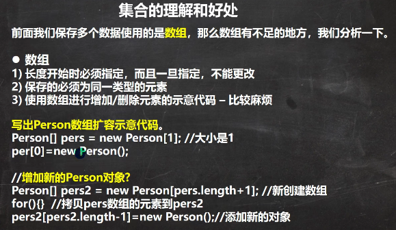
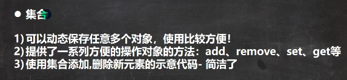
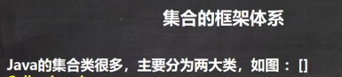
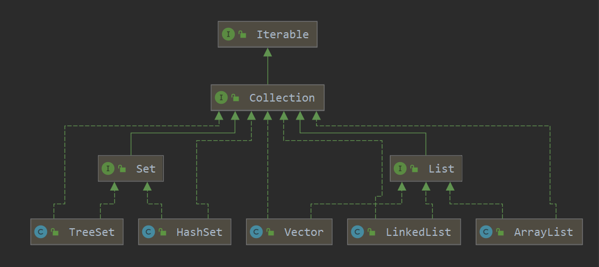
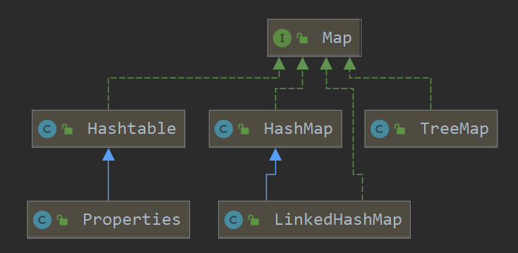

 

 

 

 

 

```java
package com.czl.collection_;

import java.util.ArrayList;
import java.util.HashMap;

public class Collection_ {
    @SuppressWarnings({"all"})
    public static void main(String[] args) {
        //1. 集合主要是两组(单列集合 , 双列集合)
        //2. Collection 接口有两个重要的子接口 List Set , 他们的实现子类都是单列集合
        //3. Map 接口的实现子类 是双列集合，存放的 K-V
        //Collection
        //Map
        ArrayList arrayList = new ArrayList();
        arrayList.add("jack");
        arrayList.add("tom");

        HashMap hashMap = new HashMap();
        hashMap.put("NO1", "北京");
        hashMap.put("NO2", "上海");
    }
}
```

