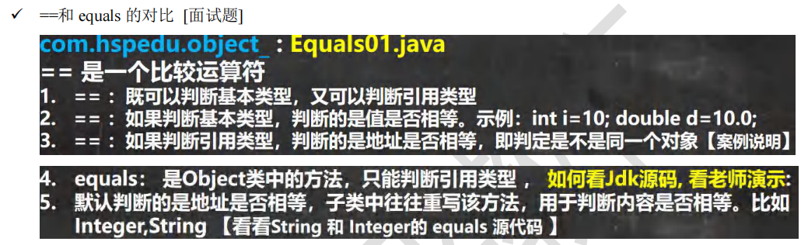
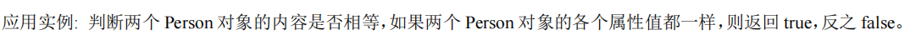
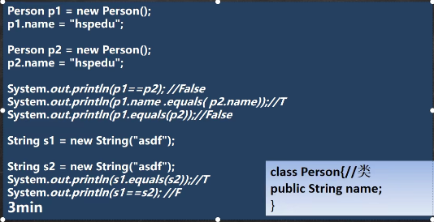
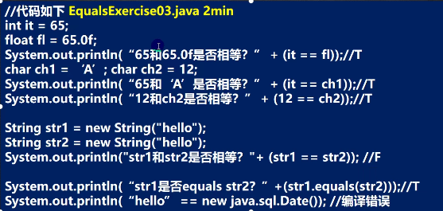
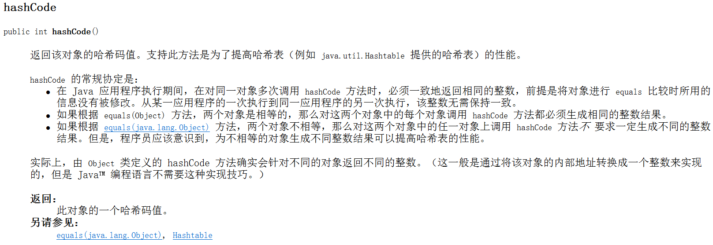
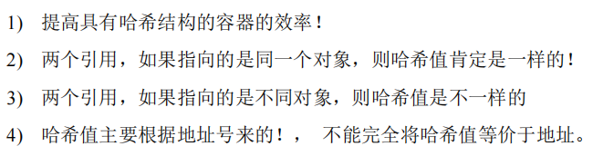
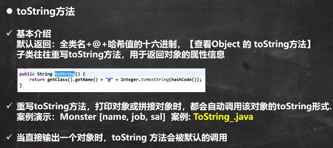
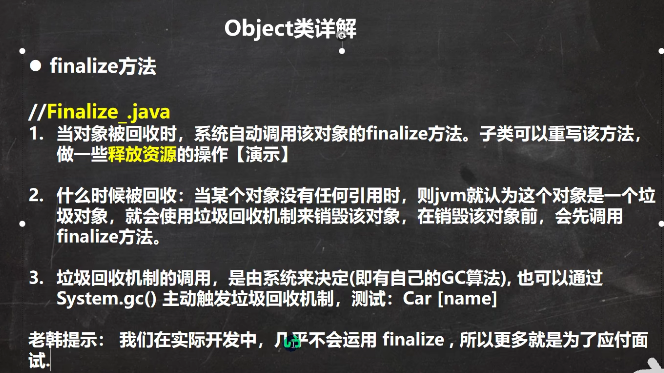

 

```java
package com.czl.object_;

public class Equals01 {
    public static void main(String[] args) {
        A a = new A();
        A b = a;
        A c = b;
        System.out.println(a == c);//true
        System.out.println(b == c);//true
        B bObj = a;//向上转型
        // 即使编译类型不一样，但都指向同一个对象空间
        System.out.println(bObj == c);//true
        int num1 = 10;
        double num2 = 10.0;
        System.out.println(num1 == num1);//true

        // equals 方法，怎么查看它的源码
        //把光标放在equals方法，Ctrl+b
        //或者在方法上 点击右键->go to -> Declaration or ...
        //"hello".equals("abc");

        /*
        //看 Object 类的 equals方法
        //判断的是 是否是同一个对象，比较的是对象地址是否相同
        public boolean equals(Object obj){
            return (this == obj);
        }
         */

        /*
        //看JDK的源码 String类的 equals方法
        //把Object的equals方法重写了，变成了比较两个字符串的值是否相等
        public boolean equals(Object anObject) {//接收的是Object类型，只要是对象就可以传进去
        if (this == anObject) {//判断是否是同一个对象，比较的是地址
            return true;
        }
        if (anObject instanceof String) {//判断anObject是否是String类型或者String子类
            String anotherString = (String)anObject;//向下转型 
            int n = value.length;
            if (n == anotherString.value.length) {//如果两个字符串长度相同
                char v1[] = value;
                char v2[] = anotherString.value;
                int i = 0;
                while (n-- != 0) {//一个个字符比较
                    if (v1[i] != v2[i])
                        return false;//有一个不相同就返回false
                    i++;
                }
                return true;//所有字符都相等
            }
        }
        return false;//不是字符串，直接返回false
    }
         */

        /*
        //也重写了Object的equals方法，变成了判断两个值是否相同
        public boolean equals(Object obj) {
            if (obj instanceof Integer) {
                return value == ((Integer)obj).intValue();
            }
            return false;
        }
        */

        Integer integer1 = new Integer(1000);
        Integer integer2 = new Integer(1000);
        System.out.println(integer1 == integer2);//false 两个不同的对象 判断地址
        System.out.println(integer1.equals(integer2));//true

        String str1 = new String("czl");
        String str2 = new String("czl");
        System.out.println(str1 == str2);//false 判断地址
        System.out.println(str1.equals(str2));//true 会到String类中找，而String类中重写了方法，所以直接调用
    }
}
class B {
}
class A extends B {
}
```


如何重写equals方法：

 

```java
package com.czl.object_;

public class EqualsExercise01 {
    public static void main(String[] args) {
        Person person1 = new Person("jack", 10, '男');
        Person person2 = new Person("jack", 10, '男');

        //重写equals前
        //Person 默认继承了Object
        //Person并没有重写equals方法，因此这里的equals方法依旧是来自父类
        //Object的equals默认比较的是地址/是否是同一对象
        //System.out.println(person1.equals(person2));//false 会先到Person类中找是否有这个方法

        System.out.println(person1.equals(person2));
    }
}
class Person {
    private String name;
    private int age;
    private char gender;

    public Person(String name, int age, char gender) {
        this.name = name;
        this.age = age;
        this.gender = gender;
    }

    public String getName() {
        return name;
    }

    public void setName(String name) {
        this.name = name;
    }

    public int getAge() {
        return age;
    }

    public void setAge(int age) {
        this.age = age;
    }

    public char getGender() {
        return gender;
    }

    public void setGender(char gender) {
        this.gender = gender;
    }
    //重写Object的equals方法
    @Override
    public boolean equals(Object obj) {
        if (this == obj) {//判断是否是同一个对象
            return true;
        }
        if (obj instanceof Person) {//运行类型判断，是否是Person类
            /*
            在主方法调用equals()方法时，会执行如下语句的功能：
            Object obj = person2;
            也就是实参赋值于形参

            实参person2传进来之后自动向上转型成Object，编译类型变成了Object

            if (obj instanceof Person)判断的是obj/person2(实参)的 运行类型是否为Person，但obj/person2的编译类型还是Object
            而调用类的成员发生在编译阶段，看编译类型，不向下转型不能调用子类特有成员
             */
            //向下转型，才能得到obj的各个属性，否则obj无法去用Person的属性
            Person p = (Person)obj;//obj的编译类型是Object
            //name是String类型，这里调用的是String的equals方法
            return this.name.equals(p.name) && this.age == p.age && this.gender == p.gender;
        }
        return false;
    }
}
```


 

 

类型不一致报错。


 

 


 

```java
package com.czl.object_;

public class ToString {
    public static void main(String[] args) {

        /*
        //Object 的 toString 方法源码
        //getClass().getName() 类的全类名(包名+类名)
        //Integer.toHexString(hashCode()) 将对象的hashCode值转为16进制字符串
        public String toString() {
        return getClass().getName() + "@" + Integer.toHexString(hashCode());
    }
         */
        Monster monster = new Monster("小妖怪", "巡山", 1000);

        //重写前
        //子类Monster没有重写方法，默认就是调用父类Object的toString方法
        //System.out.println(monster.toString() + "\nhashCode:" + monster.hashCode());
        // 输出
        // com.czl.object_.Monster@1b6d3586
        // hashCode:460141958

        //重写后
        //此时子类已经重写toString方法，monster的运行类型是Monster，所以会先从子类Monster开始
        //找toString方法
        System.out.println(monster.toString() + "\nhashCode:" + monster.hashCode());
        // 输出
        // Monster{name='小妖怪', job='巡山', sal=1000.0}
        // hashCode:460141958

        //当直接输出一个对象时，toString方法会被默认的调用
        System.out.println(monster);//默认调用monster.toString()
        //输出
        //Monster{name='小妖怪', job='巡山', sal=1000.0}
    }
}
class Monster {
    private String name;
    private String job;
    private double sal;

    public Monster(String name, String job, double sal) {
        this.name = name;
        this.job = job;
        this.sal = sal;
    }

    //重写toString方法
    //使用快捷键 alt+insert -> toString
    @Override
    public String toString() {//快捷键重写后，默认是把对象的属性值输出，也可以自定义
        return "Monster{" +
                "name='" + name + '\'' +
                ", job='" + job + '\'' +
                ", sal=" + sal +
                '}';
    }
}
```


 

```java
package com.czl.object_;

public class Finalize_ {
    public static void main(String[] args) {
        Car car = new Car("宝马");
        car = null;
        //car引用不指向Car对象了，堆里面的Car对象没有任何引用了，
        // 这个对象就变成垃圾了，垃圾回收器就会回收(销毁)对象
        //回收前，会调用该对象的finalize方法，方法中可以自定义一下业务逻辑

        System.out.println("程序退出了...");

        // 输出
        //程序退出了...
        //Car对象确实变成了垃圾，但是垃圾回收器什么时候回收对象是由系统来决定的(自己的GC算法)
        //不是一变成垃圾就立刻回收，由自己的垃圾回收算法决定

        //主动触发
        System.gc();
    }
}
class Car {
    private String name;

    public Car(String name) {
        this.name = name;
    }

    //重写finalize
    @Override
    protected void finalize() throws Throwable {
        //super.finalize();//默认调用父类的finalize方法

        //自定义
        System.out.println("我们释放了...资源...");
    }
}
```

