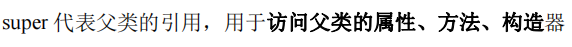
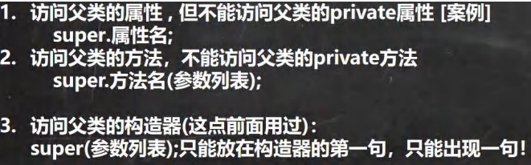
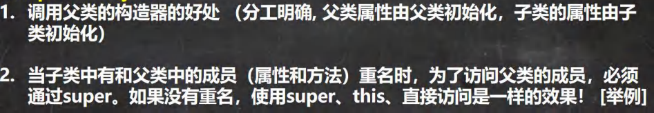
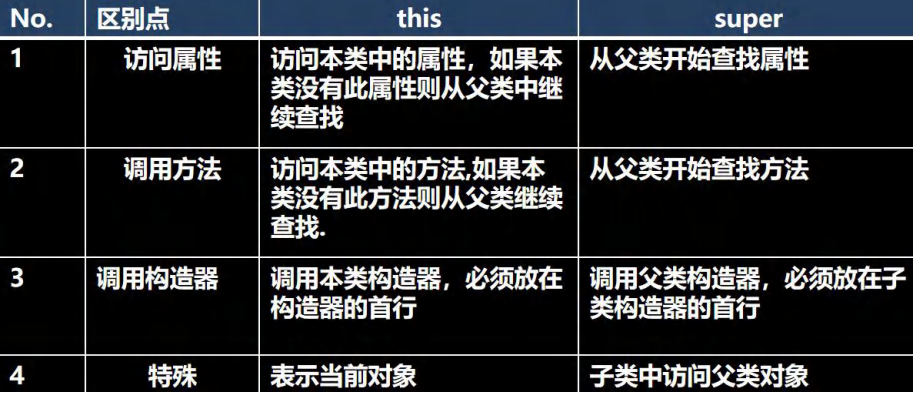

 

 

```java
package com.czl.super_;

public class Super01 {

}
class A {
    public int n1 = 100;
    protected int n2 = 200;
    int n3 = 300;
    private int n4 = 400;
    
    public A() {
    }
    public A(String name) {
    }
    public A(String name,int age) {
    }
    
    public void test100(){ }
    protected void test200(){ }
    void test300(){ }
    private void test400(){ }
}
class B extends A{
    public void test() {
        System.out.println(super.n1 + " " + super.n2 + " " + super.n3);
        super.test100();
        super.test200();
        super.test300();
    }
    //只能在构造器里面
    public B() {
        //super();
        //super("chenzhoule");
        super("chenzhoule",22);
    }
}
```


细节

 

```java
package com.czl.super_;

public class Super01 {
    public static void main(String[] args) {
        B b = new B();
        b.functionB();
    }
}
class A {
    public void functionA() {
        System.out.println("这是父类的functionA方法");
    }
    public void ok() {
        System.out.println("这是父类的ok方法");
    }
}
class B extends A{
    public void ok() {
        System.out.println("这是子类的ok方法");
    }
    public void functionB() {
        System.out.println("这是子类的方法functionB");
        //可以使用三种方式调用父类的方法
        functionA();//找functionA()方法时，先找本类，如果有且可以调用(本类都可以调用)则直接调用，如果没有则找父类，如果父类没有，则继续找父类的父类，直到object类。提示，如果查找的过程中，找到了，但是不能访问，则报错，如果查找方法的过程中，没有找到，则提示方法不存在。
        super.functionA();//直接查找父类
        this.functionA();//等价functionA()

        ok();
        this.ok();
        super.ok();
    }
}
```

 

 