notes_code\Java_Foundation(hsp)\oop_homework_middle

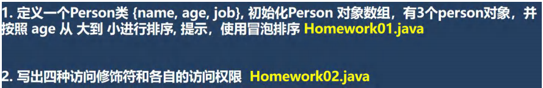 

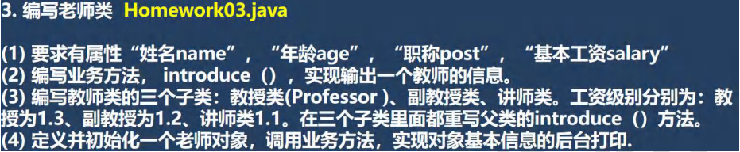 

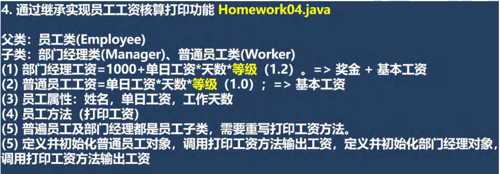 

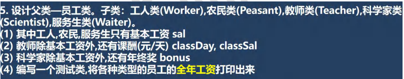 

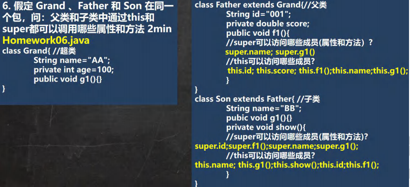 

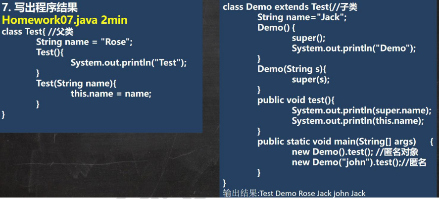 

```java
Test(String name){
          this.name = name;
}
属性没有动态绑定机制，这里的 this.name指的是父类的"Rose"，this哪里定义就在哪里用
```

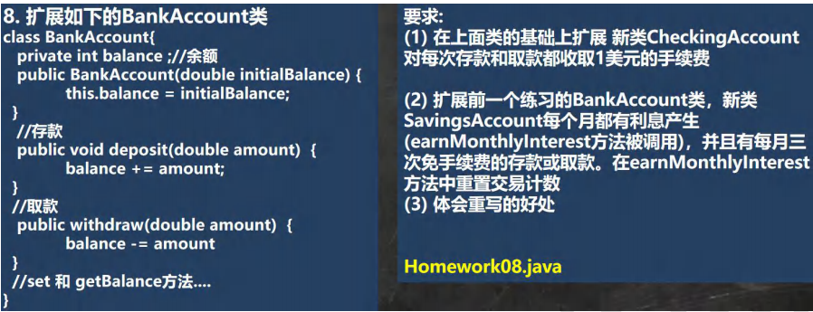 

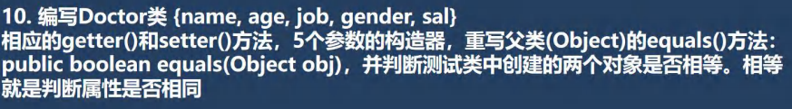 

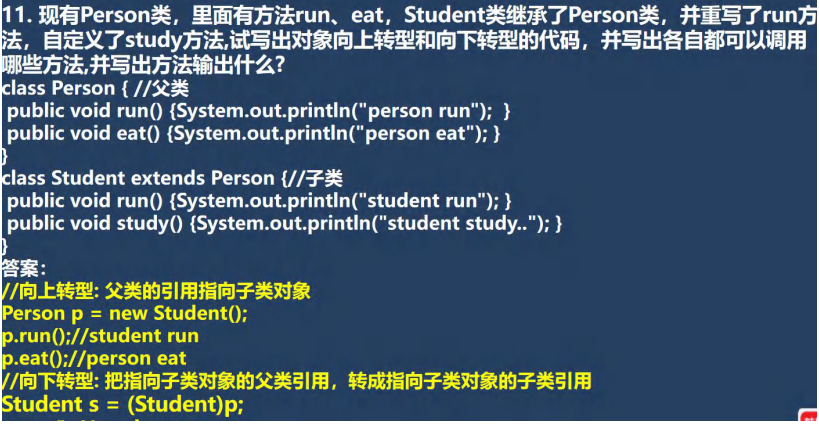 

能调用哪些方法由编译类型决定，因此p只能调用父类的方法。

到了运行阶段，看的是运行类型，先找子类有没有这个方法。

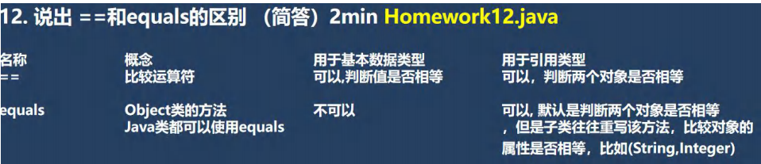 

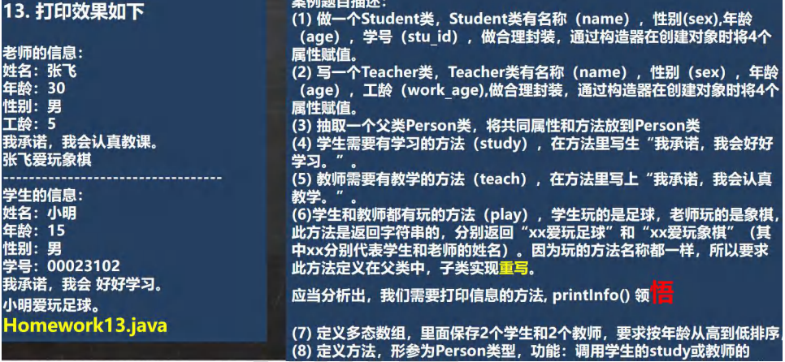 

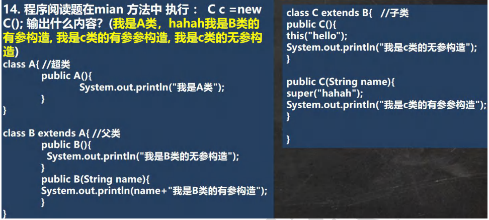 

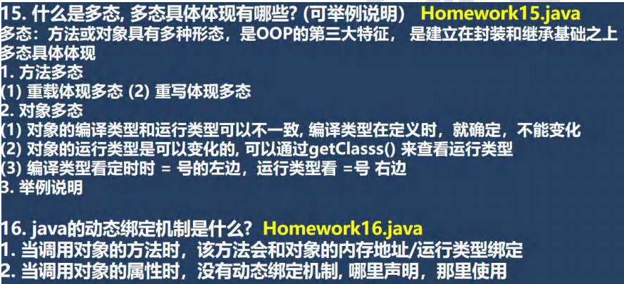 

调用方法时，会先去查找该调用者的当前运行类型里面的方法，没有就找到运行类型的父类。
如果该调用者运行类型改变，也就会变为查找新的运行类型里面的方法，没有就找父类。

```java
package com.czl.homework;

public class Homework15 {
    public static void main(String[] args) {
        AAA obj = new BBB();//向上转型
        AAA b1 = obj;
        System.out.println("obj的运行类型=" + obj.getClass());//BBB
        obj = new CCC();//向上转型
        obj.xxx();
        System.out.println("obj的运行类型=" + obj.getClass());//CCC
        obj = b1;
        obj.xxx();
        System.out.println("obj的运行类型=" + obj.getClass());//BBB
    }
}
class AAA {//超类
}
class BBB extends AAA {//父类
}
class CCC extends BBB {//子类
}
```

进入到哪个类里面去用这个属性，就用哪个。