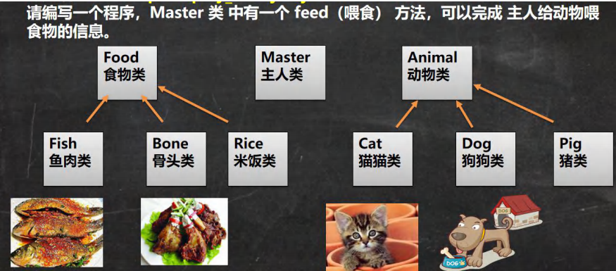 

```java
package com.czl.poly_;

public class Animal {
    private String name;

    public Animal(String name) {
        this.name = name;
    }

    public String getName() {
        return name;
    }

    public void setName(String name) {
        this.name = name;
    }
}

package com.czl.poly_;

public class Dog extends Animal {
    public Dog(String name) {
        super(name);
    }
}

package com.czl.poly_;

public class Cat extends Animal {
    public Cat(String name) {
        super(name);
    }
}

package com.czl.poly_;

public class Food {
    private String name;

    public Food(String name) {
        this.name = name;
    }

    public String getName() {
        return name;
    }

    public void setName(String name) {
        this.name = name;
    }
}

package com.czl.poly_;

public class Fish extends Food {
    public Fish(String name) {
        super(name);
    }
}

package com.czl.poly_;

public class Bone extends Food {
    public Bone(String name) {
        super(name);
    }
}

package com.czl.poly_;

public class Master {
    private String name;

    public Master(String name) {
        this.name = name;
    }

    public String getName() {
        return name;
    }

    public void setName(String name) {
        this.name = name;
    }
    //主人给小狗喂食骨头
    public void feed(Dog dog,Bone bone) {//数据类型不一样，构成方法的重载
        System.out.println("主人 " + name + " 给 " + dog.getName() + " 喂食 " + bone.getName());
    }
}

package com.czl.poly_;

public class Poly01 {
    public static void main(String[] args) {
        Dog dog = new Dog("小黄");//使用构造器进行初始化
        Bone bone = new Bone("股骨");
        Master czl = new Master("czl");
        czl.feed(dog,bone);
    }
}
```

多态的基本介绍
方法或对象具有多种状态。

多态的具体表现

1.方法的多态：方法的重写和重载就体现多态。

```java
package com.czl.poly_;

public class PolyMethod {
    public static void main(String[] args) {
        //方法重载体现多态
        A a = new A();
        //传入不同的参数，就调用不同的方法，就体现多态
        System.out.println(a.sum(10,20));
        System.out.println(a.sum(10,20,30));

        //方法的重写体现多态
        B b = new B();
        a.say();
        b.say();
    }
}
class B {
    public void say() {
        System.out.println("B say()方法被调用...");
    }
}
class A extends B {
    public int sum(int n1,int n2) {//方法重载
        return n1 + n2;
    }
    public int sum(int n1,int n2,int n3) {
        return n1 + n2 +n3;
    }
    public void say() {//方法的重写
        System.out.println("A say()被调用...");
    }
}
```


2.对象的多态

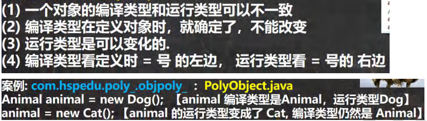 

Dog类是Animal类的子类，把一个子类对象赋给一个父类对象的引用，能够用一个父类的引用animal指向子类的一个对象。

```java
package com.czl.poly_.objectpoly;

public class Animal {
    public void cry() {
        System.out.println("Animal cry() 动物在叫...");
    }
}

package com.czl.poly_.objectpoly;

public class Dog extends Animal {
    public void cry() {
        System.out.println("Dog cry() 小狗在叫...");
    }
}

package com.czl.poly_.objectpoly;

public class Cat extends Animal {
    public void cry() {
        System.out.println("Cat cry() 小猫在叫...");
    }
}

package com.czl.poly_.objectpoly;

public class PolyObject {
    public static void main(String[] args) {
        //animal 编译类型是 Animal,运行类型是 Dog
        Animal animal = new Dog();
        animal.cry();//看运行类型 运行时，执行到该行时 Dog cry() 小狗在叫...

        //编译类型仍是 Animal，运行类型变成 Cat
        //animal对象引用 原先指向 Dog对象，现在指向 Cat对象
        //指向发生了变化，运行的时候看的是堆里面的东西。
        animal = new Cat();
        animal.cry();//Cat cry() 小猫在叫...
    }
}
```


```java
	//使用多态机制，可以统一的管理主人喂食问题
    //动物用父类来接收，父类的引用可以指向子类
    //animal 编译类型是 Animal，可以指向(接收)Animal 子类的对象(通过实参传递)
    public void feed(Animal animal,Food food) {
        System.out.println("主人 " + name + " 给 " + animal.getName() + " 喂食 " + food.getName());
    }

package com.czl.poly_;

public class Poly01 {
    public static void main(String[] args) {
        Dog dog = new Dog("小黄");
        Bone bone = new Bone("股骨");
        Master czl = new Master("czl");
        czl.feed(dog,bone);
    }
}
```


多态理解：java中多态的简单理解就是编译时和运行时类型不一致的情况，父类的引用指向子类的对象，定义的引用变量是父类型，而你创建的对象是子类型，用这个父类型的引用变量指向这个子类型的对象，然后当你调用这个对象的方法的时候，具体是调用的父类的还是子类的法只有在运行的时候才能确定，可能调用的是父类的方法也有可能调用的子类的方法，这样不用修改代码，就可以让程序选择多个运行的状态，这就是多态。


注意事项和细节

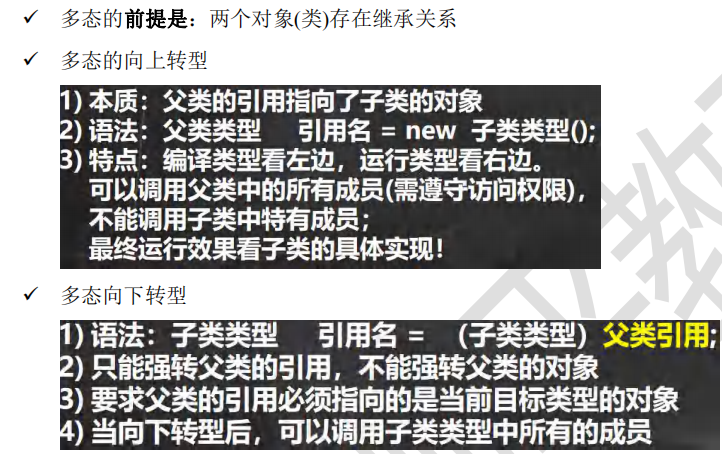 

（1）向上转型

```java
package com.czl.poly_.detail;

public class Animal {
    String name = "动物";
    int age = 10;
    public void sleep() {
        System.out.println("睡");
    }
    public void run() {
        System.out.println("跑");
    }
    public void eat() {
        System.out.println("吃");
    }
    public void show() {
        System.out.println("hello，你好");
    }
}

package com.czl.poly_.detail;

public class Cat extends Animal {
    public void eat() {//方法重写
        System.out.println("猫吃鱼");
    }
    public void catchMouse() {//Cat的特有方法
        System.out.println("猫抓老鼠");
    }
}

package com.czl.poly_.detail;

public class PolyDetail {
    public static void main(String[] args) {
        //向上转型
        Animal animal = new Cat();
        //animal.catchMouse();//错误，因为在编译阶段，能调用哪些成员由编译类型决定
                              //编译类型 Animal 里面根本没有这个方法，无法识别子类特有方法
        //到了运行阶段，看运行类型
        //运行时，按照查找关系，先在子类中找是否有这个方法，没有就找父类
        animal.eat();//猫吃鱼 Animal里面有这个函数，所以不会报错
        animal.run();//跑
        animal.sleep();//睡
        animal.show();//hello，你好
    }
}
```

（2）向下转型

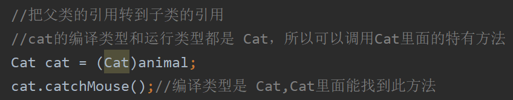

 此时animal和cat这两个引用都指向堆里面的同一个Cat对象，只是编译类型不一样(Animal和Cat)，所以能调用的方法不一样，cat能调用特有的方法。

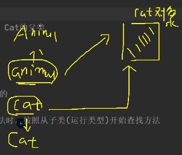 

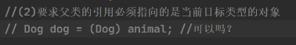 

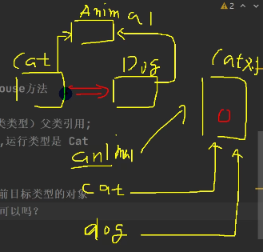  

该操作让dog引用指向Cat对象，把Cat对象强制转换成Dog类。

（3）属性没有重写之说，属性的值看编译类型

```java
package com.czl.poly_.detail;

public class PolyDetail01 {
    public static void main(String[] args) {
        Base base = new Sub();//向上转型
        System.out.println(base.count);//10,直接看编译类型
        Sub sub = new Sub();
        System.out.println(sub.count);//20
    }
}
class Base {
    int count = 10;
}
class Sub extends Base {
    int count = 20;
}
```

（4）

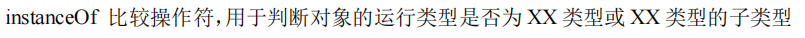 

```java
package com.czl.poly_.detail;

public class PolyDetail02 {
    public static void main(String[] args) {
        BB bb = new BB();
        System.out.println(bb instanceof BB);//true
        System.out.println(bb instanceof AA);//true
        
         //看运行类型
        AA aa = new BB();
        System.out.println(aa instanceof AA);//true
        System.out.println(aa instanceof BB);//true
    }
}
class AA {

}
class BB extends AA {

}
```


作业：

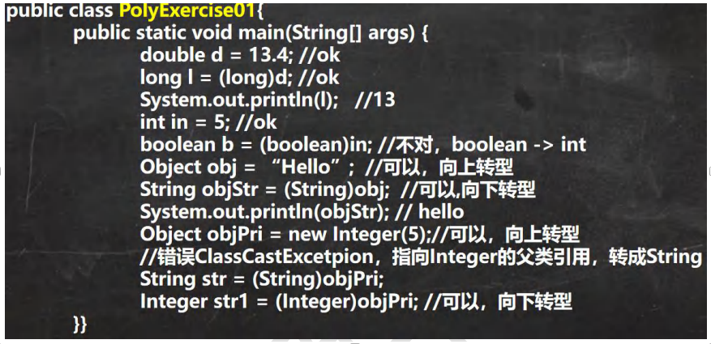 


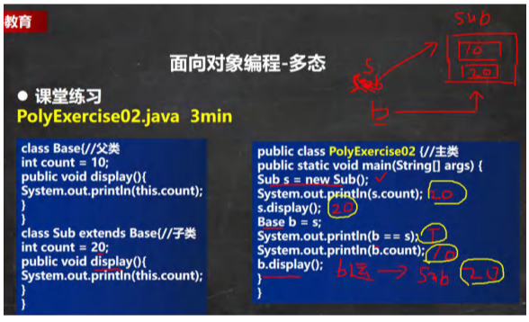 

（1）访问属性看编译类型。

（2）调用方法，看运行类型，按照方法的查找关系，先找子类。

（3）两个引用指向同一个对象。

（4）访问属性看编译类型。

（5）调用方法，看运行类型。


==Java的动态绑定机制：==

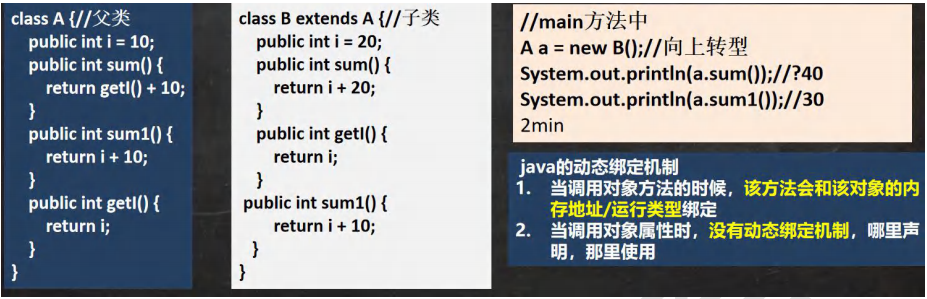 

调用方法看运行类型，按照方法的查找关系，先找子类。

```java
package com.czl.poly_.dynamic;

public class DynamicBinding {
    public static void main(String[] args) {
        A a = new B();
        //a 的编译类型 A,运行类型 B
        //调用方法，先找子类B（运行类型对应的类），子类B中找不到sum，去找父类的sum方法。
        //父类sum方法中有getI方法，子类中也有getI方法
        //根据动态绑定机制，看运行类型，此时是子类B，按照方法的查找关系，会先调用子类的getI方法
        //属性没有动态绑定机制，根据就近原则
        //当调用sum()方法和getI()方法时，和a的运行类型绑定，根据运行类型B去查找相应的类的方法，子类找不到就去找父类
        System.out.println(a.sum());//30
        System.out.println(a.sum1());//20
    }
}

class A {
    public int i = 10;
    public int sum() {
        return getI() + 10;
    }
    public int sum1() {
        return i + 10;
    }
    public int getI() {
        return i;
    }
}

class B extends A {
    public int i = 20;
//    public int sum() {
//        return i + 20;
//    }
//    public int sum1() {
//        return i + 10;
//    }
    public int getI() {
        return i;
    }
}
```


多态的应用

1.多态数组：

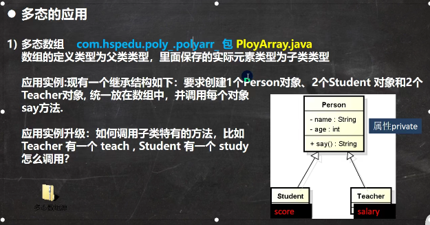 

（1）

```java
package com.czl.poly_.polyarr_;

public class Persion {
    private String name;
    private int age;

    public Persion(String name, int age) {
        this.name = name;
        this.age = age;
    }

    public String getName() {
        return name;
    }

    public void setName(String name) {
        this.name = name;
    }

    public int getAge() {
        return age;
    }

    public void setAge(int age) {
        this.age = age;
    }

    public String say() {
        return name + "\t" + age;
    }
}

package com.czl.poly_.polyarr_;

public class Student extends Persion {
    private double score;

    public Student(String name, int age, double score) {
        super(name, age);
        this.score = score;
    }

    public double getScore() {
        return score;
    }

    public void setScore(double score) {
        this.score = score;
    }

    @Override
    public String say() {
        return super.say() + "\t" + score;
    }
}

package com.czl.poly_.polyarr_;

public class Teacher extends Persion {
    private double salary;

    public Teacher(String name, int age, double salary) {
        super(name, age);
        this.salary = salary;
    }

    public double getSalary() {
        return salary;
    }

    public void setSalary(double salary) {
        this.salary = salary;
    }

    @Override
    public String say() {
        return super.say() + "\t" + salary;
    }
}

package com.czl.poly_.polyarr_;

public class PolyArray {
    public static void main(String[] args) {

        //数组类型persons为父类类型，父类的引用可以指向子类的对象
        //创建对象数组persons，Person以及Person子类对象都可以存放，用persons引用指向
        Persion[] persions = new Persion[5];
        persions[0] = new Persion("jack",20);
        persions[1] = new Student("jack",18,100);
        persions[2] = new Student("smith",19,30.1);
        persions[3] = new Teacher("scott",30,20000);
        persions[4] = new Teacher("king",50,25000);

        //循环遍历多态数组，调用say
        for (int i = 0; i < persions.length; i++) {
            //动态绑定机制，persons[i] 编译类型是 Persion,运行类型改变
            System.out.println(persions[i].say());
        }
    }
}
```

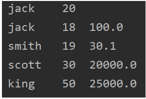 

（2）

```java
package com.czl.poly_.polyarr_;

public class Teacher extends Persion {
    private double salary;

    public Teacher(String name, int age, double salary) {
        super(name, age);
        this.salary = salary;
    }

    public double getSalary() {
        return salary;
    }

    public void setSalary(double salary) {
        this.salary = salary;
    }

    @Override
    public String say() {
        return super.say() + "\t" + salary;
    }
    
    public void teach() {
        System.out.println("老师：" + getName() + "正在讲课...");
    }
}

package com.czl.poly_.polyarr_;

public class Student extends Persion {
    private double score;

    public Student(String name, int age, double score) {
        super(name, age);
        this.score = score;
    }

    public double getScore() {
        return score;
    }

    public void setScore(double score) {
        this.score = score;
    }

    @Override
    public String say() {
        return super.say() + "\t" + score;
    }
    
    public void study() {
        System.out.println("学生：" + getName() + "正在听课...");
    }
}

package com.czl.poly_.polyarr_;

public class PolyArray {
    public static void main(String[] args) {

        //数组类型persons为父类类型，父类的引用可以指向子类的对象
        //创建对象数组persons，Person以及Person子类对象都可以存放，用persons引用指向
        Persion[] persions = new Persion[5];
        persions[0] = new Persion("jack",20);
        persions[1] = new Student("jack",18,100);
        persions[2] = new Student("smith",19,30.1);
        persions[3] = new Teacher("scott",30,20000);
        persions[4] = new Teacher("king",50,25000);

        //循环变量多态数组，调用say
        for (int i = 0; i < persions.length; i++) {
            //动态绑定机制，persons[i] 编译类型是 Persion,运行类型改变
            System.out.println(persions[i].say());

            //编译类型是 Person,里面没有这两个子类特有的方法
            //persions[i].teach();
            //persions[i].study();
            if (persions[i] instanceof Student) {//判断运行类型
                ((Student)persions[i]).study();//强制转换，向下转型
            } else if (persions[i] instanceof Teacher) {
                ((Teacher)persions[i]).teach();
            } else if (persions[i] instanceof Persion) {

            } else {
                System.out.println("类型有误!!!");
            }
        }
    }
}
```

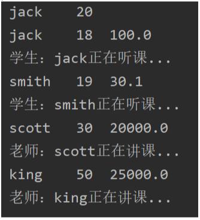 


2.多态参数：

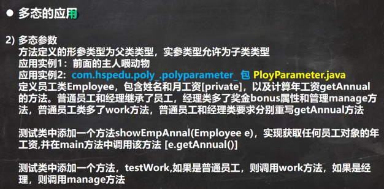 

```java
package com.czl.poly_.polyparameter;

public class Employee {
    private String name;
    private double salary;

    public Employee(String name, double salary) {
        this.name = name;
        this.salary = salary;
    }

    public String getName() {
        return name;
    }

    public void setName(String name) {
        this.name = name;
    }

    public double getSalary() {
        return salary;
    }

    public void setSalary(double salary) {
        this.salary = salary;
    }

    public double getAnnual() {
        return 12 * salary;
    }
}

package com.czl.poly_.polyparameter;

public class Worker extends Employee {
    public Worker(String name, double salary) {
        super(name, salary);
    }
    public void work() {
        System.out.println("普通员工" + getName() + "正在工作中...");
    }

    @Override
    public double getAnnual() {//不需要修改父类方法
        return super.getAnnual();
    }
}

package com.czl.poly_.polyparameter;

public class Manager extends Employee {
    private double bonus;

    public Manager(String name, double salary, double bonus) {
        super(name, salary);
        this.bonus = bonus;
    }

    public double getBonus() {
        return bonus;
    }

    public void setBonus(double bonus) {
        this.bonus = bonus;
    }
    public void manager() {
        System.out.println("经理" + getName() + "正在工作中...");
    }

    @Override
    public double getAnnual() {
        return super.getAnnual() + bonus;
    }
}

package com.czl.poly_.polyparameter;

public class PolyParameter {
    public static void main(String[] args) {
        Worker worker = new Worker("tom", 2500);
        Manager manager= new Manager("xiaochen", 5000, 20000);
        PolyParameter polyParameter = new PolyParameter();
        polyParameter.showEmpAnnual(worker);
        polyParameter.showEmpAnnual(manager);
        polyParameter.testWork(worker);
        polyParameter.testWork(manager);
    }

    public void showEmpAnnual(Employee e) {
        //动态绑定机制，传进来什么参数，就根据参数的运行类型调用不同的计算方法
        System.out.println(e.getAnnual());
    }
    public void testWork(Employee e) {
        if (e instanceof Worker) {
            ((Worker) e).work();
        } else if (e instanceof Manager) {
            ((Manager) e).manager();
        } else {
            System.out.println("错误!!!");
        }
    }
}
```

