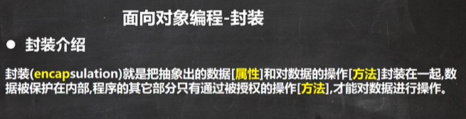
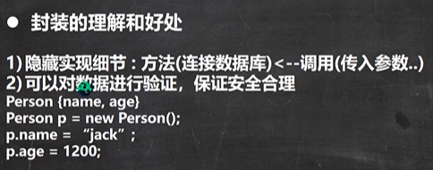
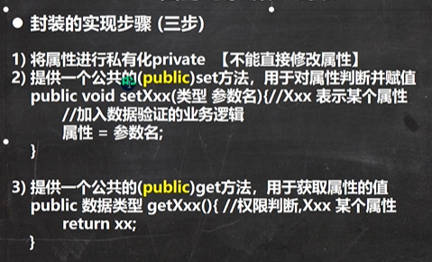
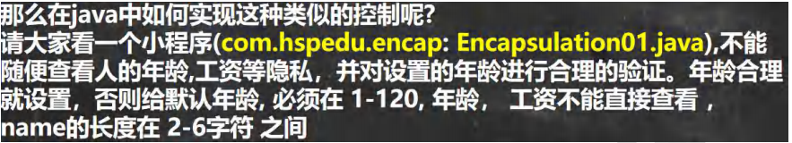
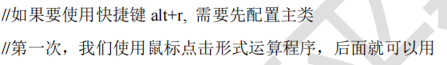

 

 

 


 

 

```java
package com.czl.encap;

public class Encapsulation01 {
    public static void main(String[] args) {
        Persion persion = new Persion();
        persion.setName("chenzhoule");
        persion.setAge(220);
        persion.setSalary(12000.0);
        System.out.println(persion.print());

        //使用构造器指定属性
        Persion chenzhoule = new Persion("chenzhoule", 2000, 3000);
        System.out.println(chenzhoule.print());
    }
}

class Persion {
    //属性
    public String name;//名字公开
    private int age;//年龄私有化
    private double salary;

    //构造器
    public Persion() {
    }
    //三个属性的构造器
    public Persion(String name, int age, double salary) {
//        this.name = name;
//        this.age = age;
//        this.salary = salary;
        //可以将set方法写在构造器中，这样仍然可以验证
        setName(name);
        setAge(age);
        setSalary(salary);
    }

    public String getName() {
        return name;
    }

    public void setName(String name) {
        //加入对名字的验证，相当于加入业务逻辑
        if (name.length() >= 2 &&name.length() <= 6) {
            this.name = name;
        } else {
            System.out.println("名字长度不对（2-6）");
        }
    }

    public int getAge() {
        return age;
    }

    public void setAge(int age) {
        if (age >= 1 && age <= 120) {
            this.age = age;
        } else {
            System.out.println("年龄需要在1-120!!!\n设置默认年龄为18!!!");
            this.age = 18;//给一个默认年龄
        }
    }

    public double getSalary() {
        //这里可以增加对当前对象的权限判断
        return salary;
    }

    public void setSalary(double salary) {
        this.salary = salary;
    }

    //返回对象信息
    public String print() {
        return "信息为 name=" + name + "\tage=" + age + "\tsalary=" + salary;
    }
}
```

