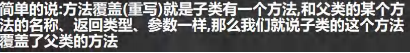
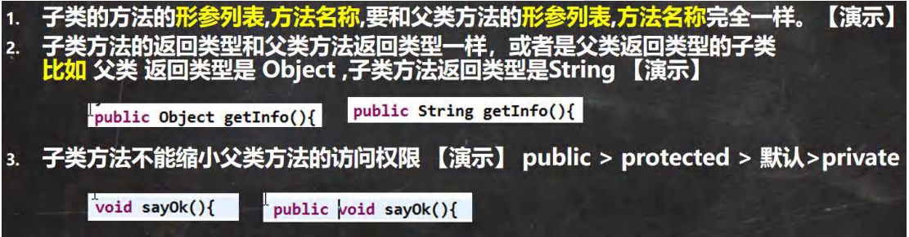
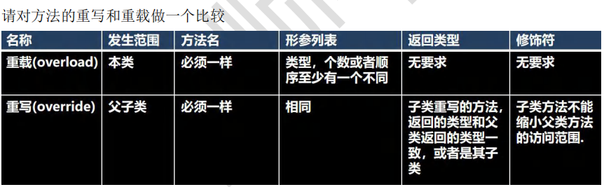
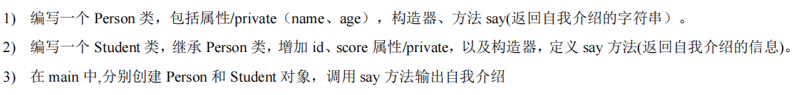
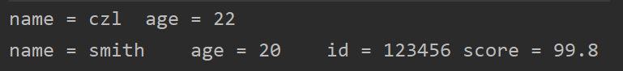

 

```java
package com.czl.override;

public class Override01 {
    public static void main(String[] args) {
        Dog dog = new Dog();
        dog.cry();//小狗叫唤...
    }
}
class Animal {
    public void cry() {
        System.out.println("动物叫唤...");
    }
}
class Dog extends Animal {
    //子类的cry方法，重写了父类的cry方法
    public void cry() {
        System.out.println("小狗叫唤...");
    }
}
```


注意事项

 

```java
2.
class Animal {
    public AAA cry(){
        return null;
    }
}
class Dog extends Animal {
    //public AAA cry(){
    public BBB cry() {
        return null;
    }
}
class AAA {
}
class BBB extends AAA {
}
```





 ```java
 package com.czl.override;
 
 public class OverrideExercise {
     public static void main(String[] args) {
         Persion persion = new Persion("czl", 22);
         System.out.println(persion.say());
         Student student = new Student("smith", 20, 123456, 99.8);
         System.out.println(student.say());
     }
 }
 class Persion {
     private String name;
     private int age;
     public Persion(String name, int age) {
         this.name = name;
         this.age = age;
     }
     public String say() {
         return "name = " + name + "\tage = " + age;
     }
 }
 class Student extends Persion {
     private int id;
     private double score;
 
     public Student(String name, int age, int id, double score) {
         super(name, age);//调用父类构造器
         this.id = id;
         this.score = score;
     }
     public String say() {
         //super的代码复用
         return super.say() + "\tid = " + id + "\tscore = " + score;
     }
 }
 ```

 