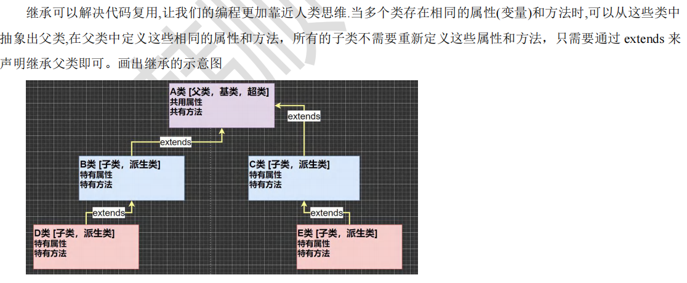 

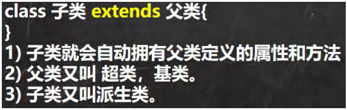 


```java
//快速入门：
package com.czl.extend_;

//父类，是 Pupil 和 Graduate 的父类
public class Student {
    //共有属性
    public String name;
    public int age;
    private double score;

    //共有方法
    public void setScore(double score) {
        this.score = score;
    }
    public void showInfo() {
        System.out.println("name = " + name + " age = " + age + " score" + score);
    }
}

package com.czl.extend_;

//让 Pupil 继承
public class Pupil extends Student {
    //特有的属性和方法
    public void testing() {
        System.out.println("小学生" + name + "正在考数学..");
    }
}

package com.czl.extend_;

//让  Graduate 继承
public class Graduate extends Student{
    //特有方法
    public void testing() {
        System.out.println("大学生" + name + "正在考数学..");
    }
}

package com.czl.extend_;

public class TestExtends {
    public static void main(String[] args) {
        Pupil pupil = new Pupil();
        pupil.name = "小米";
        pupil.age = 10;
        pupil.testing();
        pupil.setScore(60);
        pupil.showInfo();

        System.out.println("========");
        Graduate graduate = new Graduate();
        graduate.name = "大米";
        graduate.age = 22;
        graduate.testing();
        graduate.setScore(100);
        graduate.showInfo();
    }
}
```


细节1：

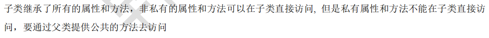 

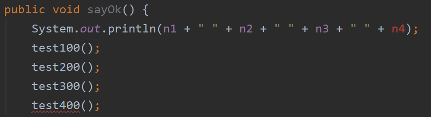

 ```java
 package com.czl.extend_;
 
 public class Base {//父类
      public int n1 = 100;
      protected int n2 = 200;
      int n3 = 300;
      private int n4 = 400;
      public Base() {//无参构造器 
          System.out.println("Base()...");
      }
 
      //在父类提供一个public方法，访问私有属性,返回n4
     public int getN4() {
          return n4;
     }
 
     public void test100() {
         System.out.println("test100");
     }
     protected void test200() {
         System.out.println("test200");
     }
     void test300() {
         System.out.println("test300");
     }
     private void test400() {
         System.out.println("test400");
     }
     //通过父类提供公共方法，调用私有方法
     public void callTest400() {
          test400();
     }
 }
 
 package com.czl.extend_;
 
 public class Sub extends Base{//子类
     public Sub() {//子类构造器
         System.out.println("sub()...");
     }
     public void sayOk() {
         System.out.println(n1 + " " + n2 + " " + n3 + " ");
         test100();
         test200();
         test300();
         //通过父类提供的方法访问私有属性n4
         System.out.println("n4 = " + getN4());
         //通过父类提供的方法间接调用私有方法test400()
         callTest400();
     }
 }
 
 package com.czl.extend_;
 
 public class ExtendsDetail {
     public static void main(String[] args) {
         Sub sub = new Sub();
         sub.sayOk();
     }
 }
 ```


细节2：

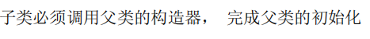 

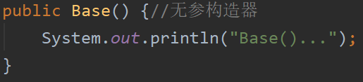 

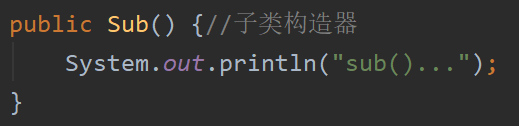 

```java
super();
System.out.println("sub()"…);
```

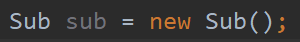 

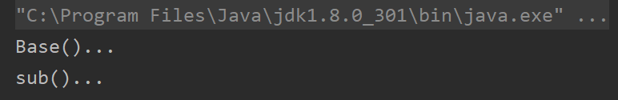

 创建子类对象 sub 时，调用了子类无参构造器，也调用了父类无参构造器，这里面隐藏了super();默认调用父类的无参构造器。


细节3：

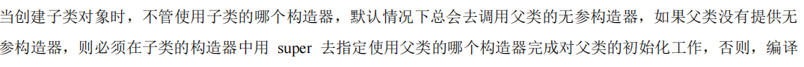

 编译不通过。

（1）

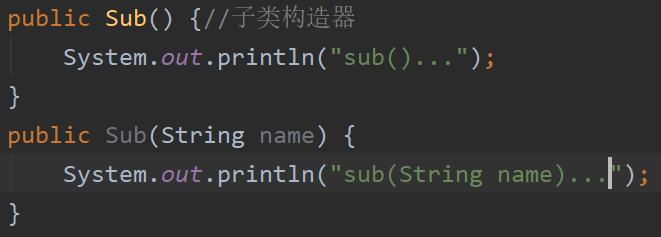 

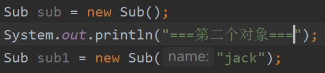 

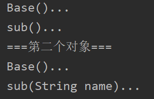 

（2）

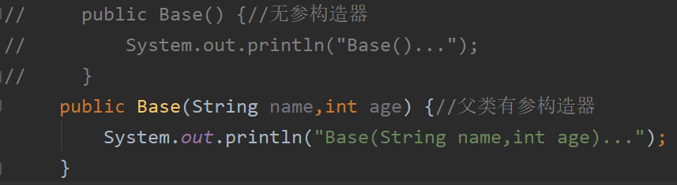 

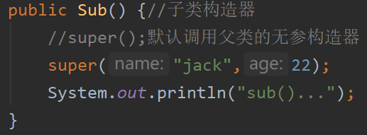 


细节4：

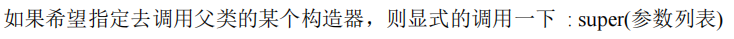 

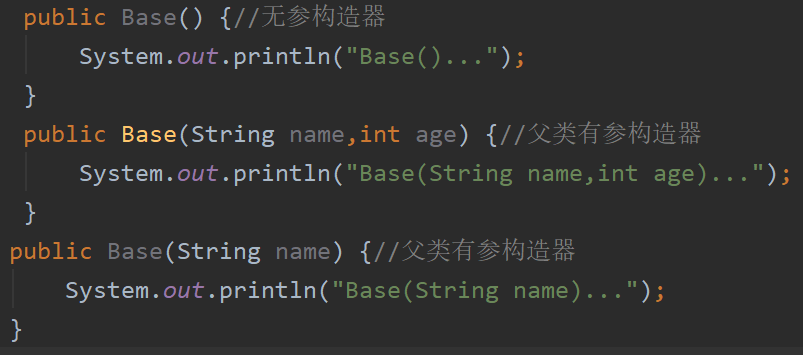 

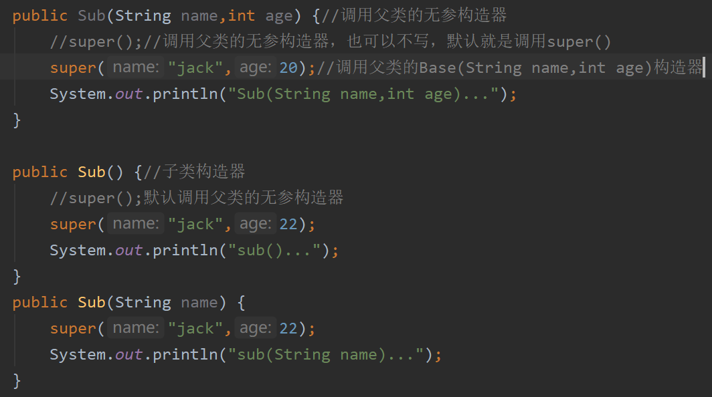

 想用父类的哪个构造器，就指定哪一个。


==先匹配子类构造器，再根据对应的子类构造器匹配父类构造器。==

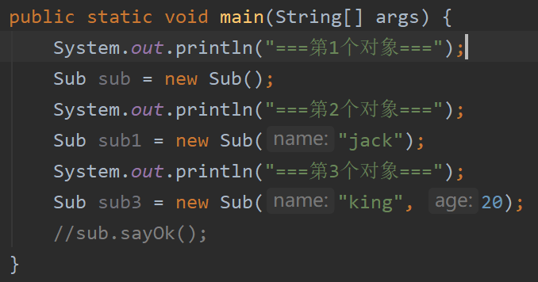 

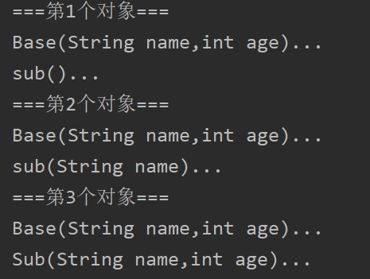 


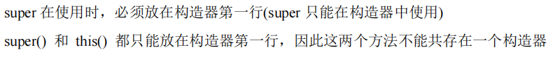 

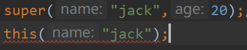 


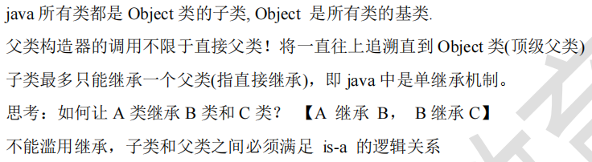 

 


继承的本质分析

 

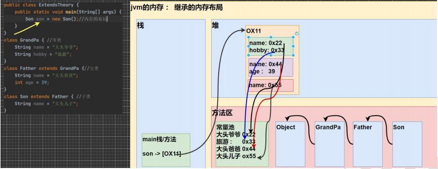

 加载Son的类信息，要查找Son的父类，先加载的是父类信息，因为父类还有父类，所以最先加载Object类信息，再加载GrandPa，再到Father，最后Son，在方法区形成类和类的继承关系。

在堆中分配地址空间给son，首先给爷爷类分配属性。再给父类分配属性，再开一个独立的空间，这个空间的属性存放的是父类的属性，两个name并不冲突。

堆的数据分配好，地址返回给son，对象引用，整个堆还是Son对象。

```java
package com.czl.extend_;

//继承本质
public class ExtendsTheory {
    public static void main(String[] args) {
        Son son = new Son();//内存的布局
        /*按查找关系来返回信息
        1.看子类是否有该属性
        2.如果子类有该属性，并且可以访问，则返回信息
        3.如果子类没有这个属性，就向上找父类有没有这
          个属性，如果有并且可以访问，就返回信息
        4.如果父类没有这个属性，就返回第三步继续找父类的父类
          直到object
         */
        System.out.println(son.name);//同一个包下，可以访问，返回 大头儿子
        System.out.println(son.age);//40
        System.out.println(son.hobby);//旅游
    }
}

class GrandPa {//爷爷类
    String name = "大头爷爷";
    String hobby = "旅游";
}
class Father extends GrandPa {//父类
    String name = "大头爸爸";
    int age = 40;
}
class Son extends Father {//子类
    String name = "大头儿子";
}
```

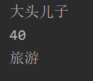 


不能访问时

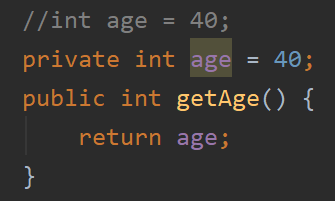 

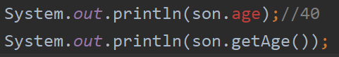 

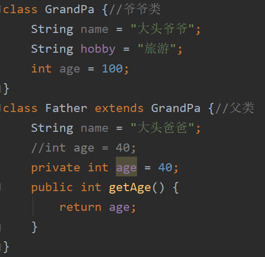 

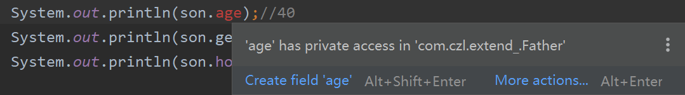

 在父类已经找到age了，发现是私有的，直接报错了，而不会跳过父类，查找爷爷类。


练习1：

```java
package com.czl.extend_.exercise;

public class ExtendsExercise01 {
    public static void main(String[] args) {
        B b = new B();
    }
}
class A {
    A() {
        System.out.println("a");
    }
    A(String name) {
        System.out.println("a name");
    }
}
class B extends A {
    B() {
        this("abc");
        System.out.println("b");
    }
    B(String name) {
        System.out.println("b name");
    }
}
```

输出：

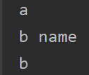 

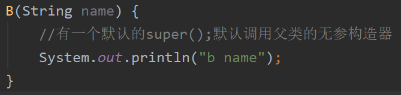 

 B(String name)里面有super，而B()里面没有super，所以B()不会调用父类的无参构造器。


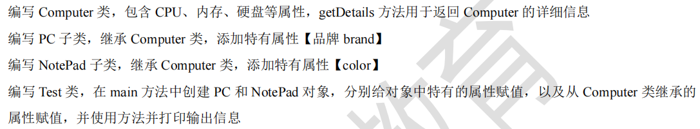 

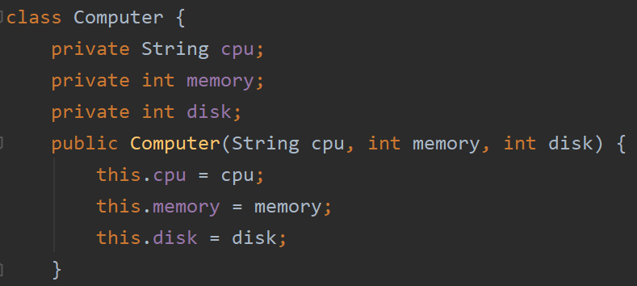 

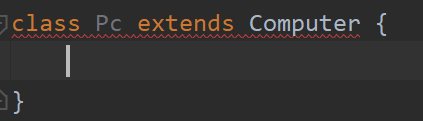 

父类已经没有默认的无参构造器（被覆盖），但是Pc有一个默认的无参构造器，而子类的默认无参构造器一定会调用父类的无参构造器，所以报错。


```java
package com.czl.extend_.exercise;

public class ExtendsExercise03 {
    public static void main(String[] args) {
        Pc pc = new Pc("intel", 16, 512, "IBM");
        NotePad notePad = new NotePad("m1", 8, 256, "ibm");
        pc.printPc();
        notePad.printNotePad();
    }
}
class Computer {
    private String cpu;
    private int memory;
    private int disk;
    public Computer(String cpu, int memory, int disk) {
        this.cpu = cpu;
        this.memory = memory;
        this.disk = disk;
    }
    public String getCpu() {
        return cpu;
    }
    public void setCpu(String cpu) {
        this.cpu = cpu;
    }
    public int getMemory() {
        return memory;
    }
    public void setMemory(int memory) {
        this.memory = memory;
    }
    public int getDisk() {
        return disk;
    }
    public void setDisk(int disk) {
        this.disk = disk;
    }
    public String getDetail() {
        return "cpu = " + cpu + "\tmemory = " + memory + "\tdisk = " + disk;
    }
}
class Pc extends Computer {
    private String brand;
    //idea 直接根据继承的规则，自动把构造器的调用写好。此时父类只有这一个构造器，直接写。
    //父类的构造器完成父类属性的初始化，子类的构造器完成子类属性的初始化
    public Pc(String cpu, int memory, int disk, String brand) {
        super(cpu, memory, disk);
        this.brand = brand;
    }
    public String getBrand() {
        return brand;
    }
    public void setBrand(String brand) {
        this.brand = brand;
    }
    public void printPc() {
        System.out.println("===PC信息===");
        //1.用父类的get方法
        //System.out.println("cpu = " + getCpu() + "memory = " + getMemory() + "disk = " + getDisk());
        //2.直接调用父类方法
        System.out.println(getDetail() + "\tbrand = " + brand);
    }
}
class NotePad extends Computer{
    private String color;
    public NotePad(String cpu, int memory, int disk, String color) {
        super(cpu, memory, disk);
        this.color = color;
    }
    public String getColor() {
        return color;
    }
    public void setColor(String color) {
        this.color = color;
    }
    public void printNotePad() {
        System.out.println("===NotePad信息===");
        System.out.println(getDetail() + "\tcolor = " + color);
    }
}
```

