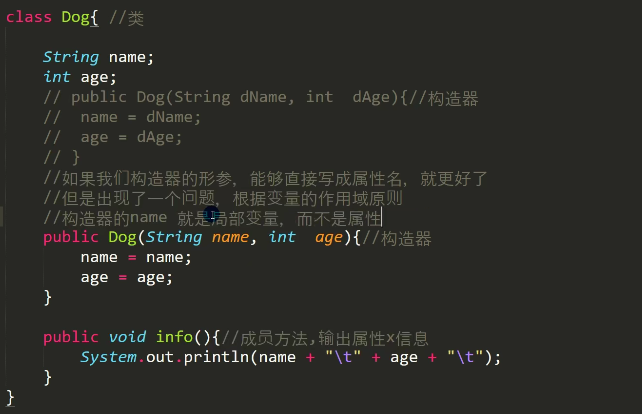 

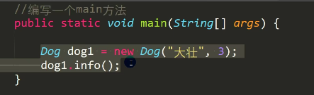 

输出：

null 0

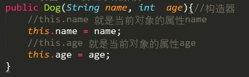 

右边的name还是局部变量

当前对象指的是dog1，创建好对象后，是谁在调用构造器，指的是new出来的对象。

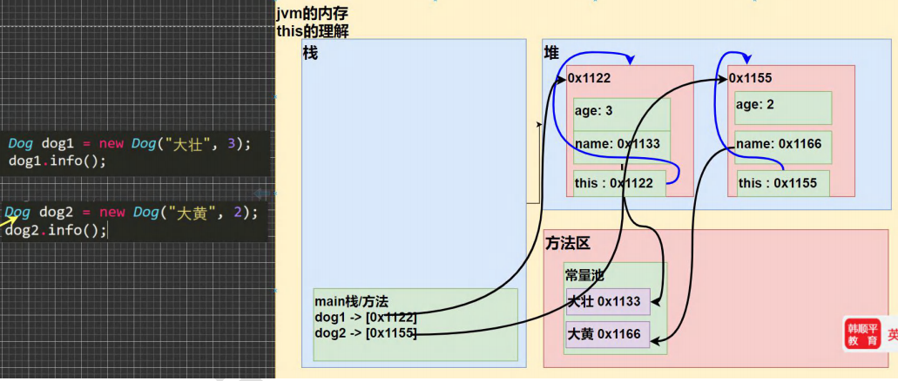 

可以理解成，在每个对象创建好了之后，在堆中还有一个隐藏的属性叫this，也是一个引用，地址是对象本身，指向对象自己。

Java虚拟机会为每个对象分配this，代表当前对象。

哪个对象调用，this就代表哪个对象。

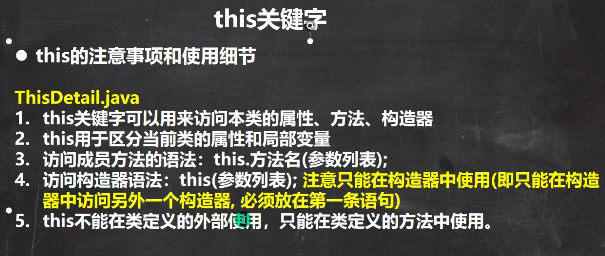 

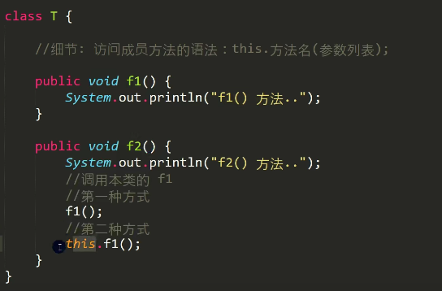 

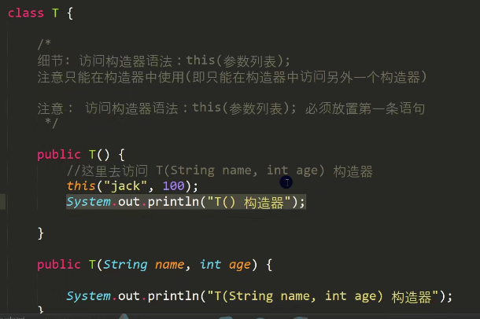 

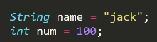 

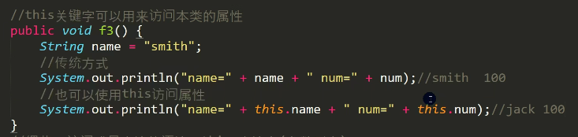 

区别：

name是按照的就近原则寻找，如果有局部变量，访问的就是局部变量

this.name明确寻找的就是属性，不管有没有局部变量，输出的都是属性

this练习：

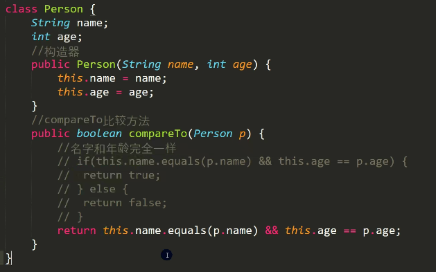 

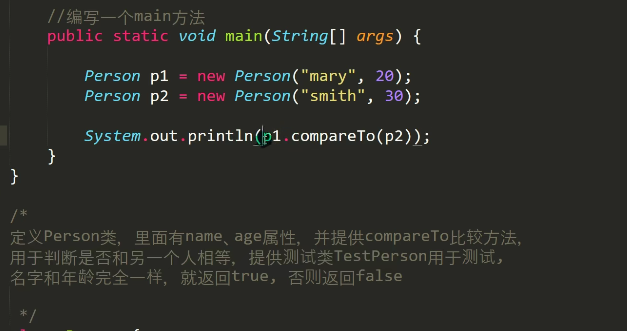 

P1作为当前对象this，p2作为参数传入

作业1：

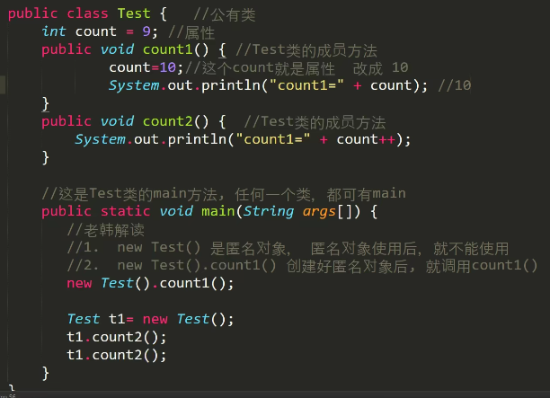 

new Test(),把Test类对应的对象创建出来，但是没有把地址返回给一个对象的引用，称为匿名对象。对象仍然在堆里面，但是只能用一次，因为用完以后，没有任何变量指向它，就被销毁了。

输出：10 9 10，最后count=11

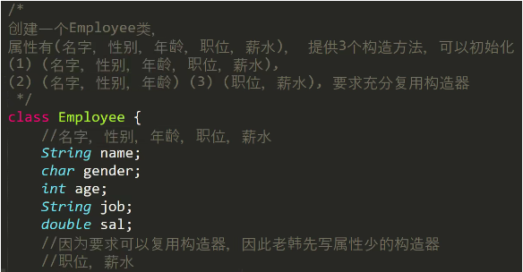 

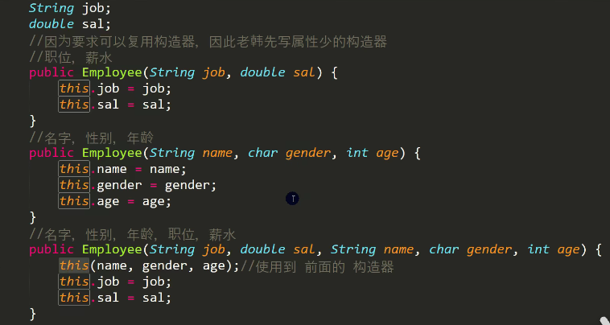 

用this调用另外一个构造器

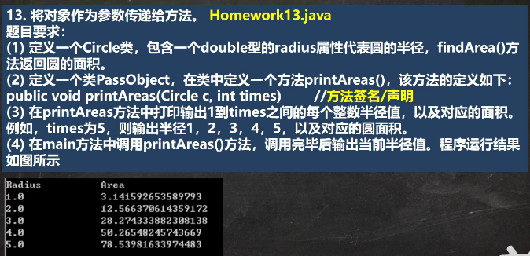 

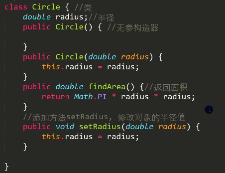 

这里面构造器没有用，可以去掉，因为实例化时是无参构造器，所以要把默认构造器写上，可以都不写。

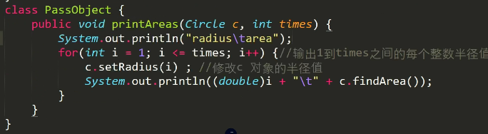 

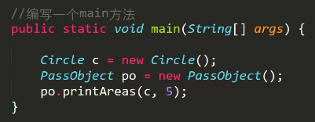 