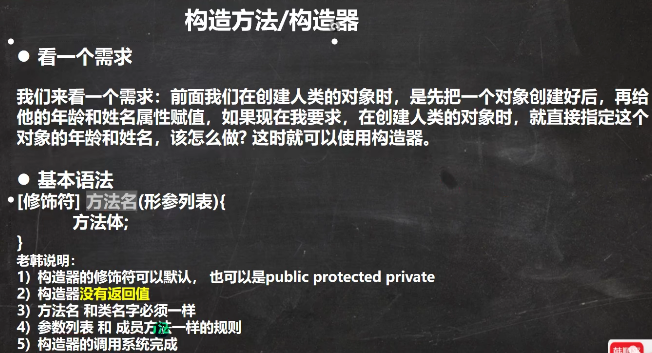 

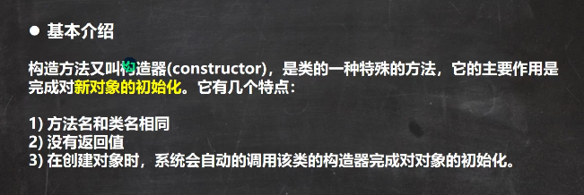 

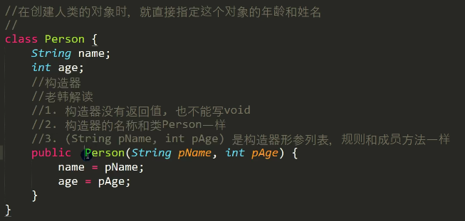 

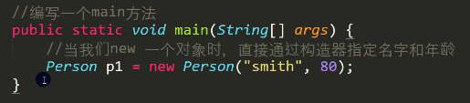 

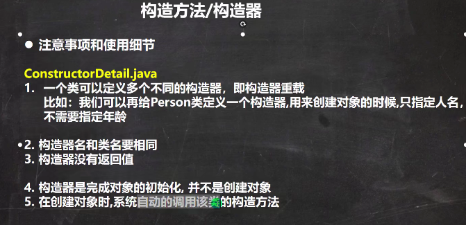 

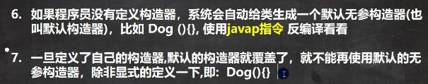 

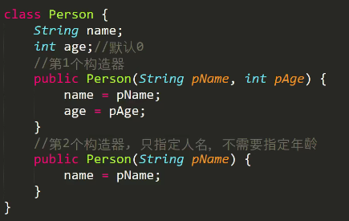 

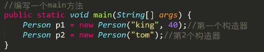 

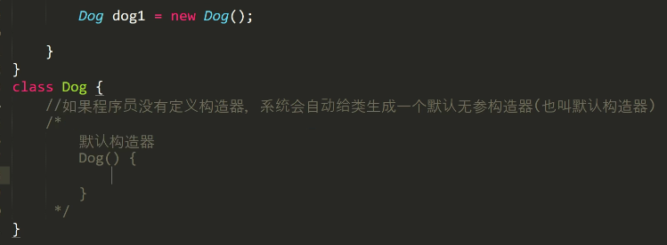 

默认构造器没有参数，默认访问修饰符

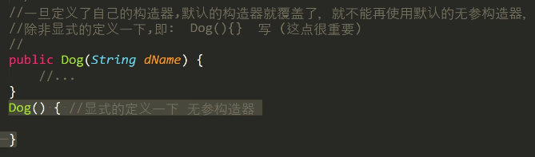 

对象创建流程分析：

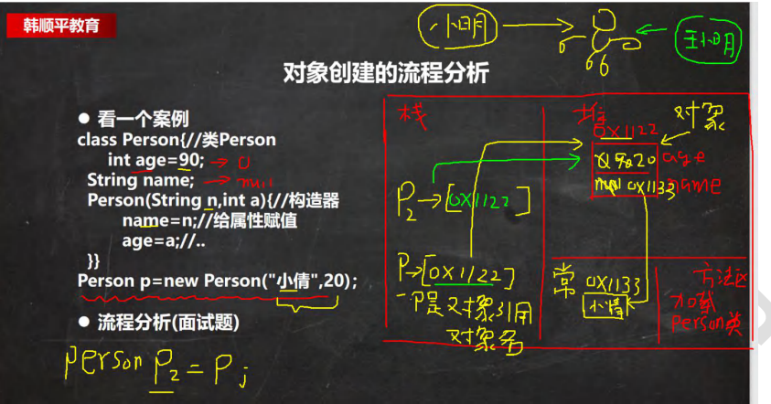 

执行new Person("小倩",20)

1.加载person类信息，只会加载一次

2.new 在堆开辟对象空间，得到一个地址

3.开始对象属性初始化，并不是直接赋值90，先进行默认初始化(age = 0,name = null)，再进行显式的初始化，赋值90，name依旧是空

4.执行构造器，进行构造器的初始化，null换成小倩的地址，赋值20，至此等号右边执行完毕

5.把对象在堆中的地址返回给p，p是对象的引用

6.Person p2 = p1;新的对象引用p2也指向这个地址

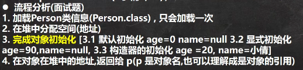 