#### 1. 类与对象的关系

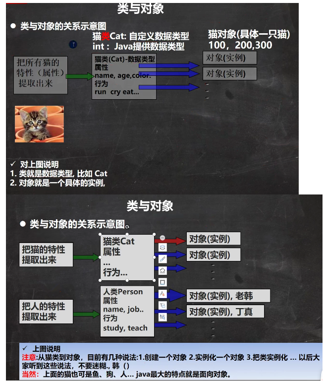 

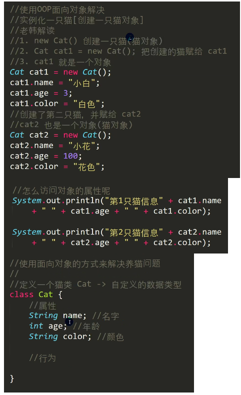 

#### 2. 对象在内存中的存在形式

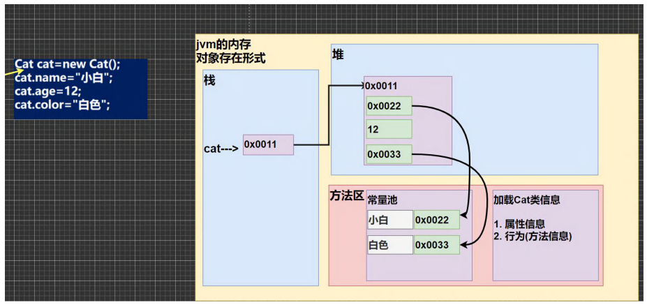 

对象和数组都是引用类型，所以cat指向一个地址，地址里面有三个空间。

真正的对象空间在堆，cat只是指向对象空间，cat代表一个对象的引用。

名字是String类型的数据，又是引用类型，会把数据放在方法区一个叫常量池的地方，所以指向地址。

年龄是基本数据类型，直接存放。

执行new时把类的信息加载到方法区，包括属性信息，行为。

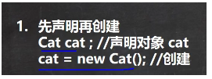 

cat先指向一个空间，里面是一个空值，cat->[null]

new之后在堆开辟一个空间，得到一个地址，将地址填回cat，cat->[填回]

#### 3. 类和对象的内存分配机制

Java内存的结构分析：

1. 栈：一般存放基本数据类型（局部变量）
2. 堆：存放对象（Cat cat，数组等）
3. 方法区：常量池（常量，比如字符串），类加载信息

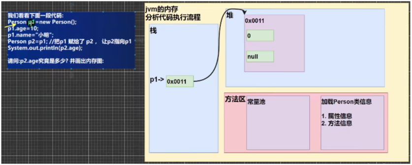 

1.加载Person类信息，主要是属性和方法信息，类信息只会加载一次。

2.new在堆里面开辟空间，得到地址，开始的值是默认值，分别为0,null

3.p1指向空间，p1->[地址]，把地址赋给p1

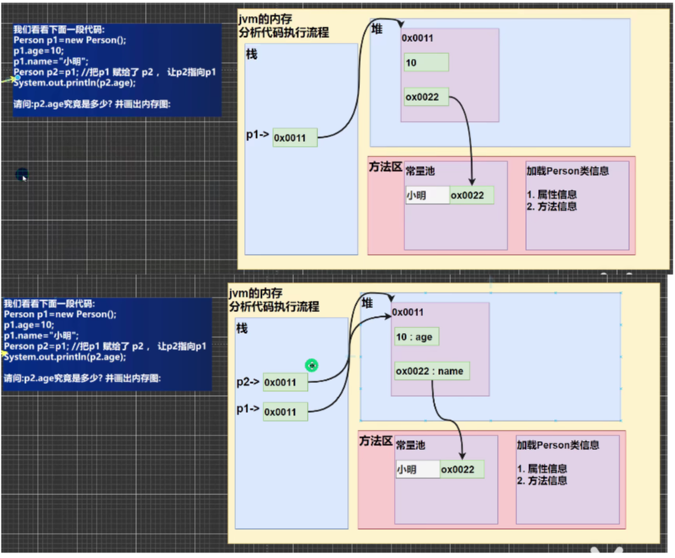 

#### 4. 成员方法调用机制

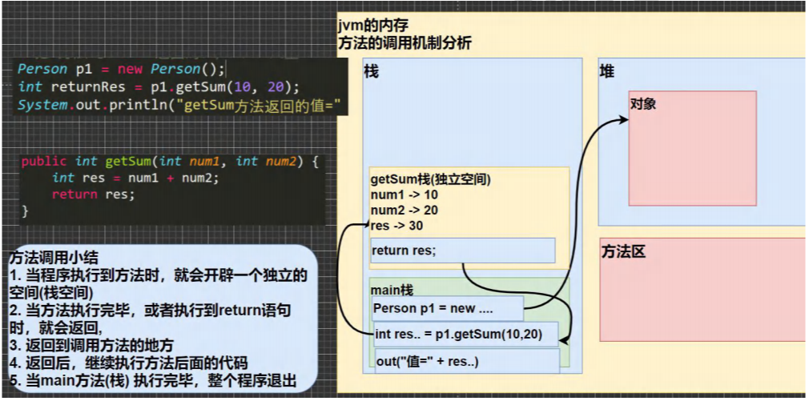 

new这行代码是在main主方法里面执行

在整个程序执行过程中，首先在栈里面创建一个空间（main栈）

当执行到p1.getSum(10,20)时，再开辟一个独立的栈空间，取名为getSum（自己取的，实际上没有这个名字），程序跳到对应的方法，执行赋值

执行到return res;时，把结果返回给p1.getSum(10,20)

销毁getSum栈

Java方法调用过程

java每个方法调用时会创建一个独立的栈空间

1、main方法为程序入口，创建一个main方法栈

2、在mian方法栈中执行程序，创建Person对象，执行System语句，语句中有对象p1的getSum方法，所以执行这个方法

3、创建一个getSum方法独立栈，将实参传入后执行getSum里面语句，返回res，退出这个getSum方法栈，转而执行main方法栈，输出getSum的返回值，getSum方法栈则被销毁。

#### 5. 成员方法的使用细节

 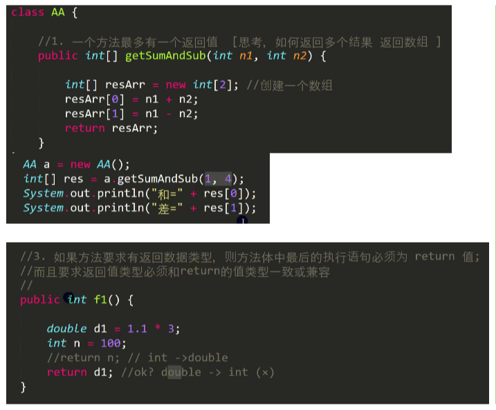 

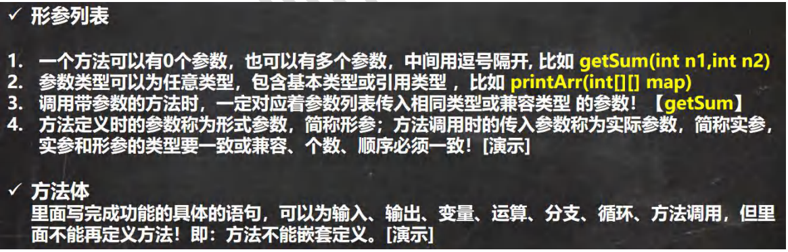 

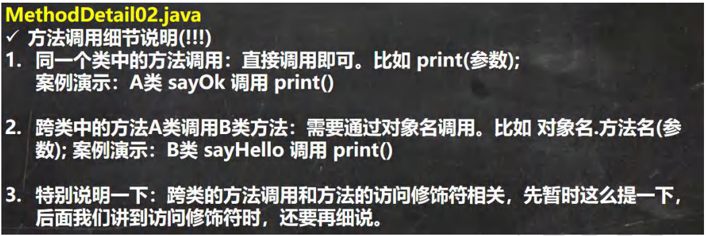 

#### 6. 成员方法传参机制

##### 6.1 基本数据类型的传参机制

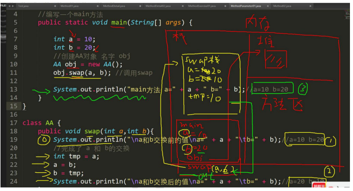 

把10和20传给swap，swap里面发生交换，但是交换并不影响主方法main中的a和b，因为两个栈是独立的数据空间，而且因为基本数据类型不是引用类型

输出的是main或者swap里面的a和b

基本数据类型，传递的是值（值拷贝），形参的任何改变不影响实参

##### 6.2 引用数据类型的传参机制

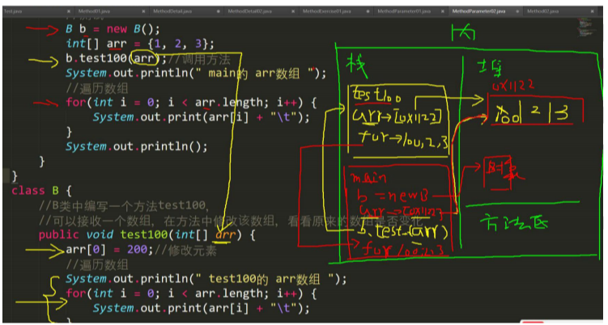 

数组是引用类型，指向堆空间

执行b.test100(arr)，把main的arr传进去，传递的是地址，test100中的arr接收的是传入的地址，两个arr指向的是同一个堆空间，遍历的是同一个数组

引用类型，传递的是地址，形参的任何改变影响实参

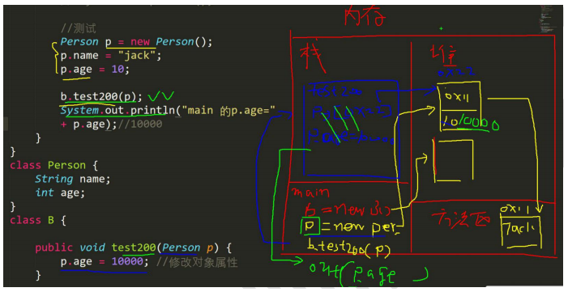 

传递的参数是对象

传递的是对象的地址

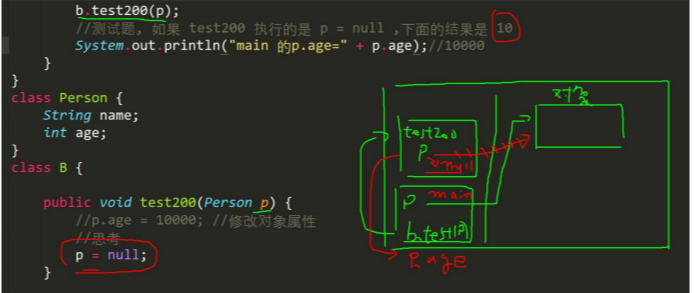 

刚开始两个p指向同一个地方

执行p =null之后test200栈的p置空，不再指向之前的地址，main栈的p指向不变

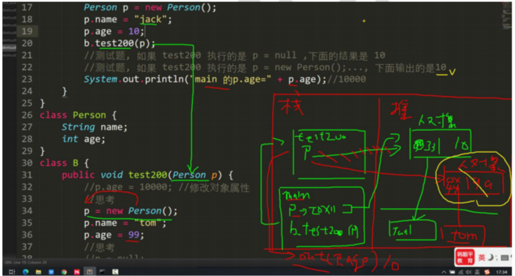 

刚开始两个p指向同一个地址

执行p = new Person()之后，在堆里面产生一个新的对象，p指向新的地址，但却没有使用，直接返回main。

#### 7. 方法递归调用

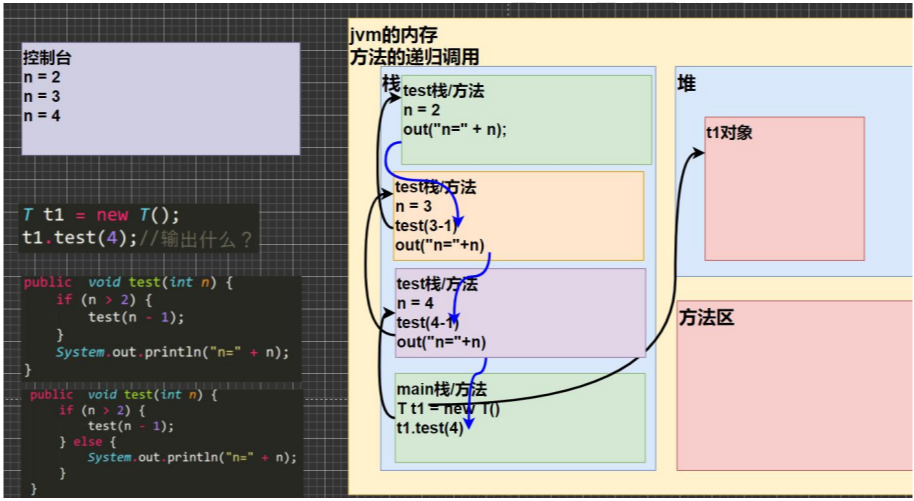 

执行t1.test(4)，开辟一个新的栈，4赋值给了test栈中的n

执行t1.test(4-1)，又开辟一个新的栈，3赋值给了n

执行t1.test(3-1)，又开辟一个新的栈，2赋值给了n

n大于2不再成立，执行下面的输出语句，此栈结束，返回到下面一个栈

改动之后只输出n = 2

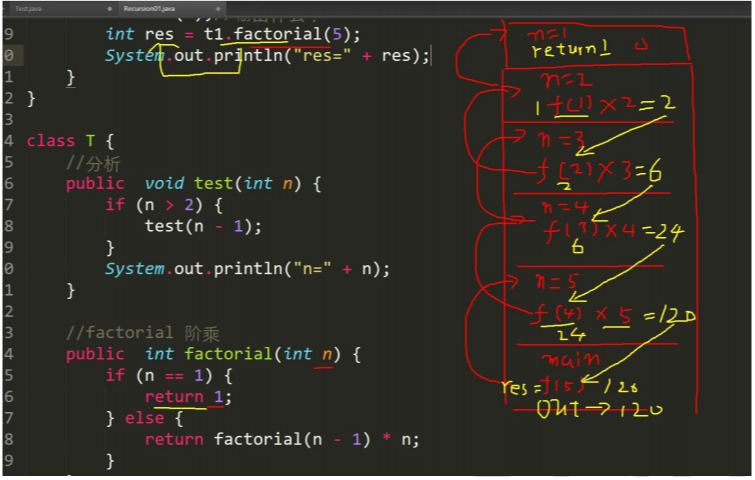 

哪里调用，就把结果返回到哪里，把1返回给f(1)。

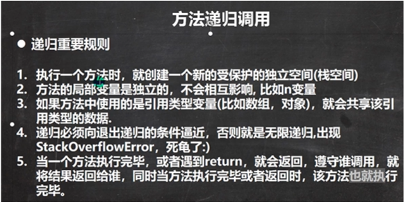 

P222 老鼠出迷宫、汉诺塔、八皇后问题，后期详细了解。