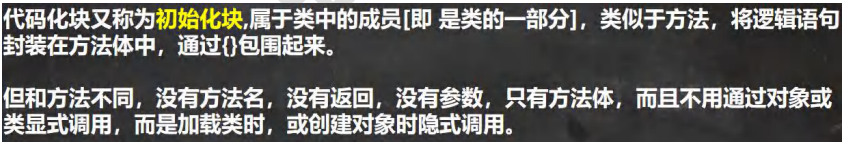 

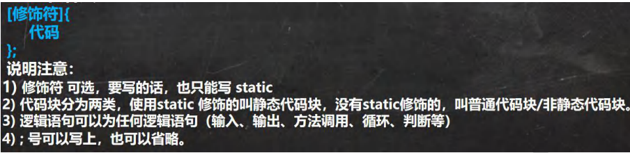 


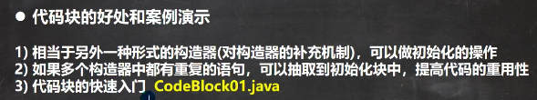 

```java
package com.czl.codeblock;

public class CodeBlock01 {
    public static void main(String[] args) {
        Movie movie = new Movie("你好，李焕英");
        System.out.println("===============");
        Movie movie2 = new Movie("唐探3", 100, "陈思诚");
    }
}

class Movie {
    private String name;
    private double price;
    private String director;

    //3个构造器 重载
    //(1) 下面的三个构造器都有相同的语句
    //(2) 这样代码看起来比较冗余
    //(3) 这时我们可以把相同的语句，放入到一个代码块中，即可
    //(4) 这样当我们不管调用哪个构造器，创建对象，都会先调用代码块的内容
    //(5) 代码块调用的顺序优先于构造器..
    {
        System.out.println("电影屏幕打开...");
        System.out.println("广告开始...");
        System.out.println("电影开始...");
    };

    public Movie(String name) {
        System.out.println("Movie(String name) 被调用...");
        this.name = name;
    }

    public Movie(String name, double price) {
        System.out.println("Movie(String name, double price) 被调用...");
        this.name = name;
        this.price = price;
    }

    public Movie(String name, double price, String director) {
        System.out.println("Movie(String name, double price, String director) 被调用...");
        this.name = name;
        this.price = price;
        this.director = director;
    }
}
```

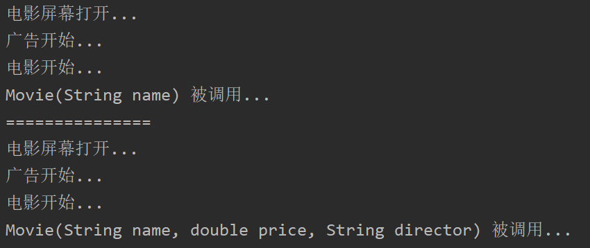 


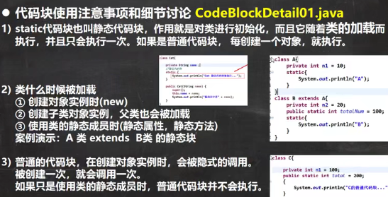 

类不管什么时候被加载，只加载一次。

```java
package com.czl.codeblock;

public class CodeBlockDetails01 {
    public static void main(String[] args) {

        //类被加载的情况举例
        //1. 创建对象实例时(new)
        //AA aa = new AA();//输出 AA 的静态代码1被执行...

        //2. 创建子类对象实例，父类也会被加载, 而且，父类先被加载，子类后被加载
        //AA aa2 = new AA();
        //输出
        //BB 的静态代码1被执行...
        //AA 的静态代码1被执行...

        //3. 使用类的静态成员时(静态属性，静态方法)
        //System.out.println(Cat.n1);
        //输出
        //Cat 的静态代码1被执行...
        //999
        //如果让Cat继承Animal，会先加载父类，输出
        //Animal 的静态代码1被执行...
        //Cat 的静态代码1被执行...
        //999

        //DD dd = new DD();
        //DD dd1 = new DD();
        //输出
        //DD 的静态代码1被执行...
        //虽然创建了两个对象，但只加载了一次类，也只执行了一次static代码块
          //加载一次就够了，此时已经包含了这个类的所有信息，再加载一次就会浪费内存资源

        //普通的代码块，在创建对象实例时，会被隐式的调用。
        // 被创建一次，就会调用一次。
        // 如果只是使用类的静态成员时，普通代码块并不会执行
        //EE ee = new EE();
        //EE ee1 = new EE();
        //输出
        //EE 的静态代码1被执行...
        //EE 的普通代码1被执行...
        //EE 的普通代码1被执行...
        System.out.println(EE.n1);
        //输出
        //EE 的静态代码1被执行...
        //8888
        //此时只加载了类，没有创建对象，所以普通代码块不会执行
    }
}

class BB {
    //静态代码块
    static {
        System.out.println("BB 的静态代码1被执行...");//1
    }
}

class AA extends BB {
    //静态代码块
    static {
        System.out.println("AA 的静态代码1被执行...");//
    }
}

class Animal {
    //静态代码块
    static {
        System.out.println("Animal 的静态代码1被执行...");//
    }
}

class Cat {
    public static int n1 = 999;
    static {
        System.out.println("Cat 的静态代码1被执行...");
    }
}

class DD {
    static {
        System.out.println("DD 的静态代码1被执行...");
    }
}

class EE {
    public static int n1 = 8888;
    static {
        System.out.println("EE 的静态代码1被执行...");
    }
    {
        System.out.println("EE 的普通代码1被执行...");
    }
}
```


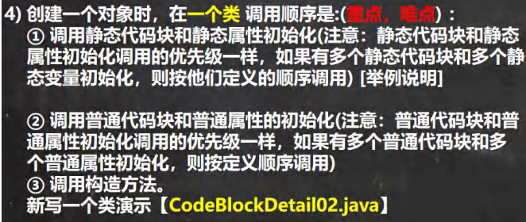 

（1）

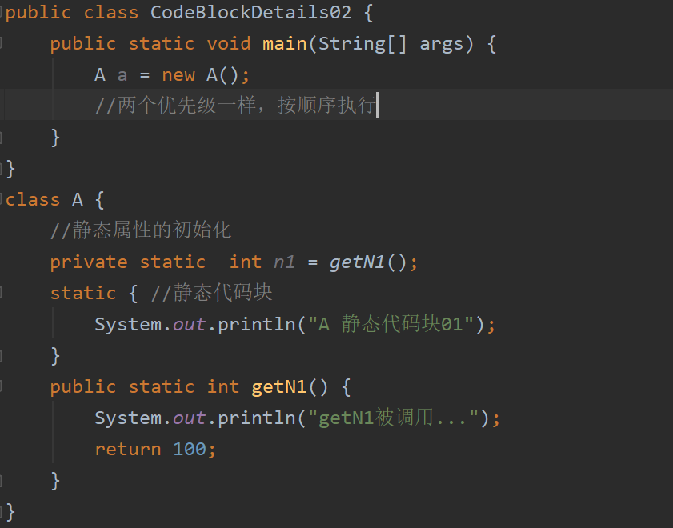 

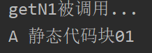 

（2）（3）

```java
package com.czl.codeblock;

public class CodeBlockDetails02 {
    public static void main(String[] args) {
        A a = new A();
    }
}
class A {
    private int n2 = getN2();//普通属性的初始化
    {//普通代码块
        System.out.println("A 普通代码块01");
    }

    //静态属性的初始化
    private static  int n1 = getN1();
    static { //静态代码块
        System.out.println("A 静态代码块01");
    }
    public static int getN1() {
        System.out.println("getN1被调用...");
        return 100;
    }
    public int getN2() {//普通方法
        System.out.println("getN2被调用...");
        return 200;
    }

    //无参构造器
    public A() {
        System.out.println("A() 构造器被调用...");
    }
}
```

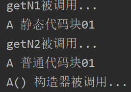 


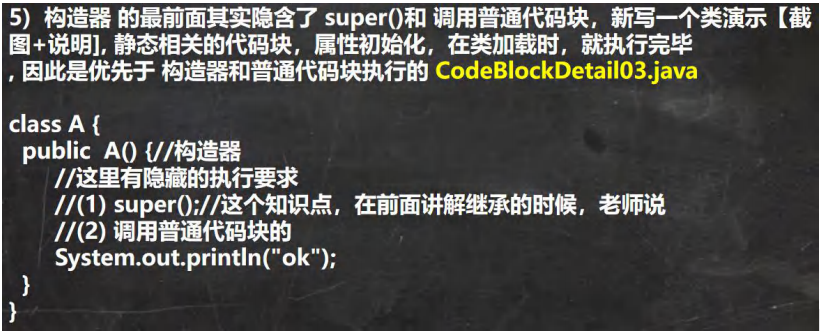 

```java
package com.czl.codeblock;

public class CodeBlockDetail03 {
    public static void main(String[] args) {
        new BBB();
    }
}

class AAA {
    {
        System.out.println("AAA的普通代码块");
    }
    public AAA() {
        //(1)super()，找到Object
        //(2)调用本类的普通代码块
        System.out.println("AAA() 构造器被调用....");
    }
}
class BBB extends AAA {
    {
        System.out.println("BBB的普通代码块...");
    }
    public BBB() {
        //有两个隐藏的东西
        //(1)super()
        //(2)调用本类的普通代码块
        System.out.println("BBB() 构造器被调用....");
    }
}
```

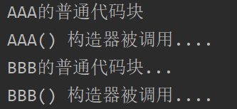 


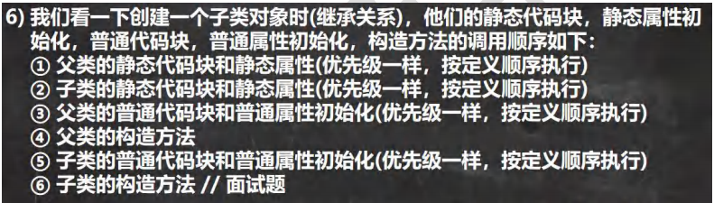 

```java
package com.czl.codeblock;

public class CodeBlockDetail04 {
    public static void main(String[] args) {

        //(1) 进行类的加载，在创建对象之前
        //    先加载 父类 A02 再加载 B02
        //    静态属性的初始化和静态代码块是和类加载相关的，所以先执行
        //(2) 创建对象 new B02()
        //    从子类的构造器开始，先执行隐藏的内容 super…
        new B02();
    }
}

class A02 { //父类
    private static int n1 = getVal01();
    static {
        System.out.println("A02的一个静态代码块..");
    }
    {
        System.out.println("A02的第一个普通代码块..");
    }
    public int n3 = getVal02();//普通属性的初始化
    public static int getVal01() {
        System.out.println("getVal01");
        return 10;
    }

    public int getVal02() {
        System.out.println("getVal02");
        return 10;
    }

    public A02() {//构造器
        //隐藏
        //super()
        //普通代码块和普通属性的初始化......
        System.out.println("A02的构造器");
    }
}
class B02 extends A02 {

    private static int n3 = getVal03();

    static {
        System.out.println("B02的一个静态代码块..");
    }
    public int n5 = getVal04();
    {
        System.out.println("B02的第一个普通代码块..");
    }

    public static int getVal03() {
        System.out.println("getVal03");
        return 10;
    }

    public int getVal04() {
        System.out.println("getVal04");
        return 10;
    }
    public B02() {//构造器
        //隐藏了
        //super()
        //普通代码块和普通属性的初始化...
        System.out.println("B02的构造器");
    }
}
```

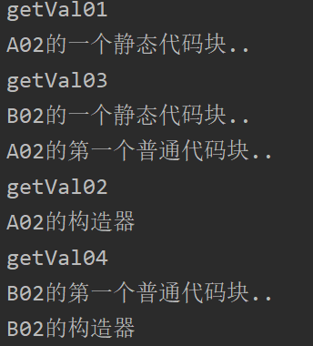 


 


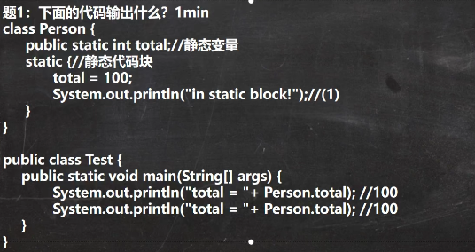 

Person.total执行时，会加载类，因此类的静态成员和静态代码块也会执行。

类只加载一次，因此in static block!只输出一次。


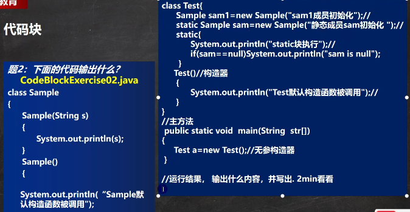 

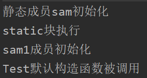 

创建对象Test时，先进行类加载 ->静态代码块和静态属性的初始化。

执行到

Test() {

​    System.out.println("Test默认构造函数被调用");

  }

里面隐藏的super与普通代码块和普通属性的初始化。