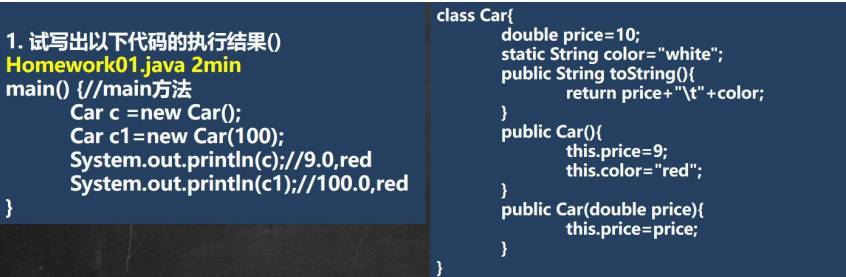
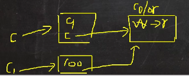
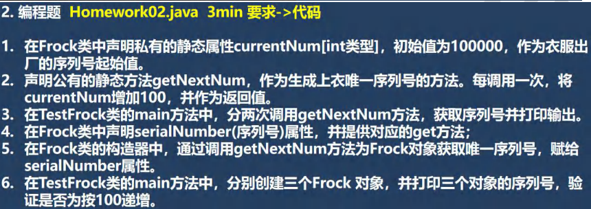
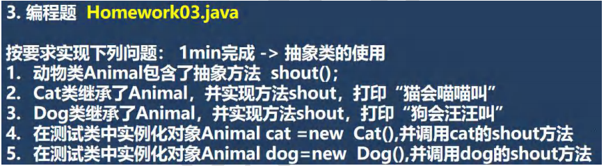
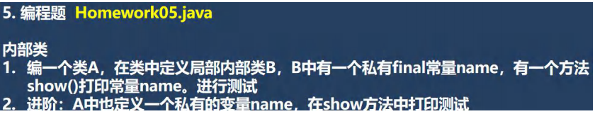
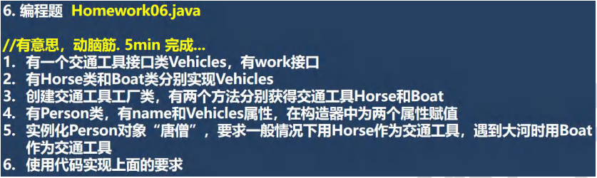
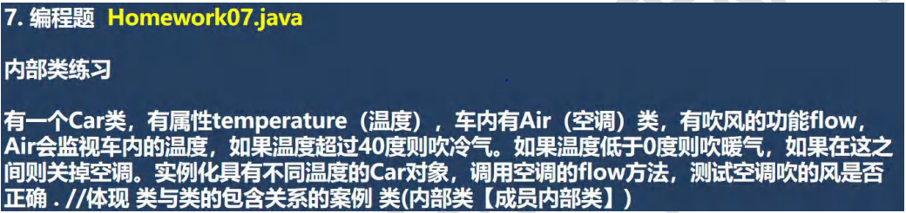
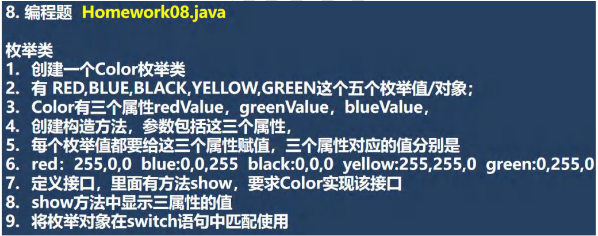

 

 


 

```java
package com.czl.enum_;

public class Homework02 {
}

class Frock {
    private static int currentNum = 100000;
    private int serialNumber;

    public Frock() {
        serialNumber = getNextNum();
    }

    public static int getNextNum() {
        currentNum += 100; //将currentNum增加100
        return currentNum;
    }

    public int getSerialNumber() {
        return serialNumber;
    }
}

class TestFrock {
    public static void main(String[] args) {
        System.out.println(Frock.getNextNum());//100100
        System.out.println(Frock.getNextNum());//100200
        Frock frock = new Frock();//序列号就是 100300
        Frock frock1 = new Frock();//序列号就是 100400
        Frock frock2 = new Frock();//序列号就是 100500
        System.out.println(frock.getSerialNumber());//100300
        System.out.println(frock1.getSerialNumber());//100400
        System.out.println(frock2.getSerialNumber());//100500
    }
}
```


 

```java
package com.czl.enum_;

public class Homework03 {
    public static void main(String[] args) {
        Animal cat = new Cat();
        cat.shout();
        Animal dog = new Dog();
        dog.shout();
    }
}

abstract class Animal {
    public abstract void shout();
}
class Cat extends Animal {
    @Override
    public void shout() {
        System.out.println("猫会喵喵叫...");
    }
}
class Dog extends Animal {
    @Override
    public void shout() {
        System.out.println("狗会汪汪叫...");
    }
}
```


 

```java
package com.czl.enum_;

public class Homework04 {
    public static void main(String[] args) {
        Cellphone cellphone = new Cellphone();
        cellphone.testWork(new Computer() {
            @Override
            public double work(double n1, double n2) {
                return n1 + n2;
            }
        },10,20);
    }
}

//编写接口
interface Computer {
    //work方法 是完成计算，但是题没有具体要求，所以自己设计
    //至于该方法完成怎样的计算，我们交给匿名内部类完成
    public double work(double n1,double n2);
}
class Cellphone {
    //当我们调用testWork方法时，直接传入一个实现了ICalculate接口的匿名内部类即可
    //该匿名内部类，可以灵活的实现work,完成不同的计算任务
    public void testWork(Computer computer,double n1,double n2) {
        double result = computer.work(n1,n2);//动态绑定，跳到匿名内部类重写的方法
        System.out.println("result=" + result);
    }
}
```


 

```java
package com.czl.enum_;
 
public class Homework05 {
    public static void main(String[] args) {
        A a = new A();
        a.hi();
    }
}
class A {
    private String NAME = "lmy";
    public void hi() {
        class B {
            private final String NAME = "czl";
            public void show() {
                System.out.println("NAME=" + NAME);
                System.out.println("A NAME=" + A.this.NAME);
            }
        }
        B b = new B();
        b.show();
    }
}
```


 

```java

public interface Vehicles {
    //有一个交通工具接口类Vehicles，有work接口
    public void work();
}


public class Horse implements Vehicles {
    @Override
    public void work() {
        System.out.println("一般情况下，使用马儿前进...");
    }
}

public class Boat implements Vehicles {
    @Override
    public void work() {
        System.out.println(" 过河的时候，使用小船.. ");
    }
}

public class VehiclesFactory {
    //马儿始终是同一匹
    private static Horse horse = new Horse(); //饿汉式

    private VehiclesFactory(){}
    //创建交通工具工厂类，有两个方法分别获得交通工具Horse和Boat
    //这里，我们将方法做成static
    public static Horse getHorse() {
//        return new Horse();
        return horse;
    }
    public static Boat getBoat() {
        return new Boat();
    }
    public static Plane getPlane() {
        return new Plane();
    }
}

public class Person {
    private String name;
    private Vehicles vehicles;

    //在创建人对象时，事先给他分配一个交通工具
    public Person(String name, Vehicles vehicles) {
        this.name = name;
        this.vehicles = vehicles;
    }

    //实例化Person对象“唐僧”，要求一般情况下用Horse作为交通工具，遇到大河时用Boat作为交通工具
    //这里涉及到一个编程思路，就是可以把具体的要求，封装成方法-> 这里就是编程思想
    //思考一个问题，如何不浪费，在构建对象时，传入的交通工具对象->动脑筋
    public void passRiver() {
        //先得到船
        //判断一下，当前的 vehicles 属性是null, 就获取一艘船
//        Boat boat = VehiclesFactory.getBoat();
//        boat.work();
        //如何防止始终使用的是传入的马 instanceOf
        //if (vehicles == null) {
        //vehicles instanceof Boat 是判断 当前的 vehicles是不是Boat
        //(1) vehicles = null  : vehicles instanceof Boat  => false
        //(2) vehicles = 马对象 ：vehicles instanceof Boat  => false
        //(3) vehicles = 船对象 ：vehicles instanceof Boat  => true
        if (!(vehicles instanceof Boat)) {
            vehicles = VehiclesFactory.getBoat();
        }
        vehicles.work();
    }

    public void common() {
        //得到马儿
        //判断一下，当前的 vehicles 属性是null, 就获取一匹马
        //if (vehicles == null) {
        if (!(vehicles instanceof Horse)) {
            //这里使用的是多态
            vehicles = VehiclesFactory.getHorse();
        }
        //这里体现使用接口调用
        vehicles.work();
    }
    //过火焰山
    public void passFireHill() {
        if (!(vehicles instanceof Plane)) {
            //这里使用的是多态
            vehicles = VehiclesFactory.getPlane();
        }
        //这里体现使用接口调用
        vehicles.work();

    }
}

//有Person类，有name和Vehicles属性，在构造器中为两个属性赋值

public class Plane implements Vehicles {
    @Override
    public void work() {
        System.out.println("过火焰山，使用飞机...");
    }
}

public class Homework06 {
    public static void main(String[] args) {
        Person tang = new Person("唐僧", new Horse());
        tang.common();//一般情况下
        tang.passRiver();//过河
        tang.common();//一般情况下
        tang.passRiver();//过河
        tang.passRiver();//过河
        tang.passRiver();//过河
        //过火焰山
        tang.passFireHill();
    }
}
```




```java
public class Homework07 {
    public static void main(String[] args) {
        //实例化不同的car对象
        Car2 car2 = new Car2(60);
        car2.getAir().flow();
        Car2 car21 = new Car2(-1);
        car21.getAir().flow();
        Car2 car22 = new Car2(20);
        car22.getAir().flow();
    }
}
//体现 类与类的包含关系的案例 类(内部类【成员内部类】)
class Car2 {

   private double temperature;

    public Car2(double temperature) {
        this.temperature = temperature;
    }

    //Air 成员内部类
   class Air {
       public void flow() {
           if(temperature > 40) {
               System.out.println("温度大于40 空调吹冷气..");
           } else if(temperature < 0) {
               System.out.println("温度小于0 空调吹暖气..");
           } else {
               System.out.println("温度正常，关闭空调..");
           }
       }
   }
   //返回一个Air对象
    public Air getAir() {
        return new Air();
    }
}
```




```java
public class Homework08 {
    public static void main(String[] args) {
        //演示一下枚举值得switch使用
        Color green = Color.GREEN;
        green.show();
        //比较一下
        //switch () 中，放入枚举对象
        //在每个case 后，直接写上在枚举类中，定义的枚举对象即可
        switch (green) {
            case YELLOW:
                System.out.println("匹配到黄色");
                break;
            case BLACK:
                System.out.println("匹配到黑色");
                break;
            default:
                System.out.println("没有匹配到..");
        }
    }
}

interface IMyInterface {
    public void show();
}

enum Color implements IMyInterface {
    RED(255, 0, 0), BLUE(0, 0, 255), BLACK(0, 0, 0), YELLOW(255, 255, 0), GREEN(0, 255, 0);
    private int redValue;
    private int greenValue;
    private int blueValue;

    Color(int redValue, int greenValue, int blueValue) {
        this.redValue = redValue;
        this.greenValue = greenValue;
        this.blueValue = blueValue;
    }

    @Override
    public void show() {
        System.out.println("属性值为" + redValue + "," + greenValue + "," + blueValue);
    }
}
```

