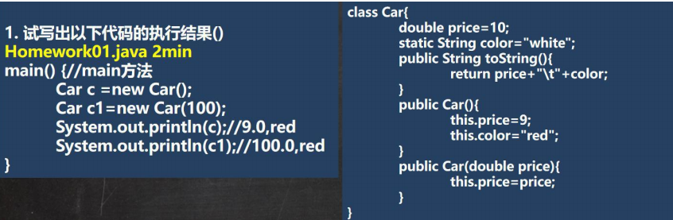
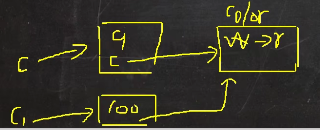
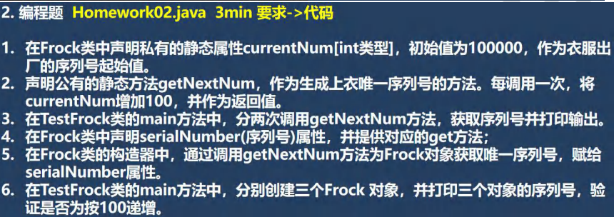
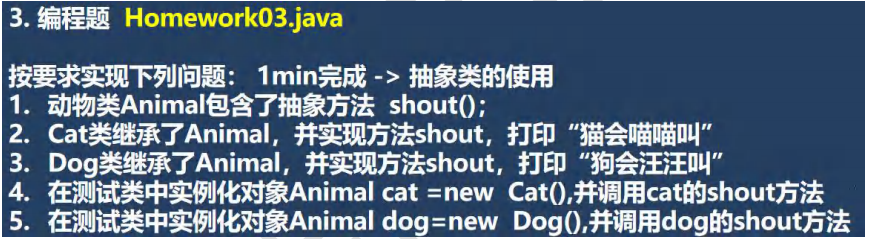
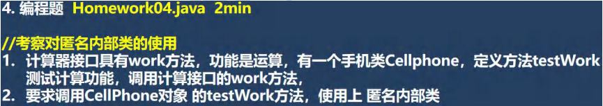
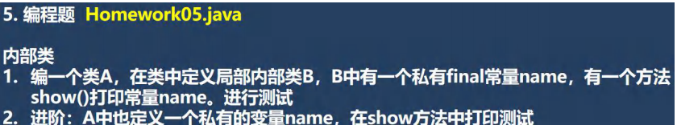
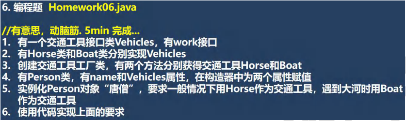
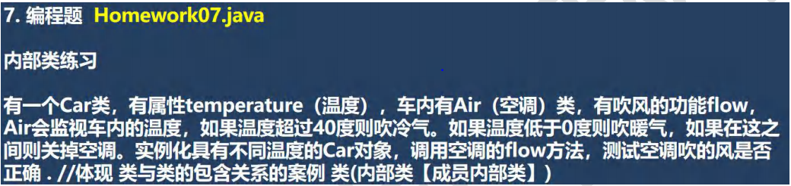
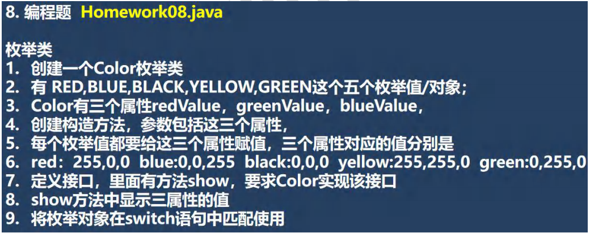

 

 


 

```java
package com.czl.enum_;

public class Homework02 {
}

class Frock {
    private static int currentNum = 100000;
    private int serialNumber;

    public Frock() {
        serialNumber = getNextNum();
    }

    public static int getNextNum() {
        currentNum += 100; //将currentNum增加100
        return currentNum;
    }

    public int getSerialNumber() {
        return serialNumber;
    }
}

class TestFrock {
    public static void main(String[] args) {
        System.out.println(Frock.getNextNum());//100100
        System.out.println(Frock.getNextNum());//100200
        Frock frock = new Frock();//序列号就是 100300
        Frock frock1 = new Frock();//序列号就是 100400
        Frock frock2 = new Frock();//序列号就是 100500
        System.out.println(frock.getSerialNumber());//100300
        System.out.println(frock1.getSerialNumber());//100400
        System.out.println(frock2.getSerialNumber());//100500
    }
}
```


 

```java
package com.czl.enum_;

public class Homework03 {
    public static void main(String[] args) {
        Animal cat = new Cat();
        cat.shout();
        Animal dog = new Dog();
        dog.shout();
    }
}

abstract class Animal {
    public abstract void shout();
}
class Cat extends Animal {
    @Override
    public void shout() {
        System.out.println("猫会喵喵叫...");
    }
}
class Dog extends Animal {
    @Override
    public void shout() {
        System.out.println("狗会汪汪叫...");
    }
}
```


 

```java
package com.czl.enum_;

public class Homework04 {
    public static void main(String[] args) {
        Cellphone cellphone = new Cellphone();
        cellphone.testWork(new Computer() {
            @Override
            public double work(double n1, double n2) {
                return n1 + n2;
            }
        },10,20);
    }
}

//编写接口
interface Computer {
    //work方法 是完成计算，但是题没有具体要求，所以自己设计
    //至于该方法完成怎样的计算，我们交给匿名内部类完成
    public double work(double n1,double n2);
}
class Cellphone {
    //当我们调用testWork方法时，直接传入一个实现了ICalculate接口的匿名内部类即可
    //该匿名内部类，可以灵活的实现work,完成不同的计算任务
    public void testWork(Computer computer,double n1,double n2) {
        double result = computer.work(n1,n2);//动态绑定，跳到匿名内部类重写的方法
        System.out.println("result=" + result);
    }
}
```


 

```java
package com.czl.enum_;
 
public class Homework05 {
    public static void main(String[] args) {
        A a = new A();
        a.hi();
    }
}
class A {
    private String NAME = "lmy";
    public void hi() {
        class B {
            private final String NAME = "czl";
            public void show() {
                System.out.println("NAME=" + NAME);
                System.out.println("A NAME=" + A.this.NAME);
            }
        }
        B b = new B();
        b.show();
    }
}
```


 

```java
package com.czl.enum_;

public interface Vehicles {
    //有一个交通工具接口类Vehicles，有work接口
    public void work();
}

package com.czl.enum_;

public class Horse  implements Vehicles {
    @Override
    public void work() {
        System.out.println("一般情况下，使用马儿前进...");
    }
}
```






