 

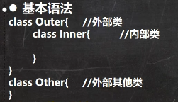 


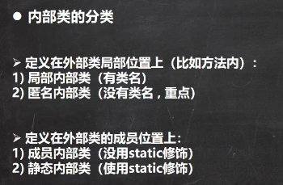 


局部内部类：

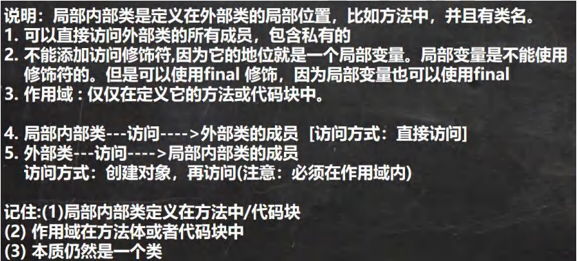 

```java
package com.czl.innerclass;

/*
局部内部类的使用
 */
public class LocalInnerClass {
    public static void main(String[] args) {
        Outer02 outer02 = new Outer02();
        outer02.m1();
    }
}
class Outer02 {//外部类
    private int n1 = 100;//外部类私有属性
    private void m2() {//外部类私有方法
        System.out.println("m2()...");
    }
    public void m1() {//方法
        class Inner02 {//局部内部类，相当于局部变量，作用域只在这个方法中。
            public void fi() {
                System.out.println("n1=" + n1);
                m2();
                //即便Inner02和Outer02不是同一个类，n1也是私有的，也能访问，而且是直接访问
            }
        }
        //外部类可以在方法中创建Inner02对象，然后调用方法
        Inner02 inner02 = new Inner02();
        inner02.fi();
    }
}
```

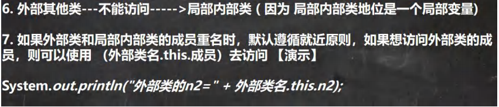 

```java
package com.czl.innerclass;

/*
局部内部类的使用
 */
public class LocalInnerClass {
    public static void main(String[] args) {
        Outer02 outer02 = new Outer02();
        outer02.m1();
    }
}
class Outer02 {
    private int n1 = 100;
    public void m1() {
        class Inner02 {
            private int n1 = 200;
            public void fi() {
                System.out.println("n1=" + n1);//输出：200
                System.out.println("外部类的n1=" + Outer02.this.n1);//100
                //Outer02.this本质是外部类的对象，谁调用m1方法Outer02.this就是谁
                // 此时指outer02，因此找的是Outer02类的属性(成员)
                System.out.println("n1=" + this.n1);//200 this指的是inner02，找的是Inner02类的属性
            }
        }
        Inner02 inner02 = new Inner02();
        inner02.fi();
    }
}
```


匿名内部类：

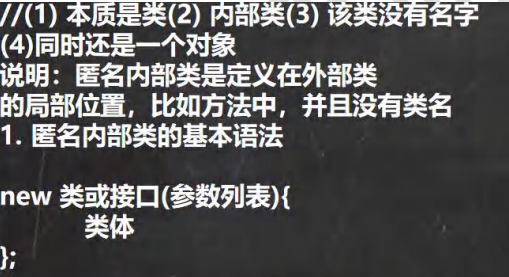 

基于接口： 

```java
package com.czl.innerclass;

/*
匿名内部类的使用演示
 */
public class AnonymousInnerClass {
    public static void main(String[] args) {
        Outer04 outer04 = new Outer04();
        outer04.method();
    }
}

class Outer04 { //外部类
    private int n1 = 10;//属性
    public void method() {//方法
        //基于接口的匿名内部类
        //1.需求：想使用IA接口,并创建对象
        //2.传统方式，是写一个类，实现该接口，并创建对象
//        IA tiger = new Tiger();
//        tiger.cry();
        //3.现在的需求是 写的/定义的Tiger/Dog 类只是使用一次，后面再不使用
        //4. 可以使用匿名内部类来简化开发
        IA tiger = new IA() {
            @Override
            public void cry() {
                System.out.println("老虎叫...");
            }
        };
        tiger.cry();
        System.out.println("tiger的运行类型:" + tiger.getClass());//tiger的运行类型:class com.czl.innerclass.Outer04$1
        //5. tiger的编译类型 ? IA
        //6. tiger的运行类型 ? 就是匿名内部类  Outer04$1
        /*
            我们看底层 系统会分配 类名 Outer04$1 该类去实现IA接口
            class Outer04$1 implements IA {
                @Override
                public void cry() {
                    System.out.println("老虎叫...");
                }
            }
         */
        //7. jdk底层在创建匿名内部类 Outer04$1,立即就new创建了 Outer04$1实例，并且把地址
        //   返回给 tiger
        //8. 匿名内部类使用一次，就不能再使用
    }
}
interface IA {//接口
    public void cry();
}
//class Tiger implements IA {
//    @Override
//    public void cry() {
//        System.out.println("老虎叫...");
//    }
//}
//class Dog implements  IA{
//    @Override
//    public void cry() {
//        System.out.println("小狗汪汪...");
//    }
//}
```

基于类：

```java
package com.czl.innerclass;

/*
匿名内部类的使用演示
 */
public class AnonymousInnerClass {
    public static void main(String[] args) {
        Outer04 outer04 = new Outer04();
        outer04.method();
    }
}

class Outer04 { //外部类
    private int n1 = 10;//属性
    public void method() {//方法
        //演示基于类的匿名内部类
        //分析
        //1. father编译类型 Father
        //2. father运行类型 Outer04$2
        //3. 底层会创建匿名内部类
        /*
            class Outer04$2 extends Father{
                @Override
                public void test() {
                    System.out.println("匿名内部类重写了test方法");
                }
            }
         */
        //4. 同时也直接返回了 匿名内部类 Outer04$2的对象
        //5. 注意("jack") 参数列表会传递给 构造器
        Father father1 = new Father("jack");
        System.out.println("father1对象的运行类型:" + father1.getClass());//father1对象的运行类型:class com.czl.innerclass.Father
        Father father = new Father("jack") {
            @Override
            public void test() {
                System.out.println("匿名内部类重写了test方法");
            }
        };
        System.out.println("father对象的运行类型:" + father.getClass());//father对象的运行类型:class com.czl.innerclass.Outer04$1
        father.test();

        //基于抽象类的匿名内部类
        Animal animal = new Animal(){
            @Override
            void eat() {
                System.out.println("小狗吃骨头...");
            }
        };
        animal.eat();
    }
}
class Father {//类
    public Father(String name) {//构造器
        System.out.println("接收到name=" + name);
    }
    public void test() {//方法
    }
}

abstract class Animal { //抽象类
    abstract void eat();
}
```

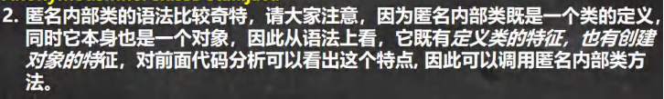 

```java
package com.czl.innerclass;

public class AnonymousInnerClassDetail {
    public static void main(String[] args) {
        Outer05 outer05 = new Outer05();
        outer05.f1();
    }
}

class Outer05 {
    private int n1 = 99;

    public void f1() {
        //创建一个基于类的匿名内部类
        Person person = new Person() {
            @Override
            public void hi() {
                System.out.println("匿名内部类重写了hi()方法...");
            }
        };
        person.hi();//动态绑定, 运行类型是 Outer05$1，
        // 而Outer05$1重写了hi()方法，所以不会找到父类的hi()

        //也可以直接调用，匿名内部类本身也是返回对象
        //class 匿名内部类 extends Person {}
        new Person() {
            @Override
            public void hi() {
                System.out.println("===匿名内部类重写了hi()方法...");
            }

            @Override
            public void ok(String str) {
                super.ok(str);//没有重写，找到父类Person类的ok方法
            }
        }.ok("jack");
    }
}

class Person {//类
    public void hi() {
        System.out.println("Person hi()");
    }
    public void ok(String str) {
        System.out.println("Person ok() " + str);
    }
}
```

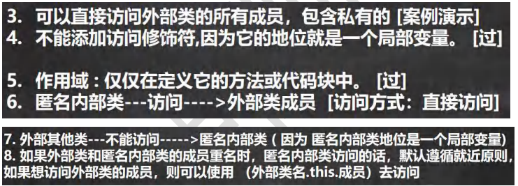 

```java
package com.czl.innerclass;

public class AnonymousInnerClassDetail {
    public static void main(String[] args) {
        Outer05 outer05 = new Outer05();
        outer05.f1();
    }
}

class Outer05 {
    private int n1 = 99;

    public void f1() {
        //创建一个基于类的匿名内部类
        //不能添加访问修饰符,因为它的地位就是一个局部变量
        //作用域 : 仅仅在定义它的方法或代码块中
        Person person = new Person() {
            private int n1 = 88;
            @Override
            public void hi() {
                //可以直接访问外部类的所有成员，包含私有的
                //如果外部类和匿名内部类的成员重名时，匿名内部类访问的话，
                //默认遵循就近原则，如果想访问外部类的成员，则可以使用 （外部类名.this.成员）去访问
                System.out.println("匿名内部类重写了hi方法 n1=" + n1 +
                        " 外部类的n1=" + Outer05.this.n1 );
                //Outer05.this 就是调用 f1的 对象
            }
        };
        person.hi();
    }
}

class Person {//类
    public void hi() {
        System.out.println("Person hi()");
    }
}
```

 

```java
package com.czl.innerclass;

public class InnerClassExercise01 {
    public static void main(String[] args) {
        //当做实参直接传递，简洁高效
        f1(new IL() {
            @Override
            public void show() {
                System.out.println("这是一副名画~~...");
            }
        });
        //传统方法
        f1(new Picture());
    }

    //静态方法,形参是接口类型
    public static void f1(IL il) {
        il.show();
    }
}
//接口
interface IL {
    void show();
}
//编写类实现IL
class Picture implements IL {
    @Override
    public void show() {
        System.out.println("这是一副名画XX...");
    }
}
```

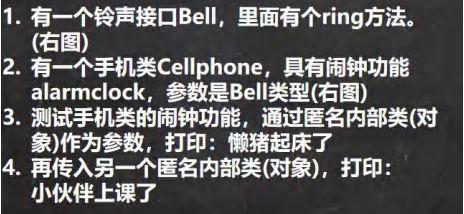 

```java
package com.czl.innerclass;

public class InnerClassExercise02 {
    public static void main(String[] args) {
        CellPhone cellPhone = new CellPhone();
        //1. 传递的是实现了 Bell接口的匿名内部类 InnerClassExercise02$1
        //2. 重写了 ring
        //3. Bell bell = new Bell() {
        //            @Override
        //            public void ring() {
        //                System.out.println("懒猪起床了");
        //            }
        //        }
        cellPhone.alarmClock(new Bell() {
            @Override
            public void ring() {
                System.out.println("懒猪起床了...");
            }
        });
        cellPhone.alarmClock(new Bell() {
            @Override
            public void ring() {
                System.out.println("小伙伴上课啦...");
            }
        });
    }
}

interface Bell { //接口
    void ring();//方法
}
class CellPhone {//类
    public void alarmClock(Bell bell){//形参是Bell接口类型
        System.out.println(bell.getClass());
        bell.ring();//动态绑定
    }
}

//class com.czl.innerclass.InnerClassExercise02$1
//懒猪起床了...
//class com.czl.innerclass.InnerClassExercise02$2
//小伙伴上课啦...
```


成员内部类：

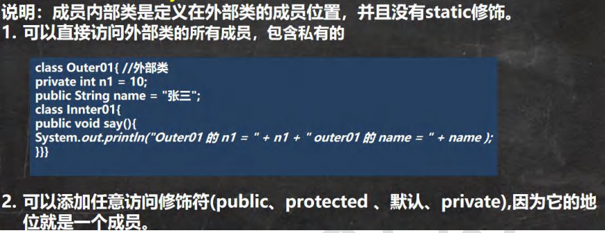 

```java
package com.czl.innerclass;

public class MemberInnerClass01 {
    public static void main(String[] args) {
        Outer08 outer08 = new Outer08();
        outer08.t1();
    }
}
class Outer08 { //外部类
    private int n1 = 10;
    public String name = "张三";

    //1.注意: 成员内部类，是定义在外部内的成员位置上
    //2.可以添加任意访问修饰符(public、protected 、默认、private),因为它的地位就是一个成员
    public class Inner08 {//成员内部类
        public void say() {
            //可以直接访问外部类的所有成员，包含私有的
            System.out.println("n1 = " + n1 + " name = " + name);
        }
    }
    //写方法
    public void t1() {
        //使用成员内部类
        //创建成员内部类的对象，然后使用相关的方法
        Inner08 inner08 = new Inner08();
        inner08.say();
    }
}
```

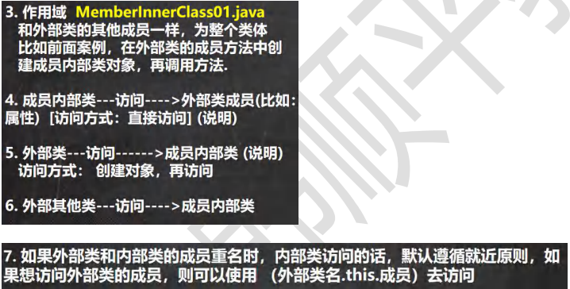 

```java
package com.czl.innerclass;

public class MemberInnerClass01 {
    public static void main(String[] args) {
        Outer08 outer08 = new Outer08();
        outer08.t1();

        //外部其他类，使用成员内部类的三种方式
        // 第一种方式
       //Outer08里面的Inner08
        // outer08.new Inner08(); 相当于把 new Inner08()当做是outer08成员，用outer08去访问
        // 把成员内部类Inner08当做Outer08的成员变量
        // 这就是一个语法，不要特别的纠结.
        Outer08.Inner08 inner08 = outer08.new Inner08();
        inner08.say();
        // 第二方式 在外部类中，编写一个方法，可以返回 Inner08对象
        Outer08.Inner08 inner08Instance = outer08.getInner08Instance();
        inner08Instance.say();

    }
}
class Outer08 { //外部类
    private int n1 = 10;
    public String name = "张三";

    private void hi() {
        System.out.println("hi()方法...");
    }

    //1.注意: 成员内部类，是定义在外部内的成员位置上
    //2.可以添加任意访问修饰符(public、protected 、默认、private),因为它的地位就是一个成员
    public class Inner08 {//成员内部类
        private double sal = 99.8;
        private int n1 = 66;
        public void say() {
            //可以直接访问外部类的所有成员，包含私有的
            //如果成员内部类的成员和外部类的成员重名，会遵守就近原则.
            //可以通过 外部类名.this.属性 来访问外部类的成员
            System.out.println("n1 = " + n1 + " name = " + name + " 外部类的n1=" + Outer08.this.n1);
            hi();
        }
    }
    //写方法
    public void t1() {
        //使用成员内部类
        //创建成员内部类的对象，然后使用相关的方法
        Inner08 inner08 = new Inner08();
        inner08.say();
        System.out.println(inner08.sal);
    }

    //方法，返回一个Inner08实例
    public Inner08 getInner08Instance(){
        return new Inner08();
    }
}
```


静态内部类：

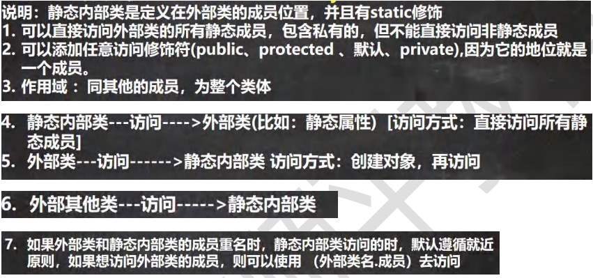 

```java
package com.czl.innerclass;

public class StaticInnerClass01 {
    public static void main(String[] args) {
        Outer10 outer10 = new Outer10();
        outer10.m1();

        //外部其他类 使用静态内部类
        //方式1
        //因为静态内部类，是可以通过类名直接访问(前提是满足访问权限)，当做成员
        Outer10.Inner10 inner10 = new Outer10.Inner10();
        inner10.say();
        //方式2
        //编写一个方法，可以返回静态内部类的对象实例.
        Outer10.Inner10 inner101 = outer10.getInner10();
        System.out.println("============");
        inner101.say();

        Outer10.Inner10 inner10_ = Outer10.getInner10_();
        System.out.println("************");
        inner10_.say();
    }
}

class Outer10 { //外部类
    private int n1 = 10;
    private static String name = "张三";
    private static void cry() {}
    //Inner10就是静态内部类
    //1. 放在外部类的成员位置
    //2. 使用static 修饰
    //3. 可以直接访问外部类的所有静态成员，包含私有的，但不能直接访问非静态成员
    //4. 可以添加任意访问修饰符(public、protected 、默认、private),因为它的地位就是一个成员
    //5. 作用域 ：同其他的成员，为整个类体
    static class Inner10 {
        private static String name = "czl";
        public void say() {
            //如果外部类和静态内部类的成员重名时，静态内部类访问的时，
            //默认遵循就近原则，如果想访问外部类的成员，则可以使用 （外部类名.成员）
            System.out.println(name + " 外部类name= " + Outer10.name);
            cry();
        }
    }

    public void m1() { //外部类---访问------>静态内部类 访问方式：创建对象，再访问
        Inner10 inner10 = new Inner10();
        inner10.say();
    }

    public Inner10 getInner10() {
        return new Inner10();
    }

    public static Inner10 getInner10_() {
        return new Inner10();
    }
}
```


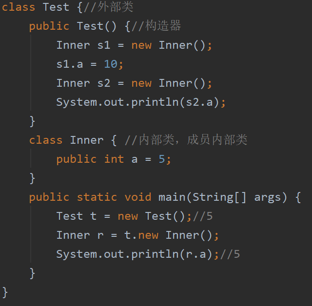 

s1和s2和r分别指向不同的对象空间。