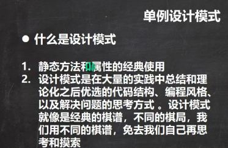
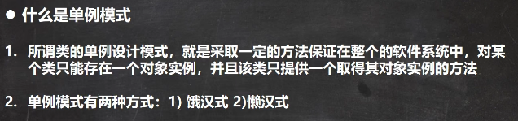
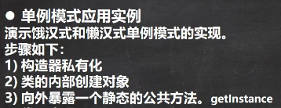
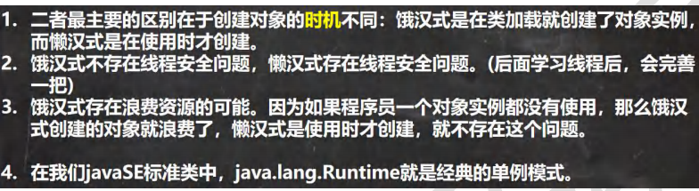

 

 


 

```java
package com.czl.single_;

public class SingleTon01 {
    public static void main(String[] args) {
        //通过方法可以获取对象
        GirlFriend instance = GirlFriend.getInstance();
        System.out.println(instance);

        GirlFriend instance2 = GirlFriend.getInstance();
        System.out.println(instance2);

        System.out.println(instance == instance2);//T
        //是同一个对象 gf是静态的，只会初始化一次

        System.out.println(GirlFriend.n1);
        //输出
        //构造器被调用...
        //100
        //此时并没有使用到 gf，但因访问静态属性，GirlFriend类加载，静态属性初始化被执行，
        //构造器被调用，gf对象就有了
    }
}

//有一个类， GirlFriend
//只能有一个女朋友(实例)
class GirlFriend {

    private String name;
    public static  int n1 = 100;

    //为了能够在静态方法getInstance()中，返回 gf 对象，需要将其修饰为static
    //对象，通常是重量级的对象, 饿汉式可能造成创建了对象，但是沒有使用。
    private static GirlFriend gf = new GirlFriend("小红红");
    //只要类加载，gf对象就创建好了，即使可能不会被使用。

    //如何保障我们只能创建一个 GirlFriend 对象
    //步骤[单例模式-饿汉式]
    //1. 将构造器私有化，防止直接 new 一个对象
    //2. 在类的内部直接创建对象(该对象是static)
    //3. 提供一个公共的static方法，返回 gf 对象
    private GirlFriend(String name) {
        System.out.println("构造器被调用...");
        this.name = name;
    }

    //如果这里不是静态的，就必须要创建一个GirlFriend对象才能调用这个方法，
    //而不能直接调用。
    public static GirlFriend getInstance() {
        return gf;
    }

    @Override
    public String toString() {
        return "GirlFriend{" +
                "name='" + name + '\'' +
                '}';
    }
}


package com.czl.single_;

/*
懒汉式单例模式
 */
public class SingleTon02 {
    public static void main(String[] args) {

        //System.out.println(Cat.n1);
        //这里类加载了，静态属性初始化也会完成，
        // 但private static Cat cat;并没有new，所以构造器没有被调用，没有创建cat对象。

        Cat instance = Cat.getInstance();
        System.out.println(instance);
        //输出
        //构造器被调用...
        //Cat{name='小可爱'}

        Cat instance1 = Cat.getInstance();
        System.out.println(instance1);
        //输出
        //构造器被调用...
        //Cat{name='小可爱'}
        //Cat{name='小可爱'}
        //此时cat不为空

        System.out.println(instance == instance1);//T
    }
}

//希望在程序运行过程中，只能创建一个Cat对象
//使用单例模式
class Cat {
    private String name;
    private static Cat cat;
    public static int n1 = 100;

    //步骤
    //1.仍然构造器私有化
    //2.定义一个static静态属性对象
    //3.提供一个public的static方法，可以返回一个Cat对象
    //4.懒汉式，只有当用户使用getInstance时，才返回cat对象, 再次调用时，会返回上次创建的cat对象
    //即便Cat类加载了，构造器也不会被调用。

    private Cat(String name) {
        System.out.println("构造器被调用...");
        this.name = name;
    }

    public static Cat getInstance() {
        if(cat == null) {//如果还没有创建cat对象
            cat = new Cat("小可爱");
        }
        return cat;
    }

    @Override
    public String toString() {
        return "Cat{" +
                "name='" + name + '\'' +
                '}';
    }
}
```


 

在类加载时就创建，可能存在资源浪费问题。