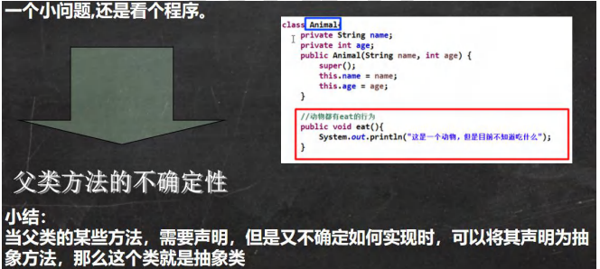 

```java
package com.czl.abstract_;

public class Abstract01 {
}
abstract class Animal {
    private String name;
    public Animal(String name) {
        this.name = name;
    }
    //思考：这里eat 这里你实现了，其实没有什么意义
    //即： 父类方法不确定性的问题
    //===> 考虑将该方法设计为抽象(abstract)方法
    //===> 所谓抽象方法就是没有实现的方法
    //===> 所谓没有实现就是指，没有方法体
    //===> 当一个类中存在抽象方法时，需要将该类声明为abstract类
    //===> 一般来说，抽象类会被继承，由其子类来实现抽象方法.
//    public void eat() {
//        System.out.println("这是一个动物，但是不知道吃什么..");
//    }
    public abstract void eat();
}
```

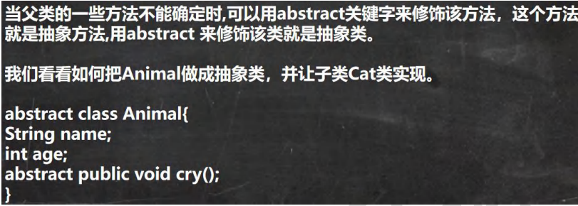 


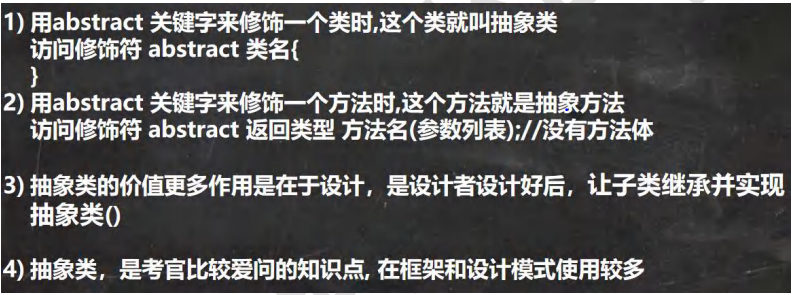 


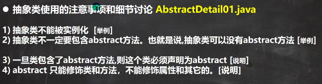 

（1）

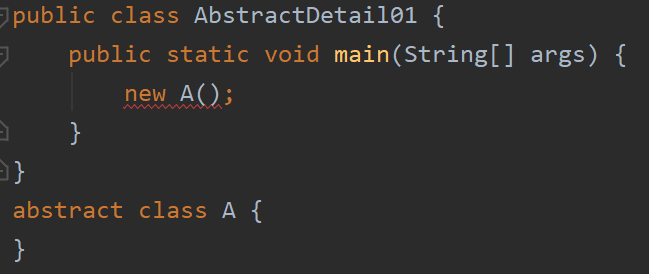 

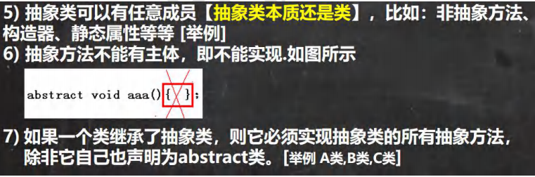 

（7）

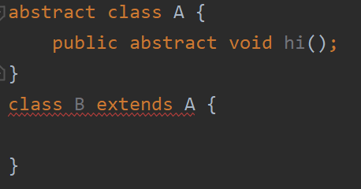 

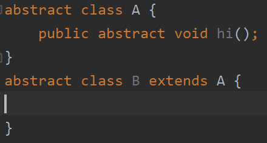 

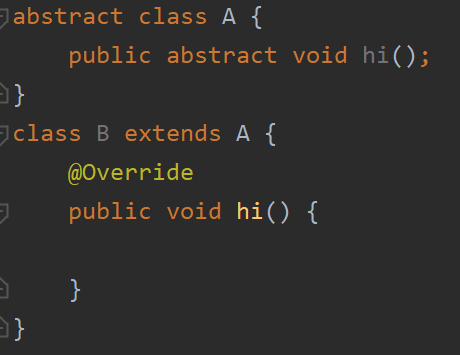 

 

抽象方法最终要被子类实现。

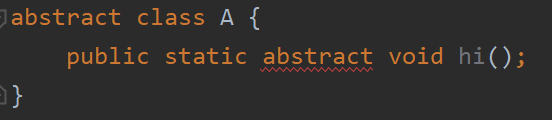 


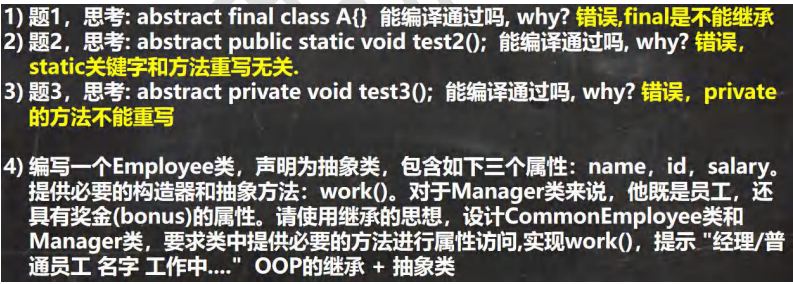 

```java
package com.czl.abstract_;

abstract public class Employee {
    private String name;
    private int id;
    private double salary;

    //将work做成一个抽象方法
    public abstract void work();

    public Employee(String name, int id, double salary) {
        this.name = name;
        this.id = id;
        this.salary = salary;
    }

    public String getName() {
        return name;
    }

    public void setName(String name) {
        this.name = name;
    }

    public int getId() {
        return id;
    }

    public void setId(int id) {
        this.id = id;
    }

    public double getSalary() {
        return salary;
    }

    public void setSalary(double salary) {
        this.salary = salary;
    }
}

package com.czl.abstract_;

public class Manager extends Employee {
    private double bonus;

    public Manager(String name, int id, double salary) {
        super(name, id, salary);
    }

    public double getBonus() {
        return bonus;
    }

    public void setBonus(double bonus) {
        this.bonus = bonus;
    }

    @Override
    public void work() {
        System.out.println("经理 " + getName() + " 工作中...");
    }
}

package com.czl.abstract_;

public class CommonEmployee extends Employee {
    public CommonEmployee(String name, int id, double salary) {
        super(name, id, salary);
    }

    @Override
    public void work() {
        System.out.println("普通员工 " + getName() + " 工作中...");
    }
}

package com.czl.abstract_;

public class AbstractExercise01 {
    public static void main(String[] args) {
        //测试
        Manager jack = new Manager("jack", 999, 50000);
        jack.setBonus(8000);
        jack.work();

        CommonEmployee tom = new CommonEmployee("tom", 888, 20000);
        tom.work();
    }
}
```


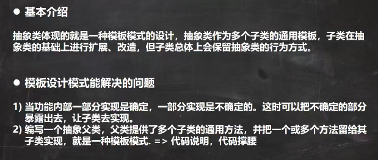 

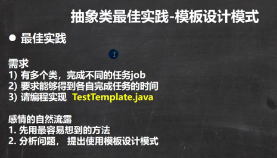 

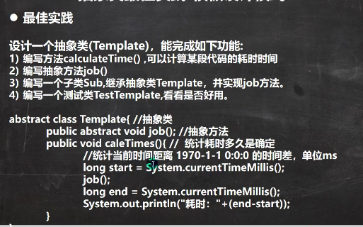 

```java
package com.czl.abstract_;

abstract public class Template { //抽象类-模板设计模式

    public abstract void job();//抽象方法

    public void calculateTime() {//实现方法，调用job方法
        //得到开始的时间
        long start = System.currentTimeMillis();
        job(); //动态绑定机制，和AA对象绑定，先找子类，子类重写了
        //得的结束的时间
        long end = System.currentTimeMillis();
        System.out.println("任务执行时间 " + (end - start));
    }
}

package com.czl.abstract_;

public class AA extends Template{
    //计算任务
    //1+....+ 800000
    @Override
    public void job() { //实现Template的抽象方法job
        long num = 0;
        for (long i = 1; i <= 800000; i++) {
            num += i;
        }
    }
}

package com.czl.abstract_;

public class BB extends Template{
    @Override
    public void job() {
        long num = 0;
        for (long i = 1; i <= 80000; i++) {
            num *= i;
        }
    }
}

package com.czl.abstract_;

public class TestTemplate {
    public static void main(String[] args) {
        AA aa = new AA();
        aa.calculateTime();//运行类型是AA，先找子类，没有找到，就找父类

        BB bb = new BB();
        bb.calculateTime();
    }
}
```

