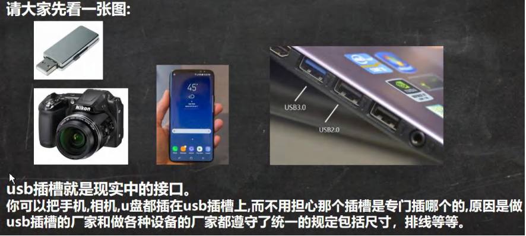 

```java
package com.czl.interface_;

public interface UsbInterface {//接口 制定规范的
    //规定接口的相关方法
    public void start();
    public void stop();
}
package com.czl.interface_;

//Phone 类实现UsbInterface接口
//Phone要去实现UsbInterface接口规定/声明的方法
public class Phone implements UsbInterface {
    @Override
    public void start() {
        System.out.println("手机开始工作...");
    }

    @Override
    public void stop() {
        System.out.println("手机停止工作...");
    }
}
package com.czl.interface_;

public class Camera implements UsbInterface {
    @Override
    public void start() {
        System.out.println("相机开始工作...");
    }

    @Override
    public void stop() {
        System.out.println("相机停止工作...");
    }
}
package com.czl.interface_;

public class Computer {
    //编写方法
   //形参是一个接口类型 UsbInterface 
   //只要是实现了 UsbInterface  接口的类对象实例就可以传递参数进去
    public void work(UsbInterface usbInterface) {//设备只需要接到接口，就能工作  将参数传进去
        //通过接口，来调用方法
        usbInterface.start();
        usbInterface.stop();
    }
}
package com.czl.interface_;

public class Interface01 {
    public static void main(String[] args) {
        Phone phone = new Phone();
        Camera camera = new Camera();
        Computer computer = new Computer();
        computer.work(phone);//把手机接到计算机
        computer.work(camera);
    }
}
```


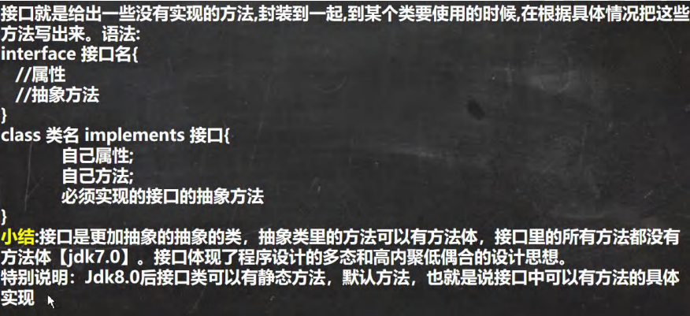 

```java
package com.czl.interface_;

public interface AInterface {
    //属性
    public int n1 = 10;
    //方法
    //在接口中，抽象方法可以省略abstract关键字
    public void hi();

    //jdk8之后，可以有默认实现方法，需要使用default关键字修饰
    default public void ok() {
        System.out.println("ok()...");
    }
    //jdk8之后，可以有静态方法
    public static void cry() {
        System.out.println("cry()...");
    }
}

package com.czl.interface_;

public class Interface02 {
}

//将接口所有的抽象方法全部实现
class A implements AInterface {
    @Override
    public void hi() {
        System.out.println("h()...");
    }
}
```


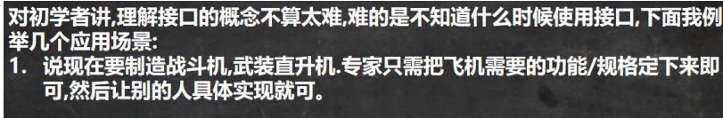

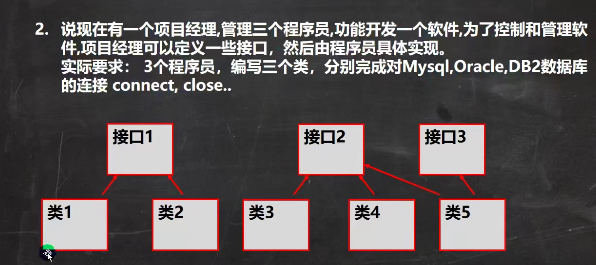 

```java
package com.czl.interface_;

public interface DBInterface {//项目经理写的
    public void connect();//连接方法
    public void close();//关闭连接
}

package com.czl.interface_;

public class MysqlDB implements DBInterface {
    @Override
    public void connect() {
        System.out.println("连接mysql...");
    }

    @Override
    public void close() {
        System.out.println("关闭mysql...");
    }
}

package com.czl.interface_;

public class OracleDB implements DBInterface {
    @Override
    public void connect() {
        System.out.println("连接oracle...");
    }

    @Override
    public void close() {
        System.out.println("关闭oracle...");
    }
}

package com.czl.interface_;

public class Interface03 {
    public static void main(String[] args) {
        MysqlDB mysqlDB = new MysqlDB();
        OracleDB oracleDB = new OracleDB();
        Interface03 interface03 = new Interface03();
        interface03.t(mysqlDB);
        interface03.t(oracleDB);
    }

    public void t(DBInterface dbInterface) {
        dbInterface.connect();
        dbInterface.close();
    }
}
```


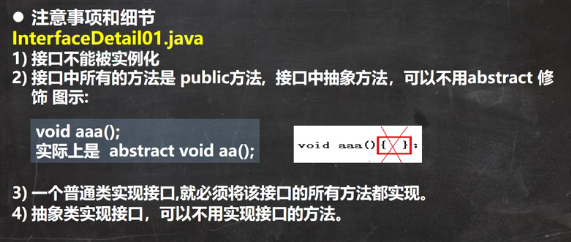 

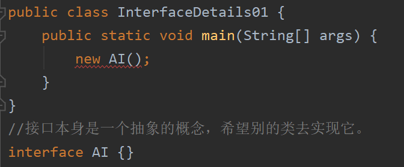 

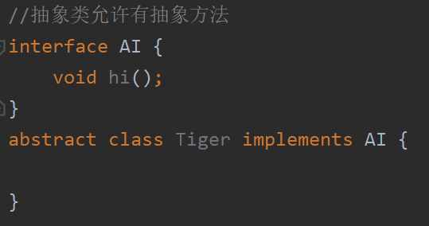 

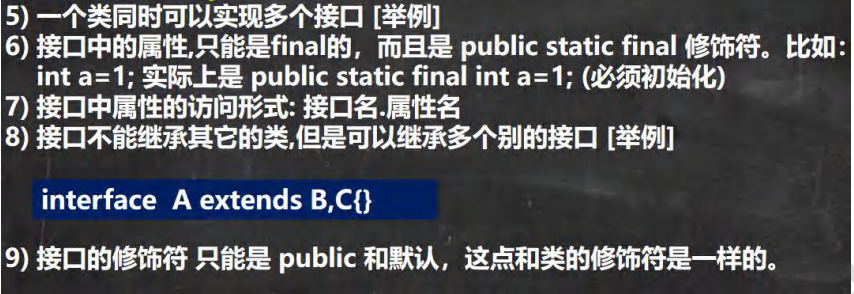 

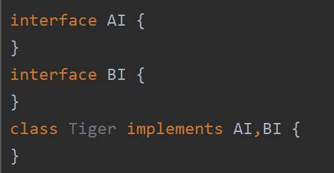 


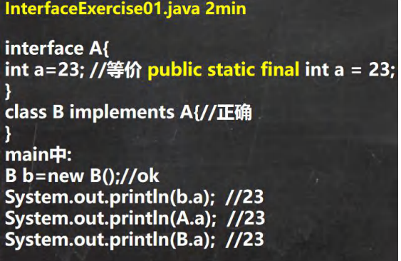 


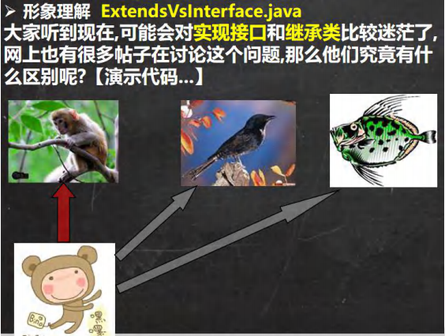 

```java
package com.czl.interface_;

public class ExtendsVsInterface {
    public static void main(String[] args) {
        LittleMonkey wuKong = new LittleMonkey("悟空");
        wuKong.climbing();
        wuKong.swimming();
        wuKong.flying();
    }
}

//猴子
class Monkey {
    private String name;
    public Monkey(String name) {
        this.name = name;
    }
    public void climbing() {
        System.out.println(name + " 会爬树...");
    }
    public String getName() {
        return name;
    }
}
//接口
interface Fishable {
    void swimming();
}
interface Birdable {
    void flying();
}

//继承
//小结:  当子类继承了父类，就自动的拥有父类的功能
//      如果子类需要扩展功能，可以通过实现接口的方式扩展.
//      可以理解 实现接口 是 对java 单继承机制的一种补充.
class LittleMonkey extends Monkey implements Fishable,Birdable {

    public LittleMonkey(String name) {
        super(name);
    }

    @Override
    public void swimming() {
        System.out.println(getName() + " 通过学习，可以像鱼儿一样游泳...");
    }

    @Override
    public void flying() {
        System.out.println(getName() + " 通过学习，可以像鸟儿一样飞翔...");
    }
}
```

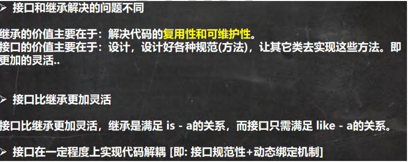 


接口的多态特性

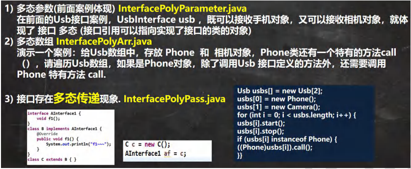 

（1）

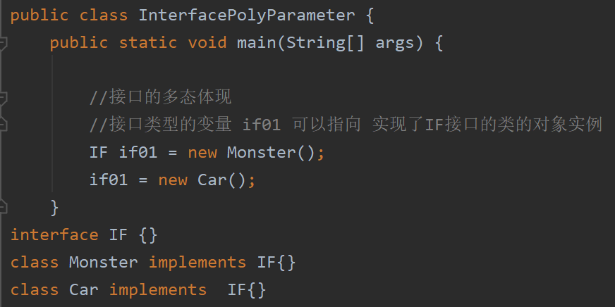 

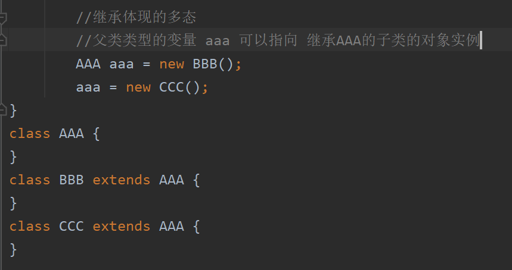 

（2）

```java
public class InterfacePolyArr {
    public static void main(String[] args) {

        //多态数组 -> 接口类型的数组 可以存放实现了接口的全部的类的实例
        Usb[] usbs = new Usb[2];
        usbs[0] = new Phone_();
        usbs[1] = new Camera_();
        /*
        给Usb数组中，存放 Phone 和 相机对象，Phone类还有一个特有的方法call（），
        请遍历Usb数组，如果是Phone对象，除了调用Usb 接口定义的方法外，
        还需要调用Phone 特有方法 call
         */
        for(int i = 0; i < usbs.length; i++) {
            usbs[i].work();//动态绑定，根据运行类型去调用相应的work()方法
            //和前面一样，我们仍然需要进行类型的向下转型
            if(usbs[i] instanceof Phone_) {//判断他的运行类型是 Phone_
                ((Phone_) usbs[i]).call();
            }
        }

    }
}

interface Usb{
    void work();
}
class Phone_ implements Usb {
    public void call() {
        System.out.println("手机可以打电话...");
    }

    @Override
    public void work() {
        System.out.println("手机工作中...");
    }
}
class Camera_ implements Usb {

    @Override
    public void work() {
        System.out.println("相机工作中...");
    }
}
```

（3）

```java
/**
 * 演示多态传递现象
 */
public class InterfacePolyPass {
    public static void main(String[] args) {
        //接口类型的变量可以指向，实现了该接口的类的对象实例
        IG ig = new Teacher();
        //如果IG 继承了 IH 接口，而Teacher 类实现了 IG接口
        //那么，实际上就相当于 Teacher 类也实现了 IH接口.
        //这就是所谓的 接口多态传递现象.
        IH ih = new Teacher();
    }
}

interface IH {
    void hi();
}
interface IG extends IH{ }
class Teacher implements IG {
    @Override
    public void hi() {
    }
}
```


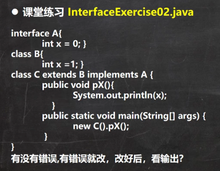 

```java
package com.czl.interface_;

public class InterfaceExercise02 {
    public static void main(String[] args) {
    }
}

interface A1 {
    int x = 0;//等价 public static final int x = 0;
}

class B1 {
    int x = 1; //普通属性
}

class C1 extends B1 implements A1 {
    public void pX() {
        //System.out.println(x); //错误，原因是不明确，x不知道到底是谁
        //可以明确的指定x
        //访问接口的 x 就使用 A1.x
        //访问父类的 x 就使用 super.x
        System.out.println(A1.x + " " + super.x);
    }

    public static void main(String[] args) {
        new C1().pX();
    }
}
```

