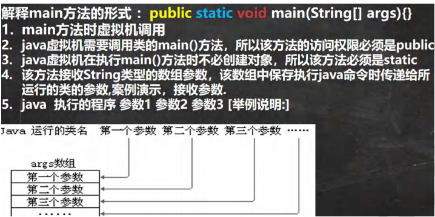
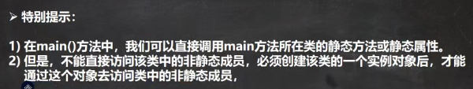
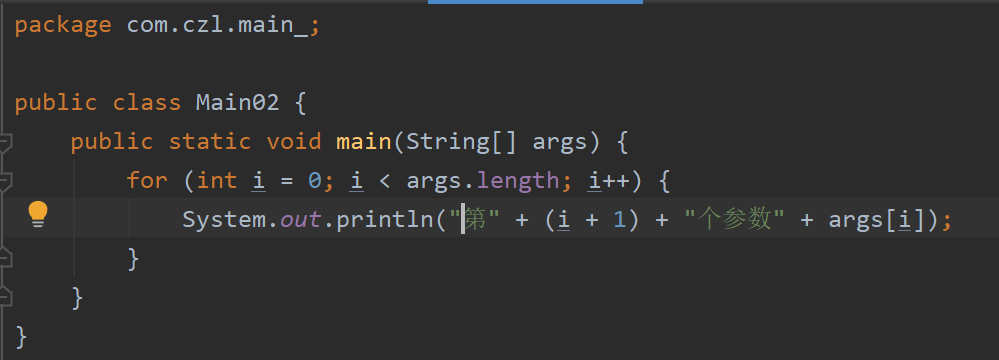
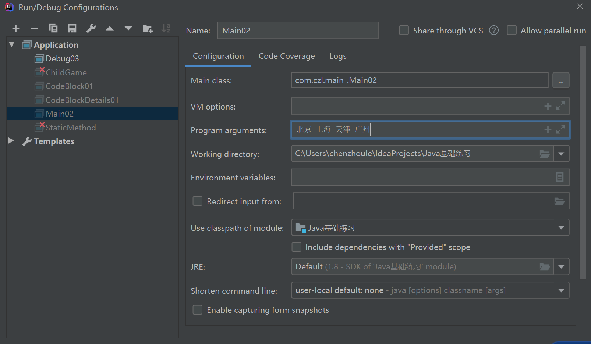
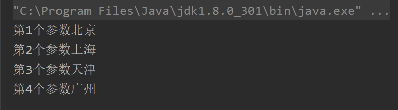

深入理解main方法：

 

 

```java
package com.czl.main_;

public class Main01 {
    //静态成员
    private static String name = "czl";
    private static void hi() {
        System.out.println("hi()...");
    }

    //非静态成员
    private int n1 = 100;
    private void say() {
        System.out.println("say()...");
    }

    public static void main(String[] args) {

        //可以直接使用 name
        //1.静态方法可以访问本类的静态成员
        System.out.println(name);
        hi();

        //2.静态方法main中不能访问本类的非静态成员
        //System.out.println(n1);//错误
        //cry();错误

        //静态方法main 要访问本类的非静态成员，要先创建对象，再调用
        Main01 main01 = new Main01();
        System.out.println(main01.n1);
        main01.say();
    }
}
```


 

 

 