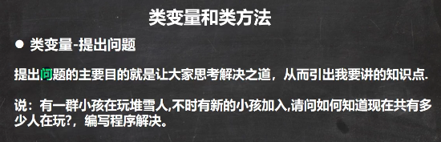 
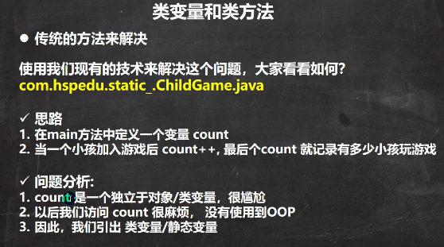 

```java
package com.czl.static_;

public class ChildGame {
    public static void main(String[] args) {
        //定义一个变量 count, 统计有多少小孩加入了游戏
        int count = 0;

        Child child1 = new Child("白骨精");
        child1.join();
        count++;

        Child child2 = new Child("狐狸精");
        child2.join();
        count++;

        Child child3 = new Child("老鼠精");
        child3.join();
        count++;

        System.out.println("共有 " + count  + " 小孩加入了游戏...");
    }
}
class Child {
    private String name;

    public Child(String name) {
        this.name = name;
    }
    public void join() {
        System.out.println(name + "加入了游戏..");
    }
}
```


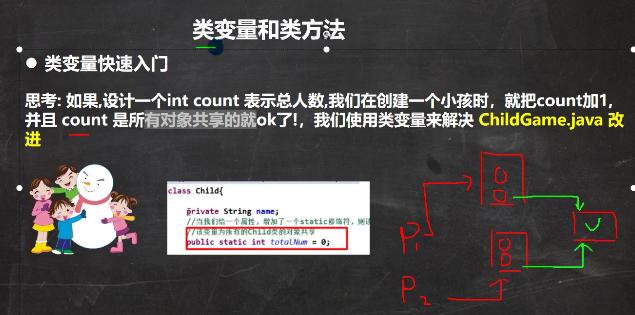 

P1和p2所指向的对象空间的数据都是独立的，而类变量使P1和p2共享一个数据空间。

```java
package com.czl.static_;

public class ChildGame {
    public static void main(String[] args) {
        //定义一个变量 count, 统计有多少小孩加入了游戏
        //int count = 0;

        Child child1 = new Child("白骨精");
        child1.join();
        //count++;
        child1.count++;

        Child child2 = new Child("狐狸精");
        child2.join();
        //count++;
        child2.count++;

        Child child3 = new Child("老鼠精");
        child3.join();
        //count++;
        child3.count++;

        //类变量，可以通过类名来访问
        System.out.println("共有 " + Child.count  + " 小孩加入了游戏...");//3
        System.out.println("child1.count=" + child1.count);//3
        System.out.println("child2.count=" + child2.count);//3
        System.out.println("child3.count=" + child3.count);//3
    }
}
class Child {
    private String name;

    //定义一个变量 count ,是一个类变量(静态变量) static 静态
    //该变量最大的特点就是会被Child 类的所有的对象实例共享
    public static int count = 0;

    public Child(String name) {
        this.name = name;
    }
    public void join() {
        System.out.println(name + "加入了游戏..");
    }
}
```


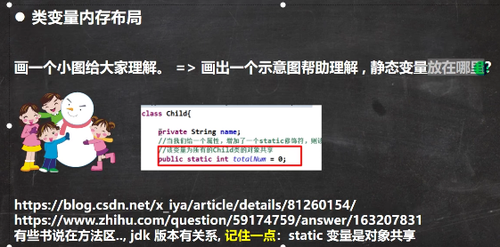 

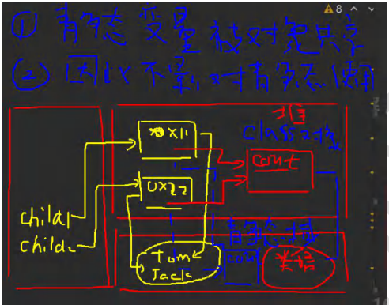 

静态变量被对象共享，因此不影响对静态变量的使用

count这个静态变量存放在哪里有不同说法，但不管在堆还是方法区中，都是共享的。

不管static变量在哪里，共识（1）static变量是同一个类所有对象共享

（2）static变量是在类加载的时候就创建了，所以没有创建对象实例也可以访问。


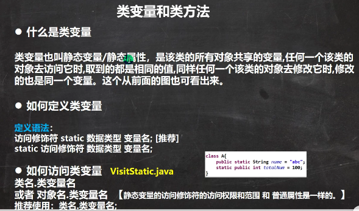 


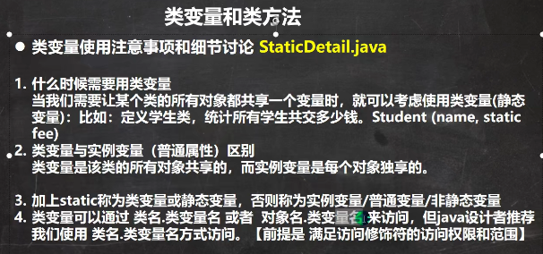 

 


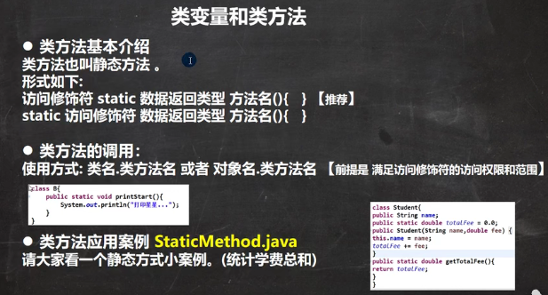 

```java
package com.czl.static_;

public class StaticMethod {
    public static void main(String[] args) {
        Stu tom = new Stu("tom");
        tom.payFee(100);//Stu.payFee(100);

        Stu mary = new Stu("mary");
        mary.payFee(200);//Stu.payFee(200);

        //输出当前收到的总学费
        Stu.showFee();//300
    }
}

class Stu {
    private String name;//普通成员
    //定义一个静态变量，来累积学生的学费
    private static double fee = 0;

    public Stu(String name) {
        this.name = name;
    }

    //说明
    //1. 当方法使用了static修饰后，该方法就是静态方法
    //2. 静态方法就可以访问静态属性/变量
    public static void payFee(double fee) {
        Stu.fee += fee;//累积到
    }
    public static void showFee() {
        System.out.println("总学费有:" + Stu.fee);
    }
}
```


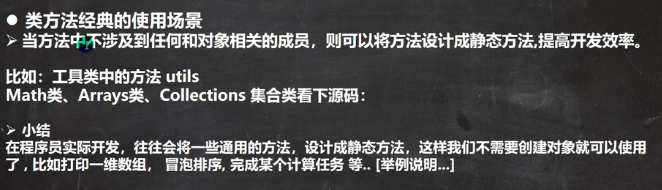 

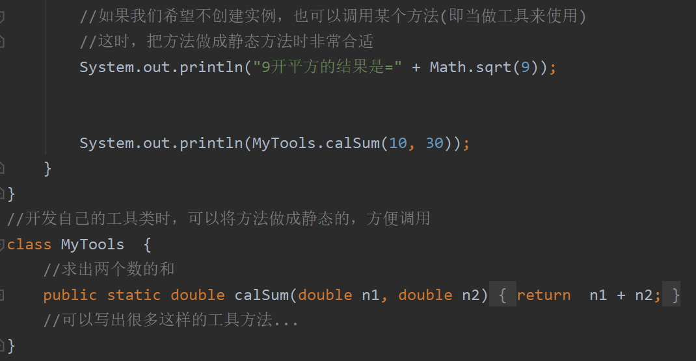 


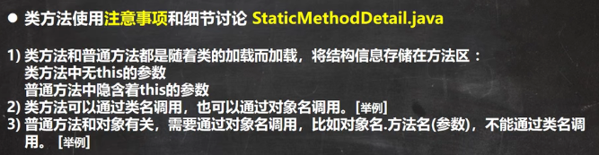 

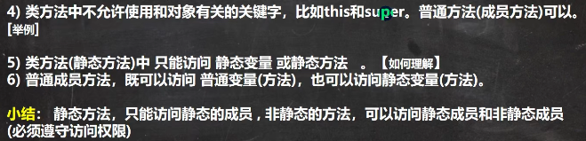 

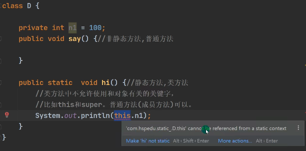 

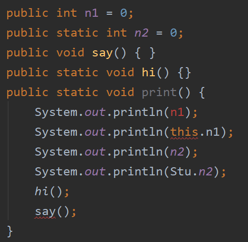 

静态成员是先加载的，非静态成员是后加载的，静态成员是先初始化的。

静态方法print()加载时，非静态方法say()还没有加载。


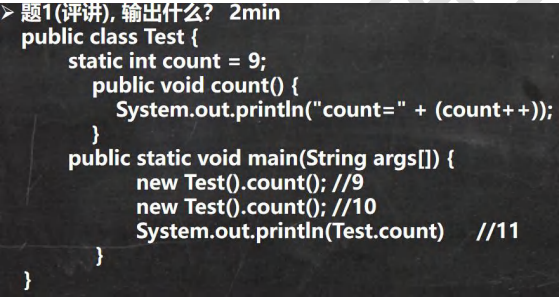 

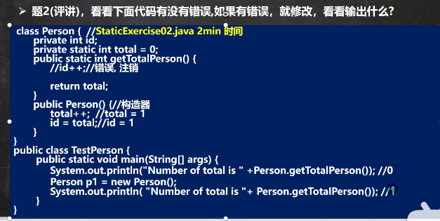 

public Person()构造器是一个非静态方法，可以访问所有成员。

Person.getTotalPerson()是用类名去调用静态方法。


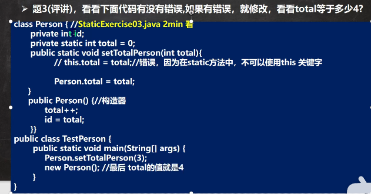 